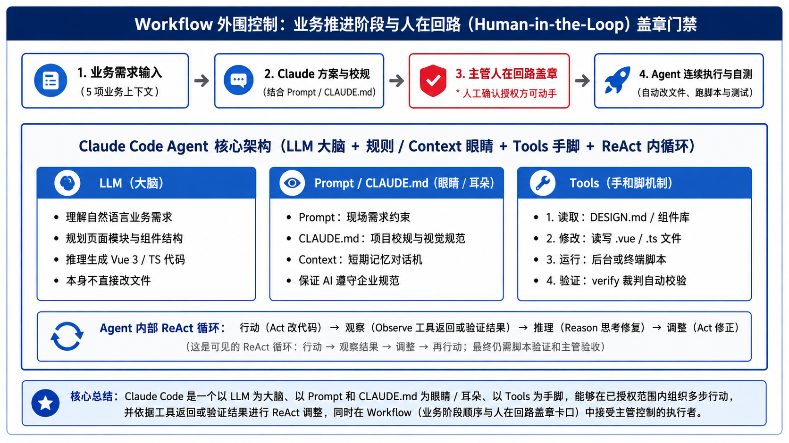

# 第一课学员指南：AI Agent 核心架构与首个原型构建

欢迎来到第一课！在未来的 90 分钟里，你将亲手构建出第一个可运行、可交互的企业级业务系统原型。更重要的是，你将掌握 AI Agent 协作的底层能力，能够用专业语言向团队和 IT 部门阐述 Agent 的工作机制。

---

## 0. 本课教学目标 (Learning Objectives)

完成本课学习后，你将能够：
1. **识别与阐述** LLM（大脑）、Tools（手脚）、Agent（执行者）、ReAct（反馈循环）与 Workflow（流程门禁）5 大核心概念及其物理区别。
2. **区分与选择** 适合自身部门的三类业务原型（A. 监控决策型 / B. 任务流程型 / C. 操作工具型）。
3. **行使人在回路 (HITL) 授权**，利用 Workflow 确认门禁精准管控 Agent 修改代码的权限。
4. **验证与交付** 包含虚构模拟数据（Mock Data）的首个可运行页面，并获得验证脚本的 `[PASS]` 结论。

---

### 核心架构线框图 (Agent Architecture Wireframe)

```text
+-----------------------------------------------------------------------------------+
|                                 Workflow 核心框架                                 |
|  (需求解构 -> 方案推演 -> 人在回路[主管盖章] -> Agent代码生成 -> 验证自测 -> 试衣镜预览 -> 微调闭环) |
|                                                                                   |
|    +-------------------------------------------------------------------------+    |
|    |                            Claude Code Agent                            |    |
|    |                                                                         |    |
|    |   +------------------+     +-------------------+    +---------------+   |    |
|    |   |    LLM (大脑)    |     |  规则/Context(眼睛)|    |  Tools (手脚) |   |    |
|    |   | 理解需求、推理方案|     | Prompt/CLAUDE.md  |    | 读取/修改/运行|   |    |
|    |   +--------+---------+     +---------+---------+    +-------+-------+   |    |
|    |            |                         |                      |           |    |
|    |            +-------------------------+----------------------+           |    |
|    |                                      |                                  |    |
|    |      ReAct 循环 (行动 -> 观察工具返回或验证结果 -> 根据结果调整 -> 再次行动)|
|    +-------------------------------------------------------------------------+    |
|                                                                                   |
|    数据支撑：Mock Data (演戏道具)           展示窗口：127.0.0.1 (本地试衣镜)       |
+-----------------------------------------------------------------------------------+
```

一句话记住 Agent 的底层协作模型：
> **Claude Code 是一个以 LLM 为大脑、以 Prompt 和 CLAUDE.md 为眼睛/耳朵、以 Tools 为手脚，能够在已授权范围内组织多步行动、调用 Tools，并依据工具返回或验证结果进行 ReAct 调整，同时在 Workflow 中接受主管控制的执行者。**



---

## 1. 核心概念【硬核四步解析卡】

在动手前，请认真阅读以下 5 个核心概念的硬核解析：

### ① LLM (Large Language Model, 大语言模型)
* **硬核工程定义**：基于 Transformer 架构的海量参数概率采样概率模型，本质是根据输入的上文 Token 序列，预测并生成下一个概率最大的 Token 序列。
* **底层运作机制**：LLM 自身没有任何操作系统访问权限，无法直接修改你电脑上的任何文件，它只在内存里进行文本推演。
* **具象业务比喻**：它是系统研发的 **“首席架构师/大脑”**。它懂所有的业务逻辑和代码语法，但只动嘴不写代码。
* **IT 沟通与交接价值**：向 IT 说明：“我们使用 LLM 进需求解构与结构化方案规划，生成标准的 JSON/Markdown 业务规格描述”。

### ② Tools (手脚/工具能力)
* **硬核工程定义**：宿主程序（如 Claude Code CLI）向 Agent 暴露的可执行函数/接口（例如：文件读取 `read_file`、终端运行 `run_command`、代码修改 `write_file`）。
* **底层运作机制**：Agent 不能直接操作操作系统的底层物理内存，必须通过结构化的 JSON 格式向宿主发送 Tool Call 请求，由宿主校验权限后代理执行并返回结果。
* **具象业务比喻**：它们是 Agent 戴上的 **“物理手脚与眼睛”**。有了 Tools，Agent 才能看项目代码（眼睛），才会在磁盘上创建 Vue 文件（手脚）。
* **IT 沟通与交接价值**：向 IT 说明：“Tools 受宿主工具权限、项目规则和用户授权约束，用于降低未经授权执行风险”。

### ③ Agent (受控的执行者)
* **硬核工程定义**：以大语言模型（LLM）为核心控制器、以提示词和项目规则（Prompt/`CLAUDE.md`）为指导、以工具库（Tools）为环境交互媒介、能够在目标驱动下自主组织多步行动并依据反馈调整策略的软件实体。
* **底层运作机制**：Agent = LLM（大脑）+ Prompt/`CLAUDE.md`（约束与指南）+ Tools（手脚）+ ReAct 循环（行动自测策略）。
* **具象业务比喻**：Agent 是一个 **“有手有脚、有项目守则约束的实习生”**。它不是无休止聊天，而是为了完成一个具体业务目标在认真干活。
* **IT 沟通与交接价值**：向 IT 说明：“我们使用的是受控 Agent 架构，所有行动受项目护栏文件与人机共同确认约束”。

### ④ ReAct 范式 (Thought -> Action -> Observation)
* **硬核工程定义**：Reasoning and Acting（推理与行动交织范式）。Agent 每一个动作都遵循“思考（Thought）-> 行动（Action）-> 观察结果（Observation）-> 再思考（Thought）”的闭环迭代。
* **底层运作机制**：Agent 执行 Tool 命令后，宿主程序会把 Tool 的返回值（如命令行报错或编译结果）作为上下文送回模型，模型据此调整下一步。
* **具象业务比喻**：它是 Agent 的 **“试错与试衣镜反馈”**。Agent 可根据日志与校验结果调整下一步行动，但修改仍受确认范围、验证结果与人工验收约束。
* **IT 沟通与交接价值**：向 IT 说明：“Agent 可结合校验与脚本调试进行自我调整，降低语法与运行错误风险”。

### ⑤ Workflow 与 Human-in-the-Loop (人在回路授权门禁)
* **硬核工程定义**：人在回路 (HITL) 是一种系统设计范式，要求 AI Agent 在执行代码修改、物理写盘或重大业务决策的行动前，必须中断自动化循环，将控制权交还给人类裁决者。
* **底层运作机制**：本课程 Workflow 要求 Agent 在物理写入前停止并等待主管确认。具体命令行是否触发工具权限弹框，取决于宿主权限配置。授权口令属于项目协作规则，不等同于操作系统级物理隔离。
* **具象业务比喻**：它是 CEO 手中的 **“公章与确认关卡”**。本课程要求 Agent 在修改前停下获得主管授权口令，人类掌控业务控制权。
* **IT 沟通与交接价值**：向 IT 说明：“原型制作要求 Agent 在写入前按 Workflow 规则进行人工确认，符合企业安全审计与合规控制要求”。

---

## 2. 准备工作与本地试衣镜

1. **确定运行环境**：双击运行项目根目录的 **`start-project.bat`**。
2. **打开本地试衣镜**：在浏览器访问 `http://127.0.0.1:8888`。这是你的高保真视觉试衣镜，所有成果在此实时渲染。
3. **Tools 权限沙箱与授权说明**：当终端弹出操作确认时，这是 Agent 在向你申请 Tools 权限。你是项目的 CEO，确认符合安全沙箱范围后予以批准。

---

## 3. 三类业务原型选型（选择你的战场）

在开始 Task 1 前，请明确你要解决的业务问题属于哪一类：

| 原型类型 | 适用场景 | 核心焦点 | 第一个关键操作 |
| :--- | :--- | :--- | :--- |
| **A. 监控与决策型** | 经营分析、履约预警、异常监控 | 核心 KPI、异常标红、明细下钻 | 筛选记录、下发预警通知 |
| **B. 任务与流程型** | 预算审批、退货处理、工单派发 | 待办列表、当前状态、状态流转 | 点击“同意/驳回”、推进下一步 |
| **C. 操作工具型** | 文案生成、规则计算、数据格式转换 | 输入要求、规则参数、结果展示区 | 点击“生成”、确认/复制/导出 |

---

## 4. 任务实操流程 (Tasks)

```text
[Task 1: LLM 理解] -> [Task 2: Tools 观察] -> [Task 3: HITL 盖章重构] -> [Task 4: ReAct 微调闭环]
  - 不读写文件          - 只读配置/组件库      - 下达裁决矩阵/授权口令   - 观察试衣镜/微调自测
```

### Task 1：LLM 业务需求理解 (15 分钟)

**目标**：观察 LLM 在不调用文件写工具的前提下，对业务需求的理解与规划能力。

#### 复制并发送给 Agent：
```text
我要创建一个【系统名称】。

原型类型属于【监控与决策型 / 任务与流程型 / 操作工具型】，主要使用者是【角色】。
他们现在遇到的业务痛点是【具体业务问题】。
页面最重要的是看到【关键指标与异常 / 待办任务与当前状态 / 输入要求与输出结果】。
使用者进入页面后首先要执行【操作】。

注意：
1. 第一版只使用模拟数据（Mock Data 演戏道具），不接真实接口。
2. 请先不要读取项目文件，也不要修改任何代码。
3. 请用你自己的专业语言复述我对需求的理解，并提出第一版页面的初步模块规划方案。
```

🚩 **本步检查 (Checklist)**：
- [ ] Agent 准确复述了你的业务需求。
- [ ] 源码层面未触发任何 Vue/JS 代码修改（LLM 仅在大脑中推演业务逻辑）。
- [ ] 手动或授权 Agent 初始化填写 `docs/PROJECT_STATE.md` 文档（记录系统名称、原型类型与核心业务问题）。

---

### Task 2：Tools 让 Agent 戴上眼睛读取规范 (10 分钟)

**目标**：授权 Agent 使用 Tools 观察项目已有规则 (`CLAUDE.md`) 与组件库。

#### 复制并发送给 Agent：
```text
现在，请戴上眼睛，使用 Tools 读取项目中的真实配置文件与组件库：
- CLAUDE.md
- DESIGN.md
- docs/COMPONENT_CATALOG.md
- src/router/index.ts
- src/components/layout/AppSidebar.vue

请根据读取到的项目规则与组件库，向我说明：
1. 本项目已有的设计规范与可复用组件
2. 准备修改或新增的文件列表（Vue 页面、路由与侧栏菜单）
3. 针对第一版页面的结构修订建议

在得到我明确许可前，请绝对不要修改或创建任何文件。
```

🚩 **本步检查 (Checklist)**：
- [ ] 终端中看到了 Agent 调用 `read_file` 的工具日志。
- [ ] Agent 列出了准备修改的文件清单，但**尚未动笔修改**。

---

### Task 3：Workflow 顺序与人在回路 (HITL) 授权 (15 分钟)

**目标**：行使 CEO 裁决权，下达业务冻结线与授权盖章口令。

#### 复制并发送给 Agent：
```text
针对你的方案，我的裁决如下：

1. 必须保留的业务字段：【填写业务字段】
2. 本轮暂不实现：【填写暂不实现的复杂功能】
3. 主要操作调整为：【填写最核心的操作按钮】
4. 业务逻辑保护：不得擅自改变已确认的字段含义、状态规则或处理逻辑。

请复述你理解的修改范围。在你得到我回复“同意方案，请开始修改代码”前，不要修改任何文件。
```

当 Agent 复述无误后，发送授权盖章口令：
👉 **`同意方案，请开始修改代码`**

🚩 **本步检查 (Checklist)**：
- [ ] Agent 仅在收到盖章口令后才开始修改代码。
- [ ] 页面在 `http://127.0.0.1:8888` 试衣镜中渲染成功，且侧边栏出现了新菜单。
- [ ] 在 PowerShell 运行 `powershell -ExecutionPolicy Bypass -File .\scripts\verify-student-project.ps1` 输出了 `[PASS]`。

---

### Task 4：ReAct 循环与人在回路微调闭环 (10 分钟)

**目标**：观察试衣镜渲染效果，发起 1 次基于试衣镜与脚本验证的 ReAct 微调闭环。

#### 复制并发送给 Agent：
```text
我在本地试衣镜中发现以下问题：
【描述 1 个最影响理解或操作的问题，例如：核心操作按钮不够醒目 / 状态标签样式不明确】

请先复述你理解的修改范围，不要改变其他业务内容。
在得到我确认后，只修改这一项并自动重新运行验证脚本。
```

收到确认后，再次发送盖章口令：`同意方案，请开始修改代码`。

---

## 5. 学员课后记忆卡与常见误区

### ✍️ 学员概念互动填空：
1. **LLM (大脑)**：它的物理本质是基于 Token 推演的 ____________ 模型，自身无权修改本地文件。
2. **Tools (手脚)**：Agent 调用 `read_file` 或 `run_command` 的底层机制是 ____________。
3. **Workflow 门禁**：在 Agent 修改代码前，主管必须通过回复 ____________ 行使人在回路授权。
4. **验证脚本**：在项目重构完成后，我运行了 ____________ 脚本，获得了 ____________ 结论。

### 💡 常见概念误区与正确理解：
| 常见误区 (Misconception) | 正确硬核理解 (Correct Understanding) | 如何纠偏与防护 |
| :--- | :--- | :--- |
| **“AI 可以全自动做完一切”** | LLM 只是推演大脑，必须由人类通过 Workflow 门禁限制其权限，否则会导致代码乱涂乱改。 | 严格执行 Task 3 的“同意方案，请开始修改代码”授权盖章。 |
| **“代码写在页面里就是接入了真实系统”** | 第一课使用的全是 **Mock Data（演戏道具）**，物理上硬编码在前端，未连接数据库。 | 明确告诫主管：原型用于验证业务逻辑，生产环境需 IT 部门对接真实的 API。 |
| **“AI 报错就意味着项目崩了”** | ReAct 范式允许 Agent 通过捕获 Console/脚本报错自回溯纠偏。 | 看到报错时将报错注入 Context，让 Agent 触发 ReAct 自修闭环。 |

---

## 6. Exit Ticket (退场测试)

在离开教室前，请回答以下测试题：
* **问题**：如果 Agent 在 Task 1 阶段就直接把你的 `AppSidebar.vue` 给改了，这违反了哪一个工程概念？应该如何救援？
* **答案**：违反了 **Workflow 与 Human-in-the-Loop (人在回路授权门禁)**。救援方法：1. 立即发送指令要求 Agent 停止继续修改；2. 让 Agent 列出已修改文件；3. 停止执行新写入；4. 由教师协助恢复（第二课建立 Git 基线后，再学习使用 VS Code Discard 或 `git restore <具体文件>` 恢复）。
