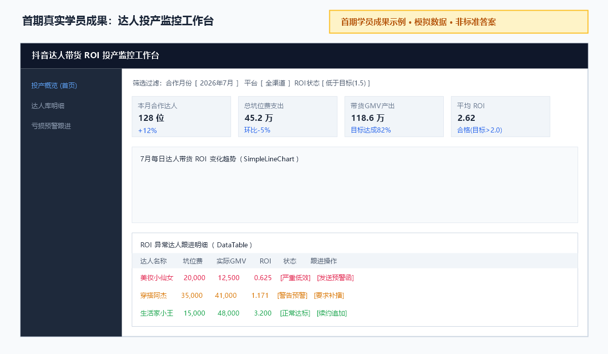
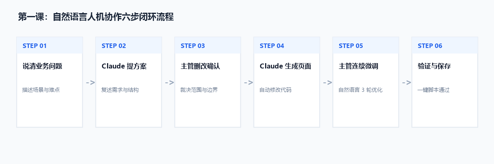
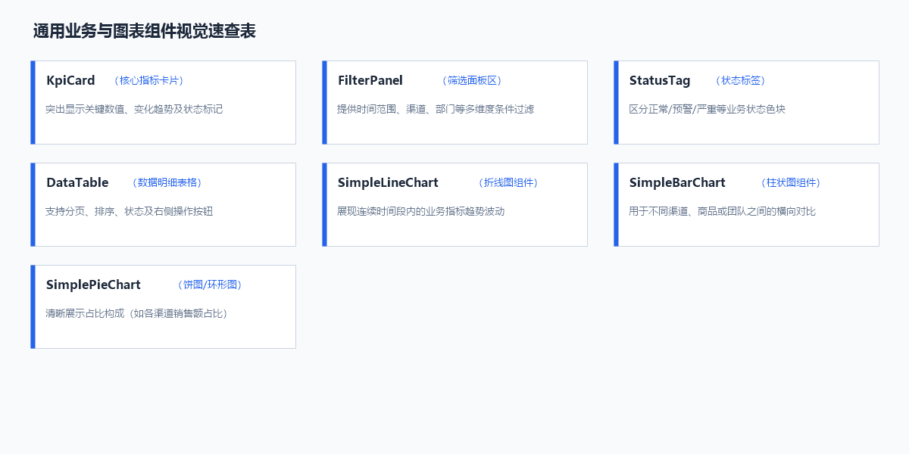
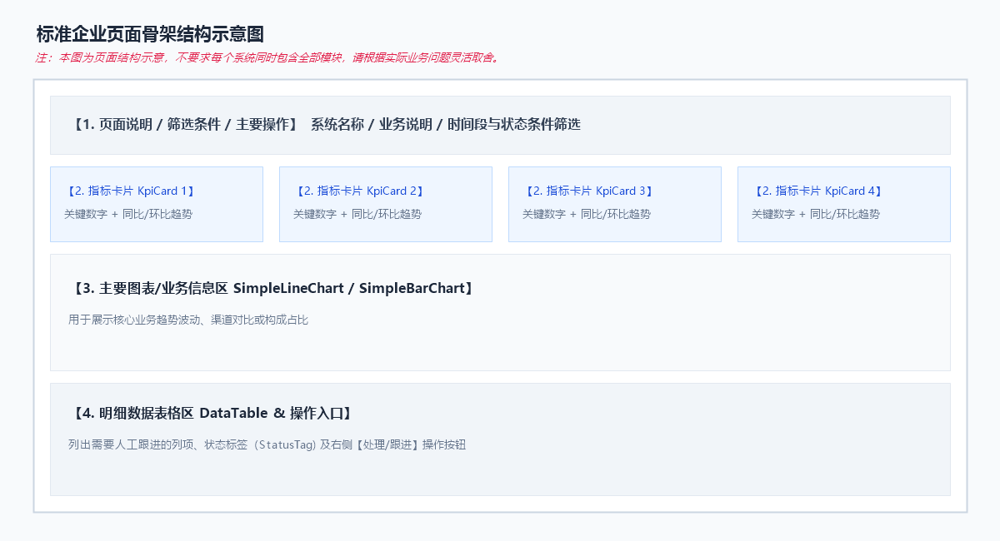

# 第一课学员手册：从业务问题创建第一个系统页面

欢迎开始第一课！在这节课中，你将体验使用自然语言控盘 Claude Code，把你的业务想法变成一个真正可以在浏览器中点击、交互的企业系统页面。

---

## 0. 这节课会做出什么

在接下来的 90 分钟里，你不需要编写一行专业前端代码，只需用自然语言表达你的业务需求，就能创造出属于你自己的系统页面。



> **文字说明**：上图为根据第一期运营主管成果整理的“达人投产监控工作台”结构示意图，包含侧边栏菜单、指标卡片、趋势图与跟进数据表。本图为模拟数据成果示意，不是标准答案，你的系统将完全由你的业务思考决定。

### 90 分钟人机协作闭环路线



> **文字说明**：人机协作六步闭环依次为：1.说清业务问题 -> 2.Claude提方案 -> 3.主管删改确认 -> 4.Claude生成页面(按确认方案修改) -> 5.主管连续微调 -> 6.验证与保存。

---

## 1. 开始前准备

开课前请确保你的项目处于运行状态：

1. 在解压后的项目根目录打开 Windows PowerShell。
   *(项目根目录是能够看到 `package.json`、`START_HERE.md`、`start-project.bat` 和 `src/` 的目录)*
2. 启动项目开发服务器：
   ```powershell
   .\start-project.bat
   ```
   *(或者在文件资源管理器中直接双击 `start-project.bat`)*
3. 打开浏览器访问：`http://127.0.0.1:8888`
4. 启动 Claude Code 并准备输入指令。

> 💡 **通用组件用途速查**：如果在设计页面时不知道项目提供了哪些现成组件，可以随时查阅下图：
>
> 
>
> **文字说明**：项目内置了 KpiCard(指标卡)、FilterPanel(筛选栏)、StatusTag(状态标签)、DataTable(明细表)、SimpleLineChart(折线图)、SimpleBarChart(柱状图)与 SimplePieChart(饼图)等通用组件，可直接复用。

---

## 2. Task 1：说清楚你要解决的问题 (15 分钟)

不要直接让 Claude 改代码！先通过回答 5 个问题，让 Claude 充分理解你的业务场景。

### 请准备好以下 5 项业务输入：
1. **系统名称**：（例如：供应商履约预警工作台）
2. **主要使用者**：（例如：采购主管）
3. **具体业务问题**：（例如：无法实时发现交货延期的供应商）
4. **首页最重要信息**：（例如：延期率 Top5 供应商与即将超期的采购单）
5. **进入首页第一个操作**：（例如：筛选延期订单并点击“发送催单提醒”）

### 复制并发送给 Claude Code：

```text
我要创建一个【系统名称】。

主要使用者是【角色】。

他们现在的问题是【具体业务问题】。

首页最重要的是看到【信息、异常、任务或结果】。

使用者进入首页后首先要执行【操作】。

第一版只使用模拟数据，不接真实接口。

请先读取项目中的：
- CLAUDE.md
- DESIGN.md
- docs/COMPONENT_CATALOG.md

先向我说明：
1. 你对需求的理解
2. 第一版页面区块规划
3. 准备复用的现有组件
4. 说明你准备如何新增页面路由和侧边栏入口，并根据当前项目结构列出具体修改文件
5. 本次明确不做的内容

请先回答上述方案，在我确认前不要修改任何文件。
```

### 🚩 本步检查 (Checklist)
- [ ] Claude Code 用自己的话复述了你的业务需求。
- [ ] Claude Code 没有直接开始改文件，而是停下来等待你的指令。
- [ ] 你纠正了 Claude 对你业务术语的至少一处理解偏差（如有）。

---

## 3. Task 2：确认第一版页面结构 (10 分钟)

当 Claude 给出了页面规划后，你需要行使主管的**裁决权**：删掉无用模块，保留核心功能。



> **文字说明**：标准企业页面通常由页面说明/筛选条件/主要操作、KPI 指标卡区、主要图表区和明细表格区组成。本图为结构示意，不要求每个系统同时包含全部模块，请根据你的业务灵活用减。第一版最低标准是：一个页面、一个核心业务信息区、一个可操作入口、模拟数据、可运行。

### 发送给 Claude 的裁决指令范例：

```text
针对你的方案，我的修改意见如下：
1. 保留【核心 KPI 卡片】和【明细数据表格】。
2. 删除【某某复杂图表】，第一版暂不需要。
3. 把表格里的跟进操作按钮命名为【发送催单提醒】。

请确认上述修改，并列出准备新增的页面文件与侧边栏菜单入口。确认后即可开始修改代码。
```

### 🚩 本步检查 (Checklist)
- [ ] 第一版页面保持极简：包含 1 个新页面、至少 1 个核心业务信息区和 1 个可点击操作。
- [ ] Claude 已说明将同时新增页面路由和侧边栏入口。
- [ ] Claude 根据现有项目结构确认了需要修改的具体文件，不由学员提前指定实现文件。

---

## 4. Task 3：生成并打开首版页面 (25 分钟)

向 Claude 发送“同意方案，请开始修改代码”。

当 Claude 提示修改完成后：

1. 切回浏览器 `http://127.0.0.1:8888`。
2. 观察左侧菜单栏，点击你刚刚创建的**新系统菜单入口**。
3. 检查页面是否成功加载出新创建的标题、核心业务信息与操作。

### 🚩 本步检查 (Checklist)
- [ ] 左侧菜单栏出现了你的系统名称。
- [ ] 页面能正常打开，没有白屏或报错。
- [ ] 页面上显示的是模拟数据，且至少有一个按钮可以点击互动。

---

## 5. Task 4：连续进行三次自然语言微调 (15 分钟)

不要期望第一版就完美。接下来你将体验用自然语言对页面进行 3 轮连续微调：

### 微调方向建议：
* **第 1 轮（修正术语）**：“把表格里的‘状态’标签改成符合我们业务的【严重超时】和【正常履约】。”
* **第 2 轮（遵从设计规范）**：“请使用项目现有的警示语义和 DESIGN.md 中已有的状态色，提高【延期订单数】卡片的识别度，不新增颜色体系。”
* **第 3 轮（增加交互）**：“把操作按钮命名为【立即催发货】，并使用符合 DESIGN.md 的警示操作样式，点击后弹出成功提示通知。”

### 每轮微调固定步骤：
```text
指出一个问题
→ 说明期望效果
→ Claude 复述本轮修改范围
→ 主管确认
→ Claude 修改
→ 浏览器检查
```

### 🚩 本步检查 (Checklist)
- [ ] 完成了至少 3 次由你自己主动发起的自然语言修改。
- [ ] 每一轮修改前，Claude 均向你复述了范围并得到了你的确认。
- [ ] 页面呈现越来越贴近你真实的业务管理习惯。

---

## 6. 验证与保存成果 (10 分钟)

完成修改后，必须运行工程脚本，确保你的代码没有引发潜在崩溃。

### 1. 运行一键验证脚本
在 PowerShell 终端中执行：

```powershell
powershell -ExecutionPolicy Bypass -File .\scripts\verify-student-project.ps1
```

> 检查输出结果是否出现 `Student project verification completed successfully.`。如果脚本报错，请将报错信息粘贴给 Claude 修复。

### 2. 填写课后记录
完成验证后，在聊天中记录并保存你的成果：

```text
系统名称：
主要使用者：
解决的业务问题：
复用的通用组件：
完成的自然语言微调：
下一步最想增加的功能：
```

---

## 7. 常见问题 (Troubleshooting)

* **页面白屏或无法访问**：检查终端 `.\start-project.bat` 是否意外关闭，重新运行即可。
* **Claude 未给方案直接改了代码**：立即发送 `请先撤销修改，按照 Task 1 的要求先输出页面规划方案`。
* **页面样式不美观**：发送 `请严格参考项目中的 DESIGN.md 规范，重新优化页面的间距与配色`。
* **验证脚本运行报错**：直接复制 PowerShell 中的报错文字发送给 Claude：`验证脚本报错了，请帮我定位并修复该问题`。
