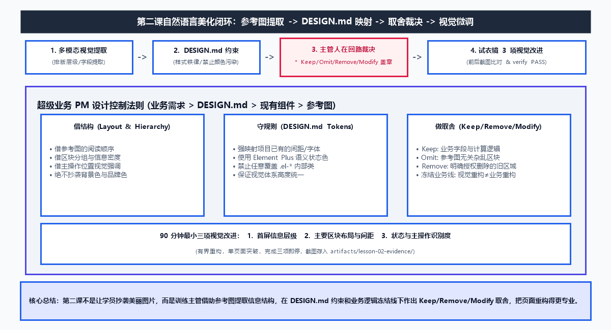

# 第二课学员指南：用参考图与设计规则做出像样的企业页面

欢迎来到第二课！在第一课中，你已经建立了属于自己的系统页面雏形。这节课，我们将学习如何使用脱敏参考图和项目 `DESIGN.md`（设计规范护栏），把粗糙的雏形重构为好看、规范、符合企业级水准的高颜系统页面！

---

## 0. 本课教学目标 (Learning Objectives)

完成本课学习后，你将能够：
1. **阐述** AI Token 概率猜测机制导致的“生成随机性”，以及如何用确定的 Design Token 规范强制收敛 AI 的随机挥发。
2. **应用** 多模态（Multimodal）Agent 能力，从视觉参考图中仅提取布局结构与主次焦点，100% 禁用参考图的杂乱背景色与字体。
3. **点开与查阅** `DESIGN.md` 中的设计字典，将组件样式 100% 映射至项目的 `--art-*` 设计变量。
4. **执行** Keep / Omit / Remove / Modify 裁决矩阵，划定业务逻辑冻结线，确保视觉美化零破坏业务逻辑。
5. **运用** Git 3 步可视化安全防护法（`Commit` 节点存档、`Diff` 红绿监视、`Discard` 1秒无损读档），锁定版本证据并获得脚本验证 `[PASS]`。

---

### 视觉重构闭环线框图 (Visual Refactoring Wireframe)

```text
+-----------------------------------------------------------------------------------+
|                         第二课 视觉重构四步闭环                                   |
|                                                                                   |
|  [Task 1: 结构提取] -> [Task 2: 规范映射] -> [Task 3: 裁决与授权] -> [Task 4: 微调与验收] |
|                                                                                   |
|   - 多模态看布局          - 物理点开 DESIGN.md   - Keep / Omit        - 试衣镜对比      |
|   - 100% 过滤杂色         - 优先 --art-* Token  - Modify 3项        - 脚本验证 PASS   |
|   - 业务能力迁移          - 字典映射不硬编码     - Git 节点1存档 Save  - Git 节点2完结存档 |
+-----------------------------------------------------------------------------------+
```

一句话记住视觉美化铁律：
> **参考图只借布局和视觉主次，绝不继承杂色与字体；重构样式绝对不等于修改业务逻辑！**



---

## 1. 核心概念【硬核四步解析卡】

在开始视觉重构前，请认真阅读以下 4 个核心概念的硬核解析：

### ① AI Token 及其输入/输出猜测机制 (Input/Output Token Guessing)
* **硬核工程定义**：AI Token 是大语言模型处理文本与多模态图像的最小离散运算单元（字元/词块）。
* **底层运作机制**：人类喂给 Agent 的 Prompt 和图片会被切碎成上千个 **Input Token（输入词块）**。Agent 基于这些 Input Token，进行极其复杂的概率采样计算，不断去**猜测**并吐出下一个最合适的 **Output Token（输出词块）**。
* **具象业务比喻**：AI 就像一个**天马行空的画家**。因为它是“按概率猜下一个词/颜色”，所以让它画按钮，它这次可能猜出 `#1890ff`，下次可能猜出 `#3b82f6`，这就导致了 UI 样式的随机挥发与失控。
* **IT 沟通与交接价值**：向 IT 说明：“我们理解 LLM 输出来源于概率采样，因此必须在前端构建确定性的约束层来限制 Token 猜想”。

### ② Design Token (设计令牌/规范变量)
* **硬核工程定义**：设计系统中将具体物理视觉数值（如 Hex 色值 `#1890ff`、像素值 `16px`）抽象并封装为具业务语义的标准化 CSS/SCSS 变量（如 `--art-primary`、`--art-spacing-md`）。
* **底层运作机制**：在项目 `DESIGN.md` 中建立全站统一的全局变量映射字典。Agent 生成代码时，禁止使用硬编码色值，必须调用 `var(--art-primary)`。
* **具象业务比喻**：它是发给 AI 画家的 **“固定调色盘与戒尺”**。我们强行用确定的业务规范（Design Token）死死收敛 AI 算力词块（AI Token）的随机猜测！
* **IT 沟通与交接价值**：向 IT 说明：“原型视觉样式 100% 映射至 `--art-*` Design Tokens，支持主题全局一键切换，无硬编码废料”。

### ③ Agent 多模态能力与业务能力迁移 (Multimodal Capabilities)
* **硬核工程定义**：模型同时具备处理文本和高维图像 Token 的交叉注意力机制（Cross-Attention），能够直接解构图像中的空间布局、组件边界与视觉层级。
* **底层运作机制**：上传的脱敏参考图被切碎为视觉 Vision Tokens，Agent 提取出 DOM 布局树结构，但过滤掉图像中的物理像素色彩。
* **具象业务比喻**：这是 Agent 戴上的 **“多模态眼睛”**。它看参考图只看“骨架（布局）”，不看“皮肉（杂色）”。
* **IT 沟通与交接价值**：向 IT 说明：“该能力可无缝迁移至业务场景——日常工作中主管可拍竞品截图、纸质单据照片或白板草图发给 Agent，直接提炼业务结构”。

### ④ Git 版本证据与 SL 游戏存档大法 (Git Version Evidence)
* **硬核工程定义**：分布式版本控制系统，通过指针记录项目树在特定时间点的快照（Snapshot）与增量补丁（Diff）。
* **底层运作机制**：`git commit` 生成不可变哈希点；`git diff` 计算当前工作区与上次快照的行级差异；`git restore / discard` 将工作区指针重置到上一个 Commit 点。
* **具象业务比喻**：这是代码界的 **“SL 游戏存档大法 (Save & Load)”**：
  - **`Git Commit`** 相当于 **【节点手动存档 Save】**：锁定时稳定版本；
  - **`Git Diff`** 相当于 **【装备属性对比】**：监视 AI 动作，防止误删代码；
  - **`Git Discard`** 相当于 **【一键读档 Load】**：AI 改崩代码，1 秒还原！
* **IT 沟通与交接价值**：向 IT 说明：“主管具备 Git 版本审计能力，所有的改动均有 Commit 证据记录，且可通过补丁快照进行版本回滚”。

---

## 2. Task 1：视觉结构提取卡 (15 分钟)

**目标**：利用 Agent 的多模态眼睛，提取脱敏参考图的首屏布局与视觉主次，禁止复制杂色。

### 复制并发送给 Agent：
```text
请读取项目中的参考图卡文件：
- docs/assets/lesson-02/ref-monitor-decision.png (或 ref-task-workflow.png / ref-operation-tool.png)

请帮我分析这张参考图的视觉结构，并列出：
1. 首屏的整体布局（如顶部 KPI 栏、左右双栏、三段式卡片流）
2. 页面中视觉最醒目的核心模块（主视觉焦点）
3. 次要信息与操作区域的排布规律

注意：请只提取布局和结构，不要使用参考图中的任何背景颜色、字体或杂乱样式。
先不要修改代码，只输出分析结果。
```

🚩 **本步检查 (Checklist)**：
- [ ] Agent 识别出了首屏布局与视觉主次焦点。
- [ ] Agent 明确承诺只借用结构，不复制杂色。

---

## 3. Task 2：设计规范映射卡 (15 分钟)

### 👁️ 动手物理阅读：点开 `DESIGN.md` 感受 Design Token
**请在左侧文件树中点击打开 `DESIGN.md` 文件**。你会看到里面并没有长篇大论，而是像查字典一样的“键值对”：
- 看到 `--art-primary: #1890ff` 了吗？这就是 **Design Token（设计令牌）**。
- `--art-primary` 是**令牌名（代表业务语义，比如“品牌主色”）**，`#1890ff` 是**实际色值**。
- **业务价值**：如果有一天公司品牌升级要换成“中国红”，程序员绝对不需要去几十个页面里查找替换，只需要在这个 `DESIGN.md` 字典里修改一处，全站瞬间自动变色！
- **用 Token 管控 AI**：因此，我们绝不能让 AI 写死颜色，必须强制它去“查这个字典”，引用 `--art-primary`。

### 复制并发送给 Agent（规范映射 Prompt）：
```text
现在，请戴上眼睛读取项目中的设计规范文件：
- DESIGN.md
- docs/COMPONENT_CATALOG.md

请将 Task 1 提取的结构与 DESIGN.md 进行映射，说明：
1. 页面背景、卡片容器与文字颜色如何映射到已有的 --art-* 变量
2. 间距与圆角如何符合 8/12/16/24px 规范
3. 哪些区域可以直接复用现有组件库中的结构（如 ElCard, ElTag, ElButton）

注意：不得虚构不存在的 Token，不得新建样式库。先不要修改文件，只输出映射方案。
```

🚩 **本步检查 (Checklist)**：
- [ ] 所有颜色与样式均显式映射到 `--art-*` 规范。
- [ ] 未产生硬编码颜色与自定义 CSS 变量。

---

## 4. Task 3：Keep / Modify 裁决矩阵与安全重构 (10 分钟)

**目标**：划定业务逻辑冻结线，完成节点 1 存档，并授权 Agent 执行视觉重构。

### 🎮 节点 1 存档动作（在下达授权口令前执行）：
打开 PowerShell 终端，依次运行以下安全存档指令：
```powershell
git status
git add .
git diff --cached
git commit -m "baseline: complete lesson 1 prototype"
```

### 复制并发送给 Agent（主管裁决与授权模板）：
```text
针对第二课页面美化，我的裁决如下：

1. Keep (保留并冻结现有业务内容)：
【填写第一课页面中必须保留的字段、模拟数据与计算逻辑】

2. Omit from Reference (参考图忽略项)：
【填写参考图中不需要复制的无关图表或修饰元素】

3. Remove from Current Page (现有页面清理项)：
【填写第一课页面中粗糙无用的临时占位文本】

4. Modify (明确进行的 3 项视觉改进)：
(1) 重构首屏视觉层级，突出核心区域
(2) 优化卡片布局与 16/24px 间距
(3) 提升关键状态与核心操作按钮的显眼度

请复述你理解的重构范围。在得到我回复“同意方案，请开始修改代码”前，不要修改文件。
```

收到 Agent 复述无误后，发送盖章口令：
👉 **`同意方案，请开始修改代码`**

### 🚨 监视与一键读档救急（Diff & Discard）：
- **查看 Diff**：点击侧边栏变更文件，监视红绿修改，确保没有误删业务代码；
- **一键读档**：万一 AI 改崩代码，在 VS Code 源代码管理面板中找到该文件，点击右侧的 **Discard Changes (放弃更改 / 撤销图标)**，1 秒恢复修改前状态！

---

## 5. Task 4：视觉对比与证据验收 (10 分钟)

1. 刷新 `http://127.0.0.1:8888` 试衣镜，对比重构前后效果。
2. **🎨 运行设计规范审计 (可选扩展)**：向 Agent 发送指令 `请使用 /design-lint 审计当前页面是否包含硬编码杂色`，获取自动化合规报告。
3. 发起 1 次人在回路微调（例如：“请将核心按钮改为 Primary 样式，卡片间距增至 24px”）。
4. 在 PowerShell 中运行自动化校验脚本：
   `powershell -ExecutionPolicy Bypass -File .\scripts\verify-student-project.ps1`
5. 确认输出 `[PASS]`，截屏保存成果至 `local-backups/lesson-02-evidence/lesson-02-screenshot.png`。
6. **🎮 节点 2 完结存档动作**：
   在 PowerShell 终端运行：
   ```powershell
   git add .
   git commit -m "style: complete lesson 2 visual refactor"
   git log --oneline -5
   ```

---

## 6. 学员课后记忆卡与退场测试

### ✍️ 学员概念互动填空：
1. **AI 输出随机性**：由于 AI 本质上是在不断猜测下一个 ____________，因此色彩会随机挥发，需要使用确定的 ____________ 来伺候约束。
2. **Design Token**：在 `DESIGN.md` 中，`--art-primary` 是 ____________，`#1890ff` 是 ____________。这种映射关系的业务价值是 ____________。
3. **Git SL 存档**：`Git Commit` 相当于游戏里的 ____________，`Git Discard` 相当于游戏里的 ____________。

### 💡 常见概念误区与正确理解：
| 常见误区 (Misconception) | 正确硬核理解 (Correct Understanding) | 如何纠偏与防护 |
| :--- | :--- | :--- |
| **“美化页面就是把参考图的颜色抄过来”** | 绝不能抄参考图杂色！参考图只借布局主次，色彩 100% 由 `DESIGN.md` 的 Token 决定。 | 发送 Task 2 映射 Prompt，强制声明只能使用 `--art-*` 变量。 |
| **“美化页面会让第一课的业务字段减少”** | 视觉重构绝对不能改变业务逻辑。必须通过 Keep 矩阵冻结业务字段。 | 在 Task 3 中显式填写 Keep 矩阵，锁定第一课字段。 |

---

## 7. Exit Ticket (退场测试)

* **问题**：如果公司品牌大升级要将全站主题色从蓝色改成红色，使用了 Design Token 的系统需要修改几十个 Vue 页面文件吗？为什么？
* **答案**：不需要！因为组件引用的都是 `--art-primary` 这个令牌名（Token），只需要在 `DESIGN.md` 字典中修改一处色值代码，全站所有页面瞬间自动变色。这就是规范治理的核心业务价值。
