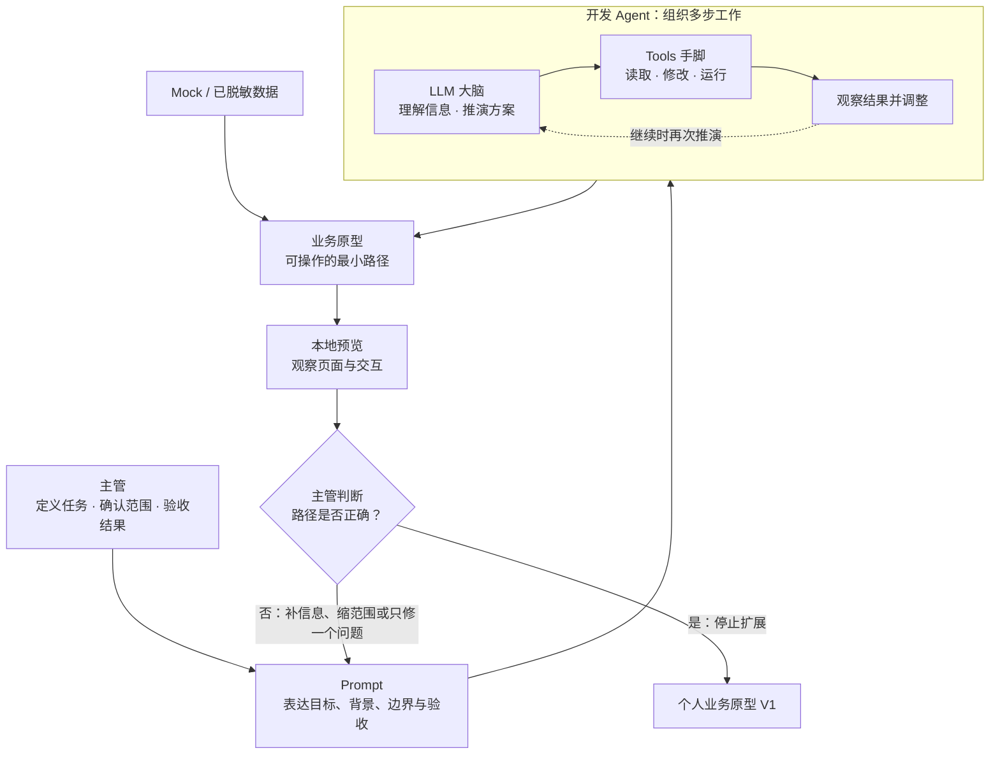

# 第一课学员指南（预览稿）——从业务问题到第一个受控原型

> **本课核心思想只有一句话：理解 LLM 大脑、Tools 手脚与 Agent 执行者的关系，并用这套协作关系建立第一个受控业务原型。**

## 一、先看懂：今天为什么学、要带走什么

### 先看一个区别

| 只在网页聊天框中提问 | 使用开发 Agent 制作原型 |
| --- | --- |
| 模型可以给出说明、方案或代码片段 | Agent 可以借助 Tools 读取项目、修改文件并运行结果 |
| 你得到的是一份候选回答 | 你在本地预览中得到一条可操作的业务路径 |
| 回答是否正确仍需核对 | 做出的页面和业务路径同样需要主管验收 |

今天你要完成“个人业务原型 V1”。它不是完整系统，也不规定页面数量；只要能用 Mock（虚构）或已脱敏数据，真实操作一条核心业务路径，并看到结果或状态变化即可。一个页面能完成就做一个页面，确实需要两个页面才能说清也可以，不为“像系统”而堆页面。

### 本课的受控原型闭环

```text
说清业务任务 → LLM 理解与推演 → Tools 读取项目事实 → 主管确认范围
→ Agent 实施 → 本地预览观察 → 主管验收或只修一个问题 → 停止扩展
```

“受控”不是指一句提示词已经形成系统硬门禁，而是你始终承担三项责任：定义业务任务、确认本轮范围、验收实际结果。

### 本课融合心智模型

这张图是整课的工作模型，不是课堂时间表。



### 四个必须掌握的概念

今天直接沿 Task 1—4 看见四个概念：Task 1 让模型复述和规划，Task 2 观察工具读取结果，Task 3 观察实际修改与运行，Task 4 由主管验收一条业务路径。主管不是旁观者，而是决定建什么、建到哪里、结果是否合格的人。

#### 1. 大语言模型（LLM）：大脑

- **是什么**：根据当前上下文推演并生成文字、方案或代码雏形的“概率大脑”。
- **怎么用**：作为智囊参谋，用于快速头脑风暴、生成初版方案与辅助梳理思路；由主管负责审阅与裁决。
- **避坑红线**：严禁直接赋予其真实系统的修改权限，绝不能把模型推演出的内容不经核验直接当作事实。

#### 2. Tools：手脚

- **是什么**：系统向 AI 开放的受控操作通道（如读取指定文件、运行测试命令、操作浏览器截图等）。
- **怎么用**：按需授权 AI 查阅代码、修改草稿或采集测试证据，让“思考”转化为具体操作。
- **避坑红线**：严禁开放无限制的系统最高权限；工具调用成功仅代表技术执行完成，不等于业务正确。

#### 3. AI Agent

- **是什么**：以 LLM 为控制器、以规则为约束、以 Tools 为通道，围绕既定目标自主组织多步行动的执行系统。
- **怎么用**：下达结构化目标与约束条件，让其自主完成“拆解步骤 → 调用工具 → 观察结果 → 迭代调整”的完整流程。
- **避坑红线**：严禁当甩手掌柜；Agent 无法独立承担管理责任，关键节点必须保留人工确认。

#### 4. 业务原型：样板间

- **是什么**：用可操作界面、模拟数据和有限路径表达假设的“样板间”，不是生产系统。
- **怎么用**：以极低成本让团队和 IT 提前看见未来软件的交互与逻辑，加速需求对齐与产品决策。
- **避坑红线**：严禁把原型直接当成上线系统，原型能跑通不代表具备高并发、数据安全与容灾能力。

**Prompt** 是主管表达任务的工具，不作为第五个核心概念。**ReAct** 是“执行一个动作—观察结果—根据结果调整”的现象，本课只要求能认出来；它不保证 Agent 一定能自动修好问题。

## 二、准备好：选择一个原型起点并打开本地预览

只选择一种起点，不要同时做三种。这只是第一课的暂定起点，不是对部门全部业务的永久分类。

| 类型 | 适合的主要动作 | 最小路径 | 例子 |
| --- | --- | --- | --- |
| **A 监控与决策型** | 看状态、发现异常、作出判断 | 查看状态 → 发现对象 → 查看信息 → 记录判断或后续动作 | 经营分析、库存异常、履约预警 |
| **B 任务与流程型** | 处理任务并改变状态 | 查看或创建任务 → 打开任务 → 执行处理 → 状态变化 | 工单、退货、预算申请、任务派发 |
| **C 操作工具型** | 输入内容、按规则处理、得到结果 | 输入 → 执行 → 规则处理 → 显示并确认结果 | 规则计算、格式转换、清单生成 |

选择困难时：主要动作是“看和判断”选 A；“处理并改变状态”选 B；“输入、规则处理、输出”选 C。

打开本地预览：双击项目根目录的 `start-project.bat`；如教师要求使用终端，可运行 `npm run dev`。浏览器未自动打开时访问 `http://127.0.0.1:8888/`。超过 3 分钟仍打不开，请助教接管。页面能显示只说明环境可用，不代表业务正确。

## 三、动手做：四步建立第一个受控原型

### Task 1：只让 LLM 理解和推演

**本步目的**：观察 LLM 能够理解和规划，但尚未读取或修改项目。只复制你选择的一个分支。

**复制提示词——A 类：监控与决策型**

```text
我要创建一个“A类：监控与决策型”业务原型。

我的业务输入：
- 原型名称：【填写】
- 主要使用者：【填写】
- 关注的业务对象：【填写】
- 使用场景或触发条件：【填写】
- 需要看到的状态、指标或异常：【填写】
- 看到异常后要完成的一项动作：【填写】
- 希望看到的最终结果：【填写】
- 本轮明确不做：【填写】

请先不要读取项目文件，不要调用修改或运行工具，也不要创建任何文件。
请只完成以下内容：
1. 用业务语言复述使用者、场景、核心动作和结果；
2. 提出一条最小路径：查看状态或指标 → 发现对象 → 查看相关信息
   → 记录一个判断或后续动作 → 显示结果；
3. 指出仍不确定、需要我确认的内容；
4. 列出本轮明确不做的内容。

不要假装已经看过项目结构，也不要自行补充真实业务事实。
```

**复制提示词——B 类：任务与流程型**

```text
我要创建一个“B类：任务与流程型”业务原型。

我的业务输入：
- 原型名称：【填写】
- 主要使用者：【填写】
- 需要处理的任务或记录：【填写】
- 使用场景或触发条件：【填写】
- 任务开始时的状态：【填写】
- 需要执行的一项处理动作：【填写】
- 执行后应该看到的状态或结果：【填写】
- 本轮明确不做：【填写】

请先不要读取项目文件，不要调用修改或运行工具，也不要创建任何文件。
请只完成以下内容：
1. 用业务语言复述使用者、任务、处理动作和状态变化；
2. 提出一条最小路径：查看或创建任务 → 打开任务 → 执行一次处理
   → 状态变化 → 显示结果；
3. 指出仍不确定、需要我确认的内容；
4. 列出本轮明确不做的内容。

不要假装已经看过项目结构，也不要自行补充真实业务事实。
```

**复制提示词——C 类：操作工具型**

```text
我要创建一个“C类：操作工具型”业务原型。

我的业务输入：
- 原型名称：【填写】
- 主要使用者：【填写】
- 使用者需要输入的内容：【填写】
- 使用场景或触发条件：【填写】
- 明确的处理规则或动作：【填写】
- 希望输出的结果：【填写】
- 使用者确认结果后要做什么：【填写】
- 本轮明确不做：【填写】

请先不要读取项目文件，不要调用修改或运行工具，也不要创建任何文件。
请只完成以下内容：
1. 用业务语言复述输入、规则、输出和使用者动作；
2. 提出一条最小路径：输入内容 → 点击执行 → 按规则处理
   → 显示结果 → 确认、复制或重置；
3. 指出仍不确定、需要我确认的内容；
4. 列出本轮明确不做的内容。

不要假装已经看过项目结构，也不要自行补充真实业务事实。
```

**你应该看见**：模型复述了你的业务、提出一条最小路径，并标出不确定信息，但没有声称已经看过项目。

**本步检查**：复述基本正确；只有一个主要业务动作；猜测没有被写成事实；本步没有读写项目。

**必须停止**：如果 Agent 已使用读取、修改或运行工具，立即停止这一轮，请教师查看实际发生了什么。文字中的“不要修改”是任务要求，不等于系统一定存在硬拦截。

### Task 2：让 Tools 读取项目事实

**本步目的**：让模型的初步设想接受项目事实校正，但仍不实施。

**复制提示词**

```text
现在请只读取完成本课原型所需的最小项目资料，不要创建或修改文件。

优先确认并读取：项目根目录说明或约束文件、DESIGN.md、
docs/COMPONENT_CATALOG.md、实际路由入口、实际布局或页面入口（存在时）。

要求：
1. 文件不存在就明确报告，不要编造；
2. 告诉我真实技术栈、可复用组件和页面入口；
3. 根据读取结果修订最小路径；
4. 列出拟创建或修改的文件及必要性；
5. 一个页面能完成就不要拆分；
6. 本步只读取和汇报，不创建、修改或运行项目。
```

**你应该看见**：真实读取结果、存在与不存在的文件、可复用内容、修订后的路径和拟修改文件清单。

**本步检查**：新方案引用项目事实；拟修改文件都有必要性；文件数量和页面数量没有无故扩大。

**必须停止**：如果 Agent 编造文件内容、已经创建或修改文件，停止本轮并要求列出真实动作和证据。

### Task 3：主管裁决范围，让 Agent 实施

**本步目的**：先把业务路径与修改范围说清楚，再让 Agent 只实现这一条路径。

**复制提示词——先裁决范围**

```text
根据你的复述和项目读取结果，我确认本轮范围如下：
1. 必须完成的一条核心业务路径：【填写】
2. 必须保留的业务字段、状态或规则：【填写】
3. 本轮明确不做：【填写】
4. 允许修改的项目范围：【确认或删减 Agent 的真实文件清单】
5. 我的点击验收方法：【填写】

请先复述实施范围并指出矛盾或缺失。在我确认复述无误前，不要实施。
```

确认没有多做页面、加入 AI 功能、连接真实接口、改变字段含义或扩大文件范围后，再复制：

```text
确认按刚才复述的范围实施。

要求：只完成一条已确认路径；页面数量由路径决定；至少有一次真实可观察的
点击、输入输出或状态变化；只使用并标明 Mock/已脱敏数据；不连接真实数据库、
业务 API、模型服务或外部系统；不加入聊天框、AI 推荐、自动决策或业务 Agent；
优先复用已有技术栈和组件，不随意增加依赖；不改变已确认的字段和规则。

完成后如实报告：实际修改文件、打开方法、点击验收路径、仍为 Mock 的内容、
明确未实现项，以及实际运行过的工程检查和结果。未运行的不要声称通过。
```

**你应该看见**：Agent 只在确认范围内实施；原型可以打开，并至少发生一次可观察的点击、输入输出或状态变化。

**本步检查**：数据标识清楚；没有加入业务 AI；实际文件与完成报告一致；你能够按自己写下的点击方法验收。

**必须停止**：出现真实数据、真实接口、字段含义改变、范围外文件或新增业务 AI 功能时，立即停止并请教师处理。

### Task 4：观察结果并只修一个问题

**本步目的**：用业务视角验收结果，只修正一个最影响理解或操作的问题，然后停止扩展。

先回答四问：谁使用？在什么情况下使用？完成什么动作？最后看到什么结果？

**复制提示词**

```text
我在本地预览中发现一个最需要修正的问题：【填写】

请先说明问题原因、准备修改的内容，以及哪些已确认业务内容不会改变。
等我确认后只修这一项。完成后重新说明预览和验收方法，并如实报告
实际运行过的工程检查；不要声称不存在或未运行的脚本已经通过。
```

**你应该看见**：Agent 先说明修改边界，只修这一项；重新预览后，问题得到改善且原业务路径仍可操作。这就是 ReAct 的入门体验。

**本步检查**：四问能说清；修正前后差异可见；没有顺手增加第二条路径或新功能。

**必须停止**：修正引发新错误、范围继续扩大或 Agent 无法说明真实检查结果时，停止继续自动修改，请教师介入。

核心路径通过后，让 Agent 根据本次对话创建或更新 `docs/PROJECT_STATE.md`，只记录原型名称、使用者、A/B/C 类型、本课路径、数据状态和未实现项。它是下一课的项目交接单，不是第二份主要作业；只需核对它与原型一致。

## 四、守住边界：安全红线、常见误区与问题处理

### 四条安全与真实性红线

- **数据与密钥**：不输入真实客户、员工、订单、金额、内部经营数据、Token、API Key 或真实账号；只使用 Mock/已脱敏数据。
- **权限与控制**：不把"Agent 答应不修改"或"主管确认"说成企业级 Workflow、人在回路授权门禁（HITL）、沙箱硬拦截或合规控制；真实能力以当前环境为准。
- **结果与验证**：不把 ReAct、构建或脚本结果说成“一定自动修好”或“业务已正确”；主管仍需验收路径。
- **能力与交付**：不声称连接了实际未连接的数据库、API、模型或自动化；本课原型不是生产系统。

### 五个常见误区

| 误区 | 正确理解 |
| --- | --- |
| 网页聊天框里的模型就是 Agent | LLM 生成候选内容；Agent 还要组织 Tools 执行动作 |
| 有 Tools 就权限无限、绝对安全 | 工具种类、授权和隔离取决于实际环境 |
| 一句“先确认再修改”就是硬门禁 | 它是工作方法；是否有运行时拦截要看真实系统 |
| 页面或脚本通过就说明业务正确 | 工程证据不能替代主管的业务验收 |
| 原型完成就是生产系统完成 | 原型只验证当前薄路径，仍使用 Mock/脱敏数据 |

### 遇到问题时只按五类处理

| 问题类型 | 先做什么 |
| --- | --- |
| **选型或范围失控**：不会选 A/B/C、路径太大、页面过多 | 按主要动作重新选型，只保留一个使用者、一个动作、一个可见结果 |
| **Agent 越阶段或编造事实**：Task 1 已改文件、声称读过不存在文件 | 立即停止，要求列出真实动作与证据，请教师判断恢复或继续 |
| **原型结果无效**：静态展示、状态不变、业务路径错误 | 优先修核心动作和结果；一次只修一个问题，不先修颜色 |
| **环境或验证卡住**：3 分钟打不开、检查无法完成 | 助教接管或换备用起点；记录未验证，不虚构 `[PASS]` |
| **出现真实或敏感数据** | 立即停止传播和操作，请教师处置并换成 Mock；不要声称已自动脱敏 |

## 五、证明会了：成果验收与随堂测试

### 成果验收

- **原型线**：原型能打开；一条核心路径能操作并看到结果；数据标识清楚；不以页面数、视觉精致度或需求完整度判定。
- **主管线**：能指出 LLM、Tools、Agent 分别做了什么，并说明主管负责业务定义、范围确认和结果验收。
- **交接单**：`PROJECT_STATE.md` 与当前原型基本一致，但不能抵消前两条线的未通过。

一句话记忆：**主管用 Prompt 说清任务，LLM 负责理解和推演，Tools 负责读取、修改与运行，AI Agent 把动作组织起来；主管最后通过本地预览验收业务原型。**

必答题可以在对应 Task 后随手完成，最后只需检查并提交。

### 必答题（5 题）

1. LLM 根据当前输入和上下文生成候选内容，本质上属于具有不确定性的 ____________ 模型。
2. 当 Agent 读取文件或运行命令时，真正执行外部动作的是宿主环境提供的 ____________。
3. 实施前，主管应确认核心路径、修改范围和 ____________；这种确认不自动等于运行时硬门禁。
4. 如果 Agent 声称某项检查 `[PASS]`，你至少应看到真实的 ____________ 和 ____________。
5. 如果 Agent 在 Task 1 就修改了项目文件，它违反了什么阶段边界？你接下来怎样处理？

### 拓展题（选做，2 题）

1. 为什么“LLM 能生成代码”和“Agent 能修改项目”不是同一件事？请用“大脑—手脚—执行者”说明。
2. 用一句话说明你的原型属于 A/B/C 哪一类、解决什么问题，以及为什么当前只做这一条路径。

### 参考答案

1. 概率生成（或概率预测）。
2. Tools / 工具调用接口。
3. 本轮明确不做的内容（非目标或停止范围）。
4. 实际运行的命令；对应的真实输出或日志。
5. 违反 Task 1“只推演、不使用项目工具”的边界。立即停止，要求 Agent 列出真实动作和改动，请教师根据实际状态决定恢复或继续。

## 六、带到下一课：只准备一个视觉问题

本课主成果应在课堂内完成。课后只做 10—15 分钟准备，不继续开发功能：

1. 找一张与你业务原型相关的视觉参考图；
2. 写一句“下一课最想改善的视觉或使用问题”。

下一课会在不扩大业务范围的前提下，让现有原型变得更清楚、更容易使用。
