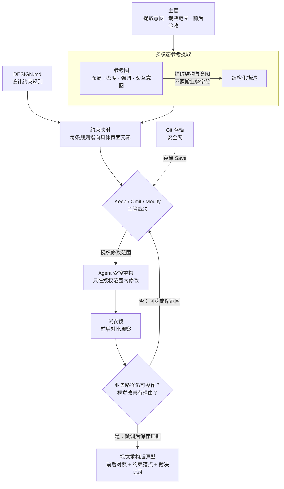

# 第二课学员指南——让原型变得清楚、可信、能用

> **本课核心思想只有一句话：**
> **不要用口头凭空描述 UI，用参考图提取意图、设计约束锚定规则、Keep/Omit/Modify 裁决范围，再用前后对比证明改变。**

## 一、先看懂：今天为什么学、要带走什么

### 先看一个区别

| 第一课的粗糙原型 | 视觉重构版原型 |
| --- | --- |
| 功能能用，但界面土气、排版混乱、色彩冲突 | 功能不变，但信息层级清楚、布局合理、操作明确 |
| "我觉得不好看"但说不清为什么 | 能说出每处改变的业务理由，并用前后对比证明 |
| 口头描述"要高端大气"导致 AI 随机套用高饱和度颜色 | 用参考图提取意图、用设计约束锚定规则，AI 输出可控 |

今天你要完成"视觉重构版个人原型"。它不是重新做，而是让第一课的原型变得更清楚、更可信、更能用。你不增加业务功能，只改善信息层级、布局、状态表达和操作清晰度。完成后你要带走：前后对照截图、3—5 条设计约束及其页面落点、以及你的 Keep/Omit/Modify 裁决记录。

### 本课的视觉重构四步闭环

```text
参考图多模态提取 → 设计约束映射 → 主管 Keep/Omit/Modify 裁决 → 受控重构与微调验收
```

"受控"不是指一句提示词形成了系统硬门禁，而是你始终承担三项责任：提取意图而非照搬、裁决范围而非交给 Agent 猜、用前后对比证明改变而非只说"更好看了"。

### 本课融合心智模型

这张图是整课的工作模型，不是课堂时间表。



### 五个必须掌握的概念

把今天的视觉重构想成装修一套二手房：先看样板房提取意图（多模态参考提取），把意图写成施工规则（设计约束映射——视觉规则写进 DESIGN.md，行为规则写进 CLAUDE.md/AGENTS.md），决定哪些墙保留、哪些拆除、哪些改造（Keep/Omit/Modify），施工后用前后对比照片证明每处改变有理由（视觉证据基线）。而决定什么先被看到，是装修的第一步（信息优先级与视觉层级）。

#### 1. 信息优先级与视觉层级

- **是什么 / 不是什么**：重要信息应先被看到，层级服务业务判断；不是装饰美化，也不是把所有信息一样大。
- **怎样运作**：通过位置、大小、对比度和间距控制信息被看到的顺序；用户第一眼看到的内容决定他能否快速做判断。
- **类比与反例**：超市货架的视线层——最需要顾客看到的商品放在与眼睛平齐的高度；如果把所有商品都放同一层，顾客反而找不到重点。
- **今天怎样看见**：Task 1 从参考图提取结构时，第一个要问的是"这张图里什么最先被看到"。

#### 2. 多模态参考提取

- **是什么 / 不是什么**：从参考图提取结构、密度、颜色和交互意图；不是像素级照抄，也不是直接复制参考图的业务字段和数据。
- **怎样运作**：AI 联合分析文本与图像，将视觉布局转化为结构化描述；提取的是"为什么这样排"的意图，而非"长什么样"的表象。
- **类比与反例**：建筑设计师的现场测绘拍照——看到一套优质精装房，拍照后在图纸上按比例复刻其硬装结构，但不会搬走房主家的家具。
- **今天怎样看见**：Task 1 你会看到 AI 如何从参考图提取布局结构，而不是照搬颜色和字体。

#### 3. 设计约束映射

- **是什么 / 不是什么**：把参考意图写成可核对规则，并指出规则落在哪个页面元素；同时确认 Agent 在改代码前读取行为约束文件。不是写 CSS 代码，也不是直接改页面；也不是手写 CLAUDE.md 全文。
- **怎样运作**：有两类约束文件 Agent 在生成前必须读取——视觉约束（`DESIGN.md`：间距、圆角、颜色层级）和行为约束（`CLAUDE.md` 或 `AGENTS.md`：包管理器、文件边界、错误处理）。视觉约束用参考图映射后由主管核对；行为约束用 `/init` 生成基础版后由主管核对。规则必须指向具体页面元素或具体行为红线。
- **类比与反例**：乐高积木的标准规格颗粒与品牌字典——视觉约束像统一规格颗粒（改一处 Token 全站变色），行为约束像施工安全守则（不许动承重墙、只用指定工具）；两类规则都贴在工地入口，工人进场前必须看。
- **今天怎样看见**：Task 2 你会把提取的结构映射到 `DESIGN.md` 的 `--art-*` 变量，并确认每条约束指向具体页面元素；同时核对 `CLAUDE.md`（或 `AGENTS.md`）的行为约束是否覆盖三条关键红线。

#### 4. Keep / Omit / Modify

- **是什么 / 不是什么**：主管对参考内容作保留、舍弃和改造裁决；不把决定交给 Agent 猜，也不是全部照搬或全部重做。
- **怎样运作**：逐项审视参考图中的每个元素，判断"保留并冻结现有业务内容""参考图忽略项""现有页面清理项"和"明确进行的视觉改进"。
- **类比与反例**：装修方案的取舍——保留承重墙（Keep）、去掉不适合自己家庭的装饰（Omit）、把书房改成儿童房（Modify）；不能把整套方案照搬回家。
- **今天怎样看见**：Task 3 你会逐项作 Keep/Omit/Modify 裁决，并说明每项的业务理由。

#### 5. 视觉证据基线

- **是什么 / 不是什么**：用前后对照和理由证明改变；不只说"更好看了"，也不依赖主观感受。
- **怎样运作**：重构前截图作为基线，重构后截图作为对照，每处改变附理由；业务路径在视觉修改后仍可操作。
- **类比与反例**：装修前后的对比照片——每面墙的变化都有原因，不是为了变而变；如果装修后水管不通了，再好看也失败。
- **今天怎样看见**：Task 4—5 你会在试衣镜中做前后对比，确认业务路径仍可操作，并保存视觉证据。

**设计令牌（Design Token）** 把颜色、间距、字号等重复规则统一命名；教师一句话说明，不作为本课工程重点。**行为约束文件 CLAUDE.md/AGENTS.md** 是原第五课迁移来的扩展认识：Agent 在修改代码前强制读取的行为约束文件，约束包管理器、文件边界和错误处理等行为红线。用 `/init` 可自动生成基础版。主管不手写全文，只核对关键红线是否覆盖。类比施工安全守则——工人进场前必须看。**版本节点** 保留批准前后候选差异的记录；不要求你掌握 Git 命令，但每次大改前先存档、改崩了一键读档恢复的操作你要会用。

## 二、准备好：选择参考图并打开试衣镜

### 选择参考图

确认工程中存放的参考图卡文件：

- `docs/assets/lesson-02/ref-monitor-decision.png`（或 `ref-task-workflow.png` / `ref-operation-tool.png`）

选择与你第一课原型业务最相关的一张。参考图用来提取布局意图，不是照搬其中的业务字段和数据。

### 打开试衣镜

1. 打开 VS Code 左侧文件树，双击点开根目录下的 `DESIGN.md`，确认包含小写 CSS Tokens（如 `var(--art-primary)`）。
2. 打开本地试衣镜：双击项目根目录的 `start-project.bat`；如教师要求使用终端，可运行 `npm run dev`。浏览器未自动打开时访问 `http://127.0.0.1:8888/`。
   ```powershell
   npm run dev
   ```

> **规范说明 vs 运行时定义**
> `DESIGN.md` 是项目的视觉规范说明书 (Design Harness)；而真正被浏览器加载的物理 CSS 变量保存在 `src/assets/styles/tailwind.css` 中。组件统一使用小写 `var(--art-primary)`，写成大写 `var(--art-PrimaryBad)` 会导致浏览器无法解析。

确认第一课原型仍可操作。页面能显示只说明环境可用，不代表业务正确。超过 3 分钟仍打不开，请助教接管。

### 确认行为约束文件

确认项目根目录有 CLAUDE.md 或 AGENTS.md 行为约束文件。若不存在，在 CLI 中运行 /init 自动生成基础版，包含包管理器约束、文件边界和错误处理原则。你不需要手写全文，只核对三条关键红线是否覆盖：

1. 包管理器约束（只用 npm，不用 yarn/pnpm）
2. 文件边界（不碰 node_modules 和配置文件）
3. 错误处理原则（遇到报错先记录而非继续改）

## 三、动手做：视觉重构四步闭环

### Task 1：从参考图提取多模态布局与意图

**本步目的**：从参考图提取布局结构和交互意图，而非像素照抄。先不要修改代码，只输出分析结果。

**复制提示词**

```text
请读取项目中的参考图卡文件：docs/assets/lesson-02/ref-monitor-decision.png

请帮我分析这张参考图的视觉结构，并列出：
1. 首屏的整体布局（如顶部 KPI 栏、左右双栏、三段式卡片流）
2. 页面中视觉最醒目的核心模块（主视觉焦点）
3. 次要信息与操作区域的排布规律

注意：请只提取布局和结构，不要使用参考图中的任何背景颜色、字体或杂乱样式。先不要修改代码，只输出分析结果。
```

**你应该看见**：AI 输出描述了首屏布局、主视觉焦点和次要信息排布，没有照搬参考图的业务字段或颜色，也没有修改代码。

**本步检查**：提取的是布局意图而非表面样式；没有照搬参考图的业务内容；本步没有修改代码。

**必须停止**：如果 AI 照搬了参考图的业务字段或颜色，指明"提取的是布局意图，不是业务内容"后重新提取。如果 AI 已修改代码，立即停止并回退。

### Task 2：把提取结果映射为设计约束

**本步目的**：把 Task 1 提取的结构与 `DESIGN.md` 进行映射，每条约束指向具体页面元素。先不要修改文件，只输出映射方案。

**复制提示词**

```text
现在，请戴上眼睛读取项目中的设计规范文件：
- DESIGN.md
- docs/COMPONENT_CATALOG.md

请将 Task 1 提取的结构与 DESIGN.md 进行映射，说明：
1. 页面背景、卡片容器与文字颜色如何映射到已有的 --art-* 变量
2. 间距与圆角如何符合 8/12/16/24px 规范
3. 哪些区域可以直接复用现有组件库中的结构（如 ElCard, ElTag, ElButton）
4. 每条约束具体落在哪个页面元素上

注意：不得虚构不存在的 Token，不得新建样式库。先不要修改文件，只输出映射方案。
```

**你应该看见**：所有样式显式映射到 `--art-*` 变量；每条约束指向具体页面元素；没有虚构不存在的 Token。同时确认 `CLAUDE.md`（或 `AGENTS.md`）的行为约束覆盖了包管理器、文件边界和错误处理三条红线。

**本步检查**：约束指向具体页面元素而非抽象描述；没有虚构 Token；映射方案没有新建样式库；`CLAUDE.md`/`AGENTS.md` 行为约束覆盖三条关键红线。

**必须停止**：如果 AI 虚构了不存在的 Token，指明只允许使用 `DESIGN.md` 已有变量后重新映射。如果映射停留在抽象层，要求补充"落在哪个元素"。如果 `CLAUDE.md`/`AGENTS.md` 缺失，用 `/init` 生成基础版后再核对。

### Task 3：主管 Keep/Omit/Modify 裁决与授权

**本步目的**：对参考内容作 Keep/Omit/Modify 裁决，授权本轮修改范围。在得到你的"同意方案"前，Agent 不修改文件。

**节点 1 存档动作**：在 PowerShell 终端运行显式提交指令：

```powershell
git status
git add .
git diff --cached
git commit -m "baseline: before visual refactor"
```

> **SL 游戏存档大法**
> `提交节点（Git Commit）` 相当于 **节点手动存档 Save**：锁住稳定版本。
> `差异视图（Git Diff）` 相当于 **装备属性对比**：监视 AI 动作，防止误删代码。
> `Git Discard` 相当于 **一键读档 Load**：AI 改崩代码，在 VS Code 界面点击 1 秒无损还原！

**发送主管裁决与授权提示词模板**

```text
针对第二课页面美化，我的裁决如下：

1. Keep (保留并冻结现有业务内容)：
【第一课原型中所有显示的业务 ID、标题、状态与 Mock 数据】

2. Omit from Reference (参考图忽略项)：
【参考图中不需要复制的无关装饰线条或多余小图标】

3. Remove from Current Page (现有页面清理项)：
【第一课页面中粗糙无用的临时占位文本】

4. Modify (明确进行的 3 项视觉改进)：
(1) 重构首屏视觉层级，突出核心区域
(2) 优化卡片布局与 16/24px 间距
(3) 提升关键状态与核心操作按钮的显眼度

请复述你理解的重构范围。在得到我回复"同意方案，请开始修改代码"前，不要修改文件。
```

收到 AI 复述无误后，发送盖章口令：

```text
同意方案，请开始修改代码
```

**你应该看见**：AI 复述了你的裁决范围，等待你的同意口令后才修改。每项裁决都有业务理由，不只是"好看/不好看"。

**本步检查**：在下发修改口令前运行了 `git commit` 存档；裁决每项有业务理由；授权了明确修改范围。

**必须停止**：如果未存档就修改，先停止，补做存档再继续。如果 AI 在未得到同意口令前就修改了文件，立即停止并回退。

### Task 4：Agent 受控视觉重构与前后对比

**本步目的**：Agent 在授权范围内执行一次受控视觉重构，你在试衣镜中做前后对比。

**监视与一键读档救急 (Diff & Discard)**

- 在 VS Code 左侧第 3 个 Git 分支视图中监视红绿修改，确保未误删代码。
- 一旦改崩，右键点击该文件，选择 **Discard Changes (放弃更改)** 1 秒物理撤销恢复！

**代码 Before vs After 视觉对比**

```diff
  /* src/components/WorkOrderBoard.vue */
- background-color: #ff0000; /* 硬编码高饱和度红 */
+ background-color: var(--art-primary); /* 引入 DESIGN.md CSS Token */
+ border-radius: var(--art-radius-md);
```

**你应该看见**：Agent 只在授权范围内修改；业务路径仍可操作；前后差异可见。

**本步检查**：Agent 没有扩大修改范围；没有误删业务代码；业务路径仍可操作；前后差异可见。

**必须停止**：改崩时用 Discard Changes 回滚。Agent 扩大范围时立即停止，回到裁决范围。业务路径失效时优先修复路径再修视觉。

### Task 5：微调、保存视觉证据与裁决记录

**本步目的**：只做必要微调，保存视觉证据与本次裁决记录，然后停止扩展。

1. 刷新 `http://127.0.0.1:8888/` 试衣镜，对比重构前后效果。
2. 只修一个最影响理解或操作的问题，然后停止扩展。
3. **节点 2 完结存档动作**：在终端运行完结存档与快照指令：
   ```powershell
   git add .
   git commit -m "style: complete lesson 2 visual refactor"
   git log --oneline -5
   ```
4. 确认截屏与快照保存至 `local-backups/lesson-02-evidence/lesson-02-screenshot.png`。

**你应该看见**：微调只修了一个问题而非全面重做；视觉证据已保存；裁决记录与实际修改一致。

**本步检查**：微调只修一个问题；视觉证据保存；裁决记录与实际修改一致；业务路径仍可操作。

**必须停止**：微调引发新错误时停止自动修改，保留当前证据请教师介入。

核心路径通过后，让 Agent 更新 `docs/PROJECT_STATE.md`，记录本次视觉约束、Keep/Omit/Modify 裁决和未实现项。它是下一课的项目交接单，不是第二份主要作业。

## 四、守住边界：安全红线、常见误区与问题处理

### 四条安全与真实性红线

- **数据与密钥**：不输入真实客户、员工、订单、金额、内部经营数据、Token、API Key 或真实账号；只使用 Mock/已脱敏数据。
- **范围与功能**：视觉重构不增加业务功能、不新增第二条主路径；业务路径在视觉修改后必须仍可操作。
- **参考图使用**：不照搬参考图中的业务字段和数据；提取的是布局意图，不是业务内容。
- **能力与控制**：不把"Agent 答应不修改"或"主管确认"说成运行时硬控制；Git 存档是安全网，不是自动审批。

### 五个常见误区

| 误区 | 正确理解 |
| --- | --- |
| "用自然语言口头描述'要高端大气' AI 就能做对" | 自然语言极度模糊，AI 会随机套用高饱和度颜色。挂载 `DESIGN.md` 视觉 Harness，配合多模态参考图进行事实锚定。 |
| "在 CSS 变量中使用大写命名如 `var(--art-PrimaryBad)`" | CSS 变量严格区分大小写，写错大小写会导致变量失效，降级为透明或白屏。强制统一使用小写 CSS Tokens。 |
| "样式改坏了，直接运行 `git restore .` 清空" | `git restore .` 是破坏性极其严重的无差别清空命令，容易误删刚写的优质代码。在 VS Code 管理视图中点击 `Discard Changes`，实现单个文件的无损撤销。 |
| "习惯使用 `git commit -a -m` 一键提交" | `git commit -a -m` 会跳过 Git 暂存区检查，将未测试的临时文件打包入库。严格按目录显式提交 `git add src/`，保持 Git 节点纯净。 |
| "视觉重构就是重新做页面" | 视觉重构是让现有原型更清楚，不是重新做。不增加业务功能，不新增第二条主路径；业务路径在视觉修改后必须仍可操作。 |

### 遇到问题时只按五类处理

| 问题类型 | 先做什么 |
| --- | --- |
| **页面白屏或样式全部失效** | 检查 CSS 变量是否误写成大写 `var(--art-PrimaryBad)`，更正为小写 `var(--art-primary)` |
| **改坏页面后找不到撤销按钮** | 打开 VS Code 左侧第 3 个 Git 分支图标，右键文件选择 `Discard Changes` |
| **参考图选择不当或照搬业务字段** | 换一张与你的业务更相关的参考图；强调提取布局意图而非业务内容 |
| **重构后业务路径失效** | 优先修复业务路径，再修视觉；一次只修一个问题 |
| **Agent 自行扩大修改范围** | 立即停止，回到 Task 3 裁决范围；用 Discard Changes 回滚超出部分 |

## 五、证明会了：成果验收与随堂测试

### 成果验收

- **原型线**：业务路径没有因视觉修改而失效；前后差异可见；数据标识仍清楚；不以页面数或视觉精致度单独评分。
- **主管线**：能解释至少一项 Keep、一项 Omit 或 Modify 的业务理由；≥3 条约束可从参考意图追溯到页面落点。
- **交接单**：`PROJECT_STATE.md` 与当前原型和裁决记录基本一致，但不能抵消前两条线的未通过。

一句话记忆：**用参考图提取意图，用设计约束锚定规则，用 Keep/Omit/Modify 裁决范围，用前后对比证明改变。**

必答题可以在对应 Task 后随手完成，最后只需检查并提交。

### 必答题（5 题）

1. 从参考图提取布局意图时，应该提取什么、不应该提取什么？
2. 设计约束映射要求每条约束指向什么？为什么不能停留在抽象描述？
3. Keep/Omit/Modify 裁决中，至少一项裁决需要说明什么才算有效？
4. 视觉证据基线要求用什么证明改变，而不只靠什么？
5. 为什么视觉重构前必须先 Git 存档？Discard Changes 的作用是什么？

### 拓展题（选做，2 题）

1. 用"装修方案取舍"比喻解释你原型中的 Keep/Omit/Modify 各一项裁决。
2. 简述 Git 存档（Save）与 Discard Changes（Load）的物理对应关系。

### 参考答案

1. 提取布局结构、密度、强调和交互意图；不应该照搬参考图的业务字段、数据和表面颜色。
2. 指向具体页面元素；因为抽象描述无法核对，也无法让 AI 知道改哪里。
3. 业务理由——为什么保留、为什么舍弃、为什么改造，不只是"好看"或"不好看"。
4. 用前后对照和理由证明改变；不只靠主观感受或"更好看了"。
5. Git 存档是安全网，锁定重构前的稳定版本；Discard Changes 是文件级无损撤销，改崩后一键读档恢复。

## 六、带到下一课：准备一个你说不清的业务问题

本课主成果应在课堂内完成。课后只做 10—15 分钟准备，不继续开发功能：

1. 在 `PROJECT_STATE.md` 中补齐本次视觉约束和 Keep/Omit/Modify 裁决记录；
2. 找一句你仍说不清的业务问题，留给下一课。

下一课会把模糊业务说成可执行契约，用结构化追问把你的口语想法追问成可核对的业务、数据与验收约定。
