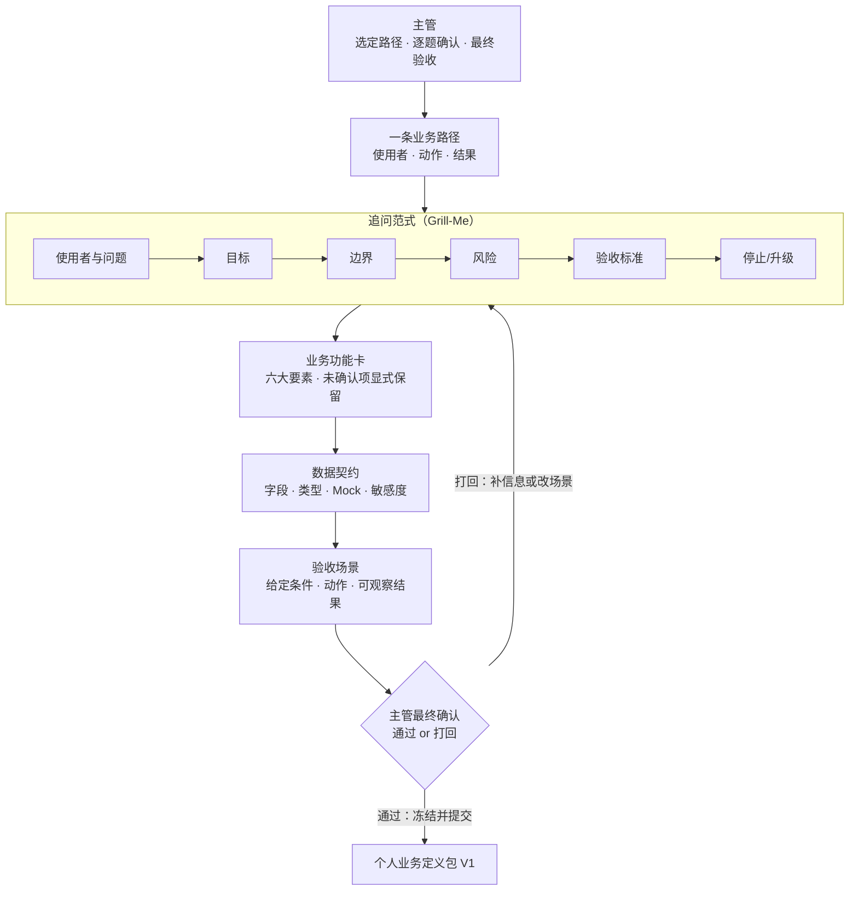

# 第三课学员指南 V4——把模糊业务说成可执行契约

> **本课核心思想只有一句话：**
> **不要急着写代码，先用追问范式锁定业务边界、数据契约和验收标准。**

> **状态：V4_CONTENT_FROZEN（2026-08-12 用户确认）**。本课保留原第三课"grill-me 澄清与契约冻结"主线。本课只完成"定义正确"，不同时承担大规模实施。本课使用 grill-me 追问 Skill 把口语想法变成可核对约定；不判断业务 AI 机会，也不在原型中加入业务 AI 功能。

## 一、先看懂：今天为什么学、要带走什么

### 先看一个区别

| 拍脑门盲开需求 | 契约冻结后的可核对定义 |
| --- | --- |
| 主管口头说"做一个工单管理功能"，AI 凭空想象补充字段 | 主管用追问范式（Grill-Me）逐题追问，每个字段和规则都经确认 |
| 遇到歧义时 AI 自作主张，代码与真实业务大相径庭 | 已确认决定收敛为业务功能卡，未确认项显式保留 |
| 没有验收标准，做完不知道对不对 | 有 1—2 条可观察的验收场景，主管能判断是否通过 |

今天你要完成"个人业务定义包 V1"。它不是大而全 PRD，也不是全部部门需求；它只围绕你现有原型的一条主路径，把业务边界、数据契约、Mock 样例和验收场景说清楚。完成后你要带走：一份业务功能卡、一份字段字典与 Mock 样例、1—2 条验收场景，以及主管的最终确认。

### 本课的契约冻结闭环

```text
选定业务路径 → grill-me 逐题追问 → 收敛为业务功能卡 → 固定字段字典与 Mock → 写出验收场景 → 主管最终确认
```

"定义正确"不是指写一份完美文档，而是你始终承担三项责任：选定一条路径而非全部需求、逐题确认而非让 AI 脑补、用可观察的验收场景而非功能名称列表判断是否通过。

### 本课融合心智模型

这张图是整课的工作模型，不是课堂时间表。



这张图保留了原版三层模式对比的演进逻辑：裸 Prompting（无护栏、AI 脑补）→ 契约锁定（本课实操：grill-me + 三份契约）→ 第四课将在契约护栏内进行受控实施。

### 五个必须掌握的概念

把今天的契约冻结想成装修前的准备流程：先确认户型范围（业务问题边界），再逐项确认主材（追问范式），然后签合同（业务契约），接着填报关单（数据契约），最后约定验房标准（验收场景）。主管不是旁观者，而是决定做什么、做到哪里、怎样算合格的人。

#### 1. 业务问题边界

- **是什么 / 不是什么**：使用者、触发、问题、目标和明确非目标共同限定本次业务；不是一句话需求，也不是全部部门需求。
- **怎样运作**：回答谁遇到什么问题、为什么要做、目标是什么、边界在哪里；缺少任何一项都会让后续实施失去锚点。
- **类比与反例**：装修前的户型确认图——在敲墙前必须确认哪些房间在范围内、哪些不在；不能只说"装修一下"就开工。
- **今天怎样看见**：Task 1 你会选定一条路径并写下使用者、动作和结果；Task 2 的前两轮追问进一步固定边界。

#### 2. 追问范式（Grill-Me）

- **是什么 / 不是什么**：沿未决分支逐题澄清并得到主管确认的追问方法；不是让 Agent 无限提问，也不是一次性抛出所有问题。
- **怎样运作**：每次只问一个最关键的问题，主管确认后再进入下一题；追问覆盖使用者与问题、目标、边界、风险、验收和停止/升级。
- **类比与反例**：装修开工前的主材确认清单——工长拿着清单逐项确认瓷砖品牌、开关插座数量，每项签字后才敲墙；不是一次把所有问题倒给业主。
- **今天怎样看见**：Task 2 你会激活 grill-me，体验一次只问一个问题的追问流程。

#### 3. 业务契约

- **是什么 / 不是什么**：把 User & Problem、Goal、Boundary、Risk、Acceptance、Stop/Escalation 固定为可执行约定；不是口头共识，也不是大而全 PRD。
- **怎样运作**：已确认的追问结果收敛为一份业务功能卡，未确认项显式保留；契约一旦冻结，后续实施只能在其范围内选择薄片。
- **类比与反例**：装修合同——口头意图变成书面条款，每条都有明确约定和违约处理；不能只靠"我们说好了"。
- **今天怎样看见**：Task 3 你会把追问结果收敛为业务功能卡，并通过只读预览门禁后授权落盘。

#### 4. 数据契约

- **是什么 / 不是什么**：固定字段、含义、类型、枚举、来源状态和 Mock 规则，避免前后口径漂移；不是 TypeScript 工程任务，主管只需核对业务含义。
- **怎样运作**：为每条业务路径列出字段字典，标注含义、类型、是否必填、Mock 样例和敏感等级；工程师可据此写类型或 Schema。
- **类比与反例**：海关进口商品的标准报关单——商品名称、编码、数量和来源必须统一申报；不能前端叫"工单号"、后端叫"订单号"。
- **今天怎样看见**：Task 4 你会填写字段字典并标注敏感等级，确认 Mock 样例与字段类型匹配。

#### 5. 验收场景

- **是什么 / 不是什么**：用给定条件、动作和可观察结果说明怎样算通过；不只列功能名称，也不依赖主观判断。
- **怎样运作**：描述前置条件存在时，执行什么动作，应观察到什么结果；遇到数据缺失或规则冲突时触发停止并升级。
- **类比与反例**：工厂流水线的紧急拉绳熔断阀——组装顺畅时按流程运转，发现零部件开裂时拉绳停机并升阶给车间主任。
- **今天怎样看见**：Task 5 你会写出 1—2 条可观察的验收场景，并由主管做最终确认。

**敏感度分级与事前脱敏** 是扩展认识：数据进入对话和材料前先判断敏感等级（公开/内部/严禁发送 AI），不在泄露后再补救。类比演习炸药箱上的红字警示标签——即使里面装的是演习用的无害沙子，箱子上也必须贴好"高危物品"标签。**结构化输出/类型文件** 也是扩展认识：工程师可把数据契约写成 TypeScript 类型或 Schema；主管只需核对业务含义，不要求自己写类型文件。

## 二、准备好：选定路径并确认 grill-me 可用

### 选定一条业务路径

从你第二课的原型中选一条最需要说清的业务路径。只选一条，不要把整个部门的需求都搬出来。

用一句话写下：
- 路径名称
- 主要使用者
- 主要动作
- 预期结果
- 本轮明确不做（至少一条）

选择困难时：选模糊度最高、最需要说清的那条。路径太大时缩到一个使用者、一个动作。

### 确认 grill-me 可用

确认 grill-me Skill 已安装且可激活。如果课程使用 `.claude/skills/grill-me/SKILL.md`，检查文件存在。如果 grill-me 不可用，请助教帮助配置。

双击项目根目录的 start-project.bat，或在终端运行
pm run dev，打开试衣镜确认第二课原型仍可操作（http://127.0.0.1:8888/）。页面能显示只说明环境可用，不代表业务正确。超过 3 分钟仍打不开，请助教接管。

## 三、动手做：契约冻结五步

### Task 1：选定最需要说清的一条业务路径

**本步目的**：从现有原型中选一条最需要说清的路径，为追问做好准备。

**复制提示词**

```text
我要从现有原型中选定一条最需要说清的业务路径。

我的业务原型类型是：【A. 监控与决策型 / B. 任务与流程型 / C. 操作工具型】
我选定的路径名称是：【填写】
主要使用者是：【填写】
主要动作是：【填写】
预期结果是：【填写】
本轮明确不做：【填写】

请先不要读取项目文件，不要调用修改或运行工具，也不要创建任何文件。
请只复述我选定的路径，并指出你认为仍模糊、需要追问的内容。
```

**你应该看见**：模型复述了你的路径，并标出仍模糊的内容，但没有声称已经看过项目或开始实施。

**本步检查**：只有一条路径；只有一个使用者和一个主要动作；本轮不做项已写明。

**必须停止**：如果 Agent 已使用读取、修改或运行工具，立即停止这一轮，请教师查看实际发生了什么。

### Task 2：用 grill-me 依次澄清六大要素

**本步目的**：通过 grill-me 逐题追问，把口语想法变成可核对的业务约定。追问覆盖使用者与问题、目标、边界、风险、验收和停止/升级。

**复制提示词**

```text
请使用 grill-me 技能帮我梳理需求。

我的业务原型类型是：【A / B / C】
我的业务痛点与一句话需求是：【填写你选定的路径和使用场景】

请按照 grill-me 规范，每次只问我 1 个最关键的问题，帮我理清：
1. 使用者与问题
2. 目标
3. 边界（本轮做什么、不做什么）
4. 风险（数据敏感度与错误代价）
5. 验收标准（怎样算通过）
6. 停止/升级条件（何时必须停下来请示）

在需求澄清完毕前，绝对不要修改任何代码与文件。
```

针对你的业务路径回答 AI 提出的 3—5 轮追问。每轮只回答一个问题，确认后再进入下一题。

🚨 **防错救急路径（Skill 装载降级救援）**：
> 如果 Agent 一次抛出了 2 个以上问题，或者擅自开启了文件修改，说明 Skill 未成功激活。请立即发送：
> 👉 **`请重新读取并严格遵循 grill-me 的物理指令，一次只问我一个问题！`**

**你应该看见**：AI 每次只问一个问题；你逐轮确认后进入下一题；追问覆盖了六大要素。

**本步检查**：一次只问一个问题；主管逐轮确认；Agent 没有在追问过程中修改文件。

**必须停止**：如果 Agent 一次抛出多个问题，发送救援指令；如果 Agent 擅自修改文件，立即停止并要求列出真实动作。

### Task 3：收敛为业务功能卡，未确认项显式保留

**本步目的**：把已确认的追问结果汇总为业务功能卡。先做只读预览（Task 3A），主管确认后再授权落盘（Task 3B）。未确认项必须显式标注"待确认"。

**Task 3A 只读方案汇总与预览**

**复制提示词**

```text
请将前面的讨论成果汇总：

1. 拟定 Markdown 文档《业务功能卡》内容预览，包含：
   - User & Problem（使用者与问题）
   - Goal（业务目标）
   - Boundary（本轮做什么、不做什么）
   - Risk（数据敏感度与错误代价）
   - Acceptance（验收标准）
   - Stop / Escalation（停止/升级条件）
   - 未确认项必须显式标注"待确认"，不能悄悄删除。

2. 拟定 TypeScript 接口草稿（src/types/prototype-contract.d.ts）
   与 Mock 种子数据（src/mocks/prototype-data.ts）的导出代码预览。

请只输出预览方案，等待我回复许可口令，严禁提前写入文件。
```

在收到 Agent 输出预览无误后，发送 **HITL 授权盖章口令**：

👉 **`同意方案，请开始落盘功能卡与契约资产`**

**Task 3B 接收授权，自动落盘契约文件**：确认生成以下文件：
- `docs/BUSINESS_FEATURE_CARD.md`（业务功能卡）
- `src/types/prototype-contract.d.ts`（TypeScript 数据契约字典）
- `src/mocks/prototype-data.ts`（静态 Mock 模拟数据集）

**你应该看见**：Agent 先输出预览方案，等待你的许可口令后才落盘；业务功能卡包含六大要素；未确认项有"待确认"标注。

**本步检查**：功能卡包含六大要素；未确认项显式保留；HITL 只读预览门禁没有被跳过；Agent 未经授权没有写文件。

**必须停止**：如果 Agent 未经授权就写文件，立即停止并回退到只读预览；如果未确认项被悄悄删除，要求补回"待确认"标注。

### Task 4：固定字段字典、状态、Mock 样例和敏感度

**本步目的**：为业务路径固定字段字典、状态、Mock 样例和敏感等级。主管核对业务含义，工程师写类型文件。

**复制提示词**

```text
基于刚才的对话，请帮我整理一份 Markdown 格式的《轻量数据契约卡》。

包含以下两部分：

1. 基础数据契约表：
   - 字段名称（英文字段名）
   - 业务含义（中文名称）
   - 数据类型（文本/数字/布尔/日期/枚举）
   - 是否必填
   - 数据来源（固定为 Mock 数据）
   - 示例值
   - 敏感等级（公开 / 内部 / 严禁发送 AI）

2. 针对我的原型类型的专属扩展契约：
   - 【监控决策型】：指标口径/计算公式、对比基准、异常阈值、下钻维度
   - 【任务流程型】：发起/处理角色、业务状态机(草稿->待处理->已完成)、允许动作、驳回/撤销规则
   - 【操作工具型】：输入结构、校验规则、处理逻辑、输出结构、HITL 人工确认点

先不要写入文件，仅输出内容方案预览呈报给我确认。
```

检查输出的数据契约表，确认包含了完整的 7 维属性与敏感等级标注。

**你应该看见**：字段字典与业务功能卡一致；敏感等级已标注（公开/内部/严禁发送 AI）；Mock 样例与字段类型匹配。

**本步检查**：字段与功能卡一致；敏感度已标注；Mock 样例与类型匹配；没有把 TS 类型文件写成主管核心任务。

**必须停止**：如果字段与功能卡漂移，重新对齐后再继续；如果敏感度未标注，补标后再继续。

### Task 5：写出 1—2 条可观察的验收场景，主管最终确认

**本步目的**：用给定条件、动作和可观察结果写出 1—2 条验收场景，并由主管做最终确认。完成后同步 `PROJECT_STATE.md` 和 Git 提交。

**复制提示词**

```text
基于业务功能卡和数据契约，请帮我写出 1—2 条可观察的验收场景。

每条验收场景包含：
1. Given（给定条件）：前置状态或数据存在
2. When（动作）：使用者执行什么操作
3. Then（可观察结果）：应观察到什么具体结果

同时请检查每条验收场景是否追溯到业务功能卡中的字段和规则。
如果遇到数据缺失或规则冲突，请说明应触发停止并升级给主管。

先不要写入文件，仅输出内容方案预览呈报给我确认。
```

确认验收场景后，让 Agent 落盘到 `docs/BUSINESS_FEATURE_CARD.md` 的验收场景部分。

**主管最终确认**：逐项对照功能卡和数据契约，确认或打回。确认后运行：

```powershell
git status
git add .
git diff --cached
git commit -m "feat: complete lesson 3 business definition package V1"
git log --oneline -5
```

**你应该看见**：验收场景有具体条件、动作和可观察结果；追溯到功能卡；只有 1—2 条而非全面铺开；主管做了最终确认。

**本步检查**：场景可观察（有具体条件、动作和结果）；追溯到功能卡；只有 1—2 条；主管已确认。

**必须停止**：如果场景不可观察，改写为具体条件后再继续；如果场景过多，只保留 1—2 条；如果主管未确认，补做确认环节。

核心路径通过后，让 Agent 更新 `docs/PROJECT_STATE.md`，记录业务定义包状态和下一课输入说明。它是下一课的项目交接单，不是第二份主要作业。

## 四、守住边界：安全红线、常见误区与问题处理

### 四条安全与真实性红线

- **数据与密钥**：不输入真实客户、员工、订单、金额、内部经营数据、Token、API Key 或真实账号；不用真实业务数据帮助 Agent"理解得更准确"。
- **范围与功能**：追问未结束前不实施功能；只围绕一条主路径说清，不把所有部门需求写成大而全 PRD。
- **权限与控制**：不把"Agent 答应不修改"或"主管确认"说成企业级 Workflow、HITL、沙箱硬拦截或合规控制；真实能力以当前环境为准。
- **能力与交付**：不声称连接了实际未连接的数据库、API、模型或自动化；本课成果是业务定义包，不是生产系统。

### 五个常见误区

| 误区 | 正确理解 |
| --- | --- |
| "直接发'帮我做个退款页面'最省事" | 模糊指令会导致 AI 凭空脑补字段与数据幻觉，后续接后端时项目直接崩溃。必须用追问范式（Grill-Me）逐题追问。 |
| "现在用的都是假数据，不需要标敏感度" | 敏感度标记是写给 IT 部门的交接契约，告知生产环境哪些真实字段不可送入 LLM。在数据契约表中必须显式标明敏感等级。 |
| "遇到业务异常或数据缺失时让 AI 随意猜测 fallback" | 盲目静默掩盖报错会导致坏数据写入系统。在功能卡中明确定义停止/升级条件，异常时拉绳停机。 |
| "AI 生成代码前不需要经过只读预览" | 直接让 AI 修改源码可能误删已有逻辑。执行 Task 3A 只读结构预览门禁，确认无误后再授权 Task 3B 写入。 |
| "把所有部门需求一次性写成大而全 PRD 才完整" | 本课只围绕一条主路径说清。大而全 PRD 会让追问失焦，也无法在课内完成。 |

### 遇到问题时只按五类处理

| 问题类型 | 先做什么 |
| --- | --- |
| **grill-me 未激活，Agent 一次抛出多个问题** | 发送救援指令：`请重新读取并严格遵循 grill-me 的物理指令，一次只问我一个问题！` |
| **追问过程中 Agent 擅自修改文件** | 立即停止，要求列出真实动作和改动，回到只追问不实施 |
| **页面提示字段未定义** | 核对数据契约字段字典与 Mock 样例是否一致；确认前端字段名与数据字典匹配 |
| **AI 尝试运行 `cd` 切换目录** | 提醒保持在工程根目录，禁止执行 `cd` 指令 |
| **路径太大无法在课内完成** | 缩到一个使用者、一个动作；未完成部分记入 `PROJECT_STATE.md` |

## 五、证明会了：成果验收与随堂测试

### 成果验收

- **原型线**：业务定义包 V1 包含业务边界、数据契约、Mock 样例和 1—2 条验收场景；字段、规则和验收场景能相互追溯。
- **主管线**：能回答谁、为何、目标、边界、风险、怎样算通过和何时必须停；能指出至少一个停止或升级条件。
- **交接单**：`PROJECT_STATE.md` 与当前业务定义包基本一致，但不能抵消前两条线的未通过。

一句话记忆：**选定一条路径，用追问范式（Grill-Me）逐题追问，收敛为业务功能卡，固定字段字典与 Mock，写出可观察的验收场景，主管最终确认。**

必答题可以在对应 Task 后随手完成，最后只需检查并提交。

### 必答题（5 题）

1. 业务问题边界需要回答哪五个问题来限定本次业务？
2. grill-me 追问和让 AI 无限提问有什么本质区别？
3. 业务契约固定了哪六个要素？未确认项应该怎么处理？
4. 数据契约要求主管核对什么？TS 类型文件由谁来写？
5. 验收场景和功能名称列表有什么区别？写出一条验收场景需要哪三个部分？

### 拓展题（选做，2 题）

1. 用"装修主材确认清单"比喻解释业务问题边界和业务契约的关系。
2. 如果你在追问过程中发现一条路径无法说清，应该怎么处理？为什么不能直接让 AI 脑补？

### 参考答案

1. 使用者、触发、问题、目标和明确非目标共同限定本次业务。
2. grill-me 是沿未决分支逐题澄清并得到主管确认，每次只问一个问题；无限提问是 Agent 自行发散，不经确认就脑补。
3. User & Problem、Goal、Boundary、Risk、Acceptance、Stop/Escalation 六个要素；未确认项必须显式标注"待确认"，不能悄悄删除。
4. 主管核对字段含义、类型、枚举、Mock 样例和敏感等级等业务含义；TS 类型文件由工程师来写，主管不要求自己写。
5. 验收场景用给定条件、动作和可观察结果说明怎样算通过；功能名称列表只列名称，无法判断是否通过。三个部分：Given（给定条件）、When（动作）、Then（可观察结果）。

## 六、带到下一课：准备一个薄切片候选

本课主成果应在课堂内完成。课后只做 10—15 分钟准备，不继续开发功能：

1. 在 `PROJECT_STATE.md` 中补齐业务定义包状态和下一课输入说明；
2. 看一眼你的业务功能卡，想一句"如果只能实施一个最小的变化，你会先做哪个"。

下一课会从你的业务定义包中选择一个薄切片实施。第三课负责把事情说对，第四课负责把一小件事情做对。
