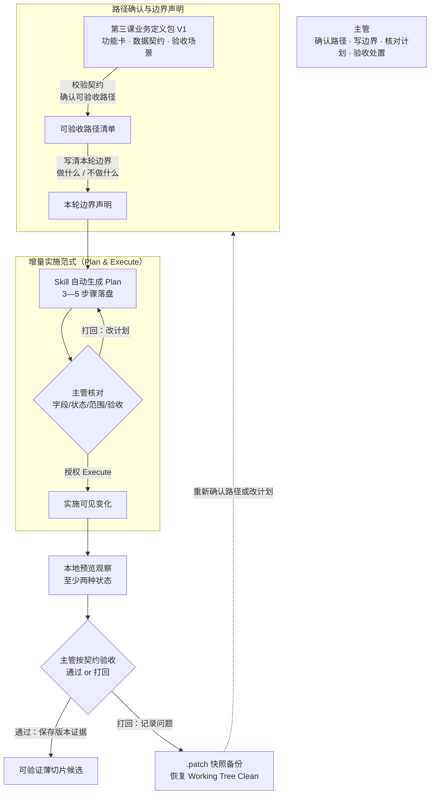

# 第四课学员指南——把契约切成一个可实施的薄片

> **本课核心思想只有一句话：**
> **不要让 Agent 一口气完成整个功能，而是先形成计划，每次只完成一个可验证的小切片。**

## 一、先看懂：今天为什么学、要带走什么

### 先看一个区别

| 巨石一口气盲开 | 薄切片受控实施 |
| --- | --- |
| AI 一口气修改 10 个文件、生成 1000 行代码 | AI 先出计划，主管核对后只授权一个切片 |
| 中途报错时白屏崩溃，无法定位根因 | 切片虽小但从输入到结果完整，报错时可导出补丁恢复 |
| 主管无法审查改动，也无法精准回退 | 候选实现与主管处置分别留痕，工作区/工作树（Working Tree）恢复 Clean |

今天你要完成“可验证薄切片候选”。它不是全部功能，也不是技术碎片；它只从第三课业务定义包中选择一个纵向变化，完成从输入到结果的可见实施，并保留至少两种必要状态。完成后你要带走：一个肉眼可见的变化、契约追溯说明、状态说明和版本证据。

### 本课的薄切片受控流转闭环

```text
校验第三课契约 → 确认可验收路径并写本轮边界 → 激活 Skill 自动生成 Plan 主管核对 → 授权 Execute 实施可见变化 → 主管按契约验收 → 记录候选版本与处置结果
```

"把一小件事情做对"不是指写最少的代码，而是你始终承担三项责任：确认可独立验收的路径并写清本轮边界、核对 Skill 自动生成的计划后才授权执行、按契约验收而非自动宣称通过。

### 本课融合心智模型

这张图是整课的工作模型，不是课堂时间表。



这张图保留了原版三层模式对比的演进逻辑：巨石盲开（反面案例）→ 薄切片受控流转（本课实操）→ 第五课将在受控薄片上判断 AI 机会。

### 四个必须掌握的概念

今天直接沿实施闭环看四个概念：Task 1—2 从第三课契约确认可验收路径和本轮边界，Task 3 核对实施计划，Task 4 观察技术状态与业务状态，Task 5 用版本证据关联验收和处置。主管不是旁观者，而是决定做哪一块、做到哪里、验不验收的人。

#### 1. 薄切片

- **是什么 / 不是什么**：一次完成一条从输入到结果的纵向变化；不是把任务拆成没有业务结果的技术碎片，也不是一口气完成全部功能。
- **怎样运作**：从业务定义包中选择一个可独立验收的纵向变化，只实施这一条；切片虽小但从输入到结果完整。
- **当课操作例子与边界**：Task 1—2 只选择一条可独立验收的纵向变化；没有完整输入到结果的路径，就不是薄切片。
- **今天怎样看见**：Task 1—2 你会从第三课契约中确认可验收路径，并写清本轮边界；切片由 Skill 在 Task 3 自动切分。

#### 2. 版本控制基础

- **是什么 / 不是什么**：用 Working Tree、Diff、Commit 记录变更、比较差异和保存版本证据；不是业务审批系统，也不规定提交次数。
- **怎样运作**：识别当前改动，查看 Diff，按项目约定保存版本证据，并让版本记录能够定位恢复；提交数量由项目需要决定。
- **当课操作例子与边界**：Task 3 只核对并授权实施计划，Task 5 才把实际变化关联到版本证据；计划本身不是版本记录，版本记录也不是业务批准。
- **今天怎样看见**：Task 3 你会核对实施计划，Task 5 会说明版本证据如何支持复核和定位恢复。

#### 3. 技术状态与业务状态

- **是什么 / 不是什么**：加载、错误等系统状态和待处理、已升级等业务含义是两件事；不能混为一谈，也不能用技术状态冒充业务状态。
- **怎样运作**：技术状态描述界面在加载、空数据、报错或成功时的呈现；业务状态描述业务对象的生命周期（如草稿→待处理→已完成）；两者物理隔离，互不替代。
- **当课操作例子与边界**：Task 4 分别展示加载、空数据、报错等技术状态和草稿、待处理、已完成等业务状态；页面能打开不代表业务已通过。
- **今天怎样看见**：Task 4 你会在本地预览中切换技术状态，同时指明业务状态标签。

#### 4. 可追溯验收

- **是什么 / 不是什么**：把验收场景、操作、观察、原始证据、结论和责任关联到具体版本；不是口头验收、只存截图或把测试通过当业务批准。
- **怎样运作**：用 Working Tree、Diff 或 Commit 记录实际变化，把候选实现、验收证据和主管处置关联；提交次数由项目需要决定，不以两个 Commit 作为通过条件。
- **当课操作例子与边界**：Task 5 同时保存实际变化和主管处置；两者都要可追溯，但不要求两个 Commit。
- **今天怎样看见**：Task 5 你会在验收通过后保存版本证据，确认 Working Tree 状态并记录主管处置。

**操作方法**：Plan & Execute、两阶段版本记录和有界恢复用于组织实施和留痕；它们不是核心概念。HITL 授权点与回退/恢复是安全规程。

## 二、准备好：校验契约并确认干净状态

### 校验第三课契约

打开你的业务功能卡和数据契约，确认它们可用且一致：
- `docs/BUSINESS_FEATURE_CARD.md` 包含六大要素和验收场景
- 数据契约字段字典与功能卡字段一致
- 1—2 条验收场景可追溯到功能卡

如果契约不一致（如字段名对不上），先回到第三课修正，不要带着不一致的契约开工。

### 确认 Working Tree Clean

在终端运行：

```powershell
git status
```

预期输出：`nothing to commit, working tree clean`。如果 Working Tree 不是 Clean，先提交或还原遗留修改。开工前确保砧板干净，避免新旧代码混在一起。

### 启动本地预览

双击项目根目录的 `start-project.bat`，或在终端运行：

```powershell
npm run dev
```

浏览器未自动打开时访问 `http://127.0.0.1:8888/`。

打开本地预览确认第三课原型仍可操作。超过 3 分钟仍打不开，请助教接管。

## 三、动手做：薄切片受控实施五步

### Task 1：校验第三课契约，确认可独立验收的路径

**本步目的**：从第三课契约中确认可独立验收的路径，每条路径有从输入到结果的完整业务结果。先不要实施，也不要手动切分切片——切分由后续 Skill 自动完成。

**复制提示词**

```text
请读取我的业务功能卡（docs/BUSINESS_FEATURE_CARD.md）和数据契约，
确认 2—3 条可独立验收的路径。

每条可验收路径需要写清：
1. 路径名称
2. 从输入到结果的完整路径
3. 可验收的方式（追溯到哪条验收场景）
4. 涉及的字段和状态

先不要修改任何代码，也不要手动切分切片，只输出可验收路径清单。
```

**你应该看见**：AI 输出了 2—3 条可验收路径，每条都有从输入到结果的完整路径和可验收方式，追溯到第三课契约。

**本步检查**：可验收路径追溯到功能卡和验收场景；从输入到结果完整；不是没有业务结果的技术碎片；没有越位手动切分切片。

**必须停止**：如果路径与契约脱节，回到功能卡重新对齐；如果 AI 已修改代码，立即停止；如果开始手动切分切片，提醒自己"切分交给 Skill"。

### Task 2：主管写本轮做什么和不做什么

**本步目的**：写清本轮的边界——做什么、不做什么、不做到哪里。你不需要自己选切片，切分是 Skill 的事；你要做的是给 Skill 的自动切分提供范围约束。

**复制提示词**

```text
本轮聚焦的可验收路径：【填写路径名称】

本轮做什么：【填写】
本轮明确不做：【填写，至少一条】

请复述你理解的本轮边界。在我确认前，不要开始实施。切分计划交给后续 Skill 自动完成。
```

**你应该看见**：AI 复述了本轮边界，等待你确认后才实施。

**本步检查**：本轮边界聚焦在一条可验收路径上；非目标明确写出；边界只有一个主要变化。

**必须停止**：如果边界太宽（包含多个主要变化），缩到一个主要变化；如果非目标模糊，追问自己"不做什么"。

### Task 3：激活 Skill 自动生成 Plan（增量实施范式），主管核对后才授权 Execute

**本步目的**：激活 incremental-implementation Skill，让它读取契约文件后自动生成实施计划。主管核对字段、状态、修改范围和验收路径是否与 Task 2 声明的边界一致，确认无误后才授权执行。在授权前，Agent 不修改代码。

**复制提示词**

```text
请使用 incremental-implementation 技能帮我规划实施。

本轮聚焦的可验收路径：【填写路径名称】
本轮边界：【填写】
本轮明确不做：【填写】

请自动把本轮需求切成 3—5 个独立步骤，写入 docs/LESSON_04_IMPLEMENTATION_PLAN.md。
每个步骤写清：修改的文件、涉及的字段和状态、验收路径。

先不要修改代码，只输出计划预览，等待我回复许可口令。
```

检查 AI 输出的计划预览，核对：
- 每步修改的文件是否在授权范围内
- 字段和状态是否与第三课数据契约一致
- 验收路径是否追溯到第三课验收场景
- 是否只有一个主要变化

核对无误后，发送授权口令：

👉 **`同意保存实施计划`**

**你应该看见**：Skill 自动生成计划并落盘 `IMPLEMENTATION_PLAN.md`，等待你的许可口令后才执行代码修改。

**本步检查**：Skill 自动生成了计划；主管核对了字段、状态、修改范围和验收路径；计划落在 Task 2 声明的边界内；没有跳过核对直接授权。

**必须停止**：如果 Agent 抬手就写代码，立即停止并要求先激活 Skill 出计划；如果计划超出 Task 2 边界，退回 Task 2 重新声明；如果计划与契约不一致，回到 Task 1 校验。

### Task 4：实施一个可见变化，至少展示两种必要状态

**本步目的**：Agent 在授权范围内执行一个受控切片，你在本地预览中观察可见变化并至少展示两种状态。

**复制提示词**

```text
授权执行 Step 1

请按计划实施 Step 1，只修改授权范围内的文件。
实施后报告：实际修改文件、验收方法、展示的状态。
```

实施完成后，在本地预览中验证：
- 变化是否肉眼可见
- 至少展示两种状态（如正常和空，或正常和错误）
- 使用 `prototypeState` 调试按钮切换技术状态（Loading / Empty / Error / Success）
- 指明业务状态标签（如待处理、已完成）

**你应该看见**：Agent 只在授权范围内修改；变化肉眼可见；至少两种状态可切换；技术状态和业务状态物理隔离。

**本步检查**：变化可见；至少两种状态；学员能指出哪个是技术状态、哪个是业务状态；Agent 没有扩大范围。

**必须停止**：如果 Agent 扩大修改范围，立即停止并回到 Task 2 声明的边界范围；如果只有一种状态，补展示另一种。

### Task 5：主管按契约验收，记录候选版本与处置结果

**本步目的**：你在第二课做过视觉证据基线——用前后对比留下视觉证据。现在用同样的习惯为薄切片留下实施前后的页面证据——验收本身仍按第三课契约追溯。按第三课验收场景逐项验收，确认或打回。验收后分别记录候选实现与主管处置，提交数量不固定。

**复制提示词**

```text
请按以下步骤完成验收与归档：

1. 逐项对照第三课验收场景，报告每条验收的通过或失败。
2. 如果全部通过，保存版本证据：记录实际 Diff/Commit（如有）以及主管对验收和处置的决定；不要求两个 Commit。
3. 运行 git status 确认 working tree clean。
4. 如实报告实际运行过的工程检查和结果。未运行的不要声称通过。
```

如果验收不通过，不要强行通过。发送：

👉 **`同意记录 Step 1 问题`**

Agent 会导出 `.patch` 快照备份到 `local-backups/`，然后恢复 Working Tree Clean。问题记录在 `PROJECT_STATE.md` 中。

**你应该看见**：验收追溯到契约；候选实现与主管处置分别留痕；Working Tree 状态已核对；没有自动宣称通过。

**本步检查**：验收追溯到契约；版本证据分别记录源码变化和主管处置；Working Tree 状态已核对；主管做了最终确认。

**必须停止**：如果验收不通过，记录问题而非强行通过；不要以提交次数替代业务验收。

核心路径通过后，让 Agent 更新 `docs/PROJECT_STATE.md`，记录薄切片候选状态、处置结果和下一课输入说明。它是下一课的项目交接单，不是第二份主要作业。

## 四、守住边界：安全红线、常见误区与问题处理

### 四条安全与真实性红线

- **数据与密钥**：不输入真实客户、员工、订单、金额、内部经营数据、Token、API Key 或真实账号；只使用 Mock/已脱敏数据。
- **范围与功能**：不同时实施多个业务切片；一次只做一个可验证的薄片；不在尚未理解业务环节时强加 AI 功能。
- **权限与控制**：不把"Agent 答应不修改"或"主管确认"说成运行时硬控制；Git 本身不理解业务确权，它只是记录工具。
- **能力与交付**：不声称连接了实际未连接的数据库、API、模型或自动化；不虚构 `verify-project.ps1` 等课堂能力；本课成果是薄切片候选，不是生产系统。

### 五个常见误区

| 误区 | 正确理解 |
| --- | --- |
| "让 AI 一口气写完页面所有功能效率最高" | 一口气修改 10 个文件会导致 Working Tree 一片狼藉，报错时无法定位根因。用薄切片范式，每次只授权一个切片。 |
| "静态编译通过就代表切片做对了" | 静态检查无法替代人工点击页面和主管对业务逻辑的验收。必须逐项对照第三课验收场景确认。 |
| "混淆界面技术状态与业务流程状态" | Loading 或 Error 是技术状态，待处理或已完成是业务状态。两者物理隔离，互不替代。 |
| "一次记录可以同时说明所有责任" | 版本变化和主管处置是两个维度，应分别留痕；但不以提交次数作为验收标准。 |
| "验收不通过就让 AI 随便改到通过" | 验收不通过时记录问题而非强行通过；候选实现与主管处置分别留痕，不自动宣称通过。 |

### 遇到问题时只按五类处理

| 问题类型 | 先做什么 |
| --- | --- |
| **契约不一致（字段对不上）** | 回退到第三课，核对功能卡与数据契约字段是否匹配 |
| **切片报错，Working Tree 一直 Dirty** | 下发 `同意记录 Step 1 问题`，导出 `.patch` 快照后恢复 Clean |
| **Agent 抬手就写代码，不出计划** | 立即停止，要求先出计划再等授权 |
| **Agent 一次修改多个切片的文件** | 立即停止，回到 Task 2 声明的边界范围 |
| **学员混淆技术状态和业务状态** | 回到 Task 4，分别指出页面状态和业务对象状态，不用其中一个替代另一个 |

## 五、证明会了：成果验收与随堂测试

### 成果验收

- **原型线**：切片从输入到结果完整，但范围只有一个主要变化；变化能追溯到第三课契约和验收场景；至少展示两种必要状态。
- **主管线**：能指出至少一个技术状态和一个业务状态；候选实现与主管处置分别留痕；不自动宣称通过。
- **交接单**：`PROJECT_STATE.md` 与当前薄切片候选和处置记录基本一致，但不能抵消前两条线的未通过。

一句话记忆：**从契约中确认可验收路径并写清本轮边界，激活 Skill 自动生成计划你核对后再授权，实施后展示两种状态，按契约验收并分别留痕。**

必答题可以在对应 Task 后随手完成，最后只需检查并提交。

### 必答题（5 题）

1. 薄切片和把任务拆成技术碎片有什么区别？一条合格的薄切片从哪里到哪里完整？
2. Plan & Execute 要求主管在授权 Execute 前核对什么？为什么不能跳过核对？
3. 技术状态和业务状态有什么区别？各举一个例子。
4. 版本证据如何分别记录候选实现与主管处置？为什么提交次数不能替代业务验收？
5. 主管验收不通过时应该怎么处理？为什么不能自动宣称通过？

### 拓展题（选做，2 题）

1. 版本控制能提供哪些证据？为什么 Git 记录不等于主管业务批准？怎样把验收关联到具体版本？
2. 如果切片实施后发现第三课契约有遗漏，应该怎么处理？为什么不能直接让 Agent 脑补补齐？

### 参考答案

1. 薄切片是一次完成一条从输入到结果的纵向变化，有业务结果可验收；技术碎片没有业务结果。从输入到结果完整。
2. 核对字段、状态、修改范围和验收路径；跳过核对会让 Agent 自行决定范围，偏离契约。
3. 技术状态：加载、空、错误、成功等界面呈现；业务状态：草稿、待处理、已完成等业务生命周期。例：Loading 是技术状态，待处理是业务状态。
4. 版本证据记录候选实现和主管处置；Git 不理解业务确权，提交次数由项目需要决定。
5. 记录问题而非强行通过；导出 `.patch` 快照备份后恢复 Clean；候选实现与主管处置分别留痕。

## 六、带到下一课：准备一个 AI 机会候选

本课主成果应在课堂内完成。课后只做 10—15 分钟准备，不继续开发功能：

1. 在 `PROJECT_STATE.md` 中补齐薄切片候选状态和处置记录；
2. 看一眼你的薄切片，想一句"如果只在一个环节加一点智能，你会选哪里"。

下一课会第一次正式把 AI/Agent 融入业务。你已经有了一个稳定的普通业务薄片，第五课会在它上面选择一个低风险、可验证的智能机会。
