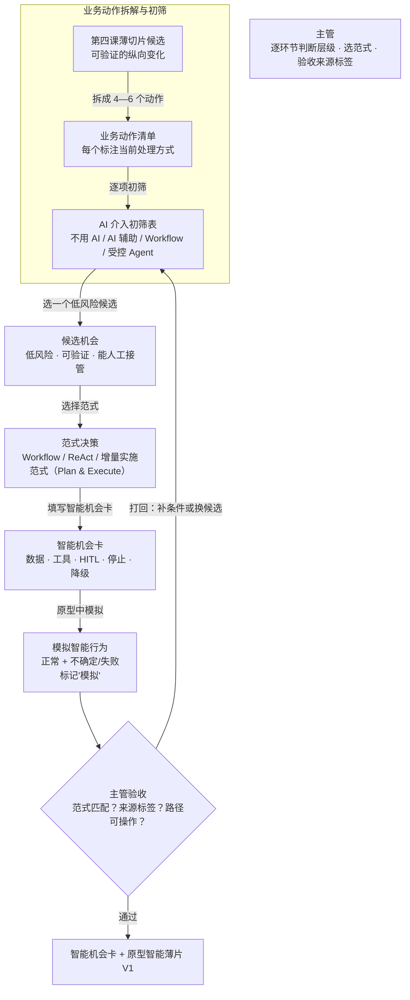

# 第五课学员指南——第一次把 AI/Agent 融入业务

> **本课核心思想只有一句话：**
> **不是给每个环节都塞 AI，而是逐环节判断需要什么程度的智能，并选择最简单足够的方式。**

## 一、先看懂：今天为什么学、要带走什么

### 先看一个区别

| 给每个环节都塞 AI | 逐环节判断选最简单足够的方式 |
| --- | --- |
| 所有操作都交给 AI，连查列表都要"智能推荐" | 先判断任务性质，能用规则的不用 AI |
| 出了问题不知道是哪个环节的 AI 出错 | 每个环节的层级、范式和边界都有记录 |
| Agent 自主跑飞了，主管无法接管 | 关键节点有人工检查点，出错能降级 |

今天你要完成"智能机会卡 + 原型智能薄片 V1"。它不是全部门 AI 蓝图，也不是真实 AI 能力；它只在你第四课的薄切片上选择一个低风险、可验证、能人工接管的智能机会，并在原型中模拟正常和至少一种不确定/失败结果。完成后你要带走：一张智能机会卡、一个标记"模拟"的智能行为、以及你判断的范式和边界说明。

### 本课的 AI 介入判断闭环

```text
拆解薄切片为业务动作 → 逐项标注当前处理方式 → 对每个动作做 AI 介入初筛
→ 选一个低风险候选 → 选择范式并写智能机会卡 → 在原型中模拟正常和不确定/失败结果
→ 主管验收范式匹配与来源标签
```

"最简单足够"不是指偷懒不做 AI，而是你始终承担三项责任：判断每个环节需要什么程度的智能、选择最简单的足够范式、确保出错时人能接管或停止。

### 本课融合心智模型

这张图是整课的工作模型，不是课堂时间表。



这张图保留了原版控制流对比的演进逻辑：单 Agent 三大控制流（原版工程视角）→ 业务 AI 介入层级判断（本课业务视角）→ 第六课把 ReAct 与有界控制落到真实排错。

### 五个必须掌握的概念

今天直接沿 Task 1—4 看见五个概念：Task 1 区分确定性和概率性动作，Task 2 选择 AI 介入层级，Task 3 记录候选机会，Task 4 选择 Workflow、Agent 或人工并写明 HITL 检查点。主管不是旁观者，而是判断每个环节需要什么程度智能、选择范式、验收来源标签的人。

#### 1. AI 介入层级

- **是什么**：任务接入 AI 的自治度梯度（不用 AI、辅助建议、固定流程、受控多步决策、低风险闭环）。
- **怎么用**：针对每个环节的错误代价与确定性，选择“最低且足够”的介入程度，把风险与成本控制在最低。
- **避坑红线**：牢记 Anthropic 核心原则：“能用固定规则或简单方法搞定的，绝不引入多余的复杂性。”

#### 2. 确定性任务与概率性任务

- **是什么**：规则清晰、结果唯一的是“确定性任务”；开放发散、语义理解的是“概率性任务”。
- **怎么用**：确定性任务坚决用程序规则与代码固化；概率性任务才引入大模型辅助，并配备人工校对。
- **避坑红线**：严禁把确定性计算交给大模型盲猜，绝不能用概率方法处理严密逻辑。

#### 3. Workflow 与 Agent（判定黄金法则）

- **是什么**：Workflow 走预先固定的步骤流水线；Agent 则根据中间结果动态决定下一步行动。
- **怎么用**：步骤固定、流程标准的事项坚决建 Workflow；只有需要根据现场情况灵活应变的事项才考虑 Agent。
- **避坑红线**：严禁盲目追求“全自动 Agent”，能用固定流程解决的问题绝不要引入多余的动态循环。

#### 4. ReAct 循环

- **是什么**：AI 在“思考（Thought）→ 行动（Action）→ 观察（Observation）”之间不断循环的工作机制。
- **怎么用**：用于需要边调查、边尝试、边根据反馈调整方向的探索性任务。
- **避坑红线**：严禁放任无休止的循环试错，必须设置明确的最大尝试次数与主动停止条件。

#### 5. 人在回路授权门禁（HITL）

- **是什么**：在自动化流程的关键卡点上，由人工进行确认、纠偏、接管或叫停的责任门禁。
- **怎么用**：在权限越界前（资金/高危）、方案落地前（契约终审）、异常失控时（连续排错失败）设置人工门禁。
- **避坑红线**：严禁把“事后口头问一句”当成门禁；必须指向具体拦截节点与明确的责任签字人。

**增量实施范式（Plan & Execute）迁移比较** 是扩展认识：与 ReAct 对比，判断何时先固定计划、何时允许局部动态循环。**Guardrail/护栏** 也是扩展认识：文字指导、流程门禁和运行时拦截强度不同；本课只要求认识层级。

## 二、准备好：回顾第四课薄切片并确认环境

### 回顾第四课薄切片

打开你的第四课可验证薄切片候选，确认它仍可操作：
- 本地预览中原型能打开，业务路径仍能走通
- `docs/PROJECT_STATE.md` 有薄切片候选状态和处置记录

如果薄切片不可用或路径不通，先回到第四课修复，不要在不稳定的薄片上加 AI。

### 确认 Working Tree Clean

在终端运行：

```powershell
git status
```

预期输出：`nothing to commit, working tree clean`。如果 Working Tree 不是 Clean，先提交或还原遗留修改。

### 启动本地预览

双击项目根目录的 `start-project.bat`，或在终端运行：

```powershell
npm run dev
```

浏览器未自动打开时访问 `http://127.0.0.1:8888/`。

打开本地预览确认第四课原型仍可操作。超过 3 分钟仍打不开，请助教接管。

## 三、动手做：AI 介入判断五步

### Task 1：把第四课薄片拆成具体业务动作

**本步目的**：先别想 AI，把你的薄切片拆成 4—6 个具体业务动作，每个标注当前处理方式。这是后续初筛的基础。

**复制提示词**

```text
请读取我的第四课薄切片原型和 docs/PROJECT_STATE.md，
把这个薄切片拆成 4—6 个具体业务动作。

每个动作写清：
1. 动作名称
2. 使用者在做什么
3. 当前处理方式（人工 / 规则 / 已有程序）
4. 输入是什么
5. 输出是什么

先不要建议加 AI，只如实拆解和标注当前处理方式。
不要修改任何代码。
```

**你应该看见**：AI 输出了 4—6 个具体业务动作，每个有当前处理方式标注，但没有修改代码。

**本步检查**：动作具体到业务层面而非技术步骤；每个动作都标注了当前处理方式；没有拆得太碎或太粗；没有开始建议加 AI。

**必须停止**：如果 AI 已经修改了代码或开始建议 AI 方案，立即停止并提醒"先标注现状，不急着想 AI"。

### Task 2：对每个动作做 AI 介入初筛

**本步目的**：对每个业务动作判断属于哪个 AI 介入层级，写理由和错误代价。遵循"最简单足够"原则——能用规则的不用 AI，能用 Workflow 的不用 Agent。

**复制提示词**

```text
请对我在 Task 1 中拆解的每个业务动作做 AI 介入初筛。

对每个动作回答：
1. 有固定规则吗？（是/否）
2. 结果唯一吗？（是/否）
3. 错了能恢复吗？（是/否）
4. 建议层级：不用 AI / AI 辅助 / Workflow / 受控 Agent
5. 理由
6. 错误代价（错了会造成什么后果）

原则：能用规则解决的不用 AI，能用 Workflow 的不用 Agent。
最简单足够优先，不要追求最高自主程度。
先不要修改代码，只输出初筛表。
```

**你应该看见**：AI 输出了一张初筛表，每个动作有层级判断、理由和错误代价，但没有修改代码。

**本步检查**：理由基于任务性质（确定性/概率性）；考虑了错误代价；遵循"最简单足够"原则；没有所有动作都选 Agent。

**必须停止**：如果 AI 给每个环节都选了 AI 或 Agent，回到"这个动作有固定规则吗？结果唯一吗？"；如果 AI 已修改代码，立即停止。

### Task 3：选一个低风险、可验证、能人工接管的候选

**本步目的**：从初筛结果中选一个候选机会，它必须是低风险、结果可验证、能人工接管的。只选一个。

**复制提示词**

```text
请从初筛结果中推荐一个最适合的候选机会。

这个候选必须同时满足：
1. 低风险：错了能恢复，不会造成不可逆后果
2. 可验证：有明确的标准判断结果对不对
3. 能人工接管：AI 失效时人能接手处理

只推荐一个，并说明：
- 候选环节名称
- 为什么低风险
- 怎样验证结果
- 出了问题人能怎么接管
```

写完候选选择后，用两句话写下你拒绝其他候选的理由——为什么你选的这个环节不能只用确定性规则，或为什么被拒绝的环节不应该用 Agent。写下来贴在你的智能机会卡上。

**你应该看见**：AI 推荐了一个候选，并写明了低风险、可验证、能人工接管三项说明。

**本步检查**：候选符合低风险（错了能恢复）；可验证（有明确标准）；能人工接管（AI 失效时人能接手）；只选了一个。

**必须停止**：如果候选是高风险不可逆的，换一个"错了能恢复"的；如果无法验证结果，选一个有明确标准的；如果选了多个，缩到一个。

### Task 3 收尾：写下你的拒绝理由（2 分钟）

**本步目的**：把你的判断写下来，变成可存档的证据。用两句话写下为什么你选的这个环节不能只用确定性规则，或者为什么你拒绝的环节不应该用 Agent。写下来贴在你的智能机会卡上。

**你应该做**：用两句话写下你的拒绝理由，贴在智能机会卡上。不是口头说——是写下来。

**本步检查**：写下了至少一条拒绝理由；理由基于任务性质和错误代价；是写下来而非口头表达。

**必须停止**：如果只写了选的理由没写拒绝理由，追问"你没选的那些为什么不用 AI"。

### Task 4：选择范式并写智能机会卡

**本步目的**：为候选机会选择 Workflow、ReAct 或 增量实施范式（Plan & Execute） 范式，并填写智能机会卡：数据、工具、HITL 检查点、停止条件、降级条件。

**复制提示词**

```text
请帮我为这个候选机会选择范式并填写智能机会卡。

候选环节：【填写 Task 3 选定的候选】

请回答以下内容：

1. 范式选择：Workflow / ReAct / 增量实施范式（Plan & Execute）
   - 选择理由（路径是否预先确定？任务是否需要动态调查？）
   - 如果选 ReAct，说明 Thought → Action → Observation 循环如何运作
   - 如果选 增量实施范式（Plan & Execute），说明与第四课的 增量实施范式（Plan & Execute） 有什么不同

2. 智能机会卡：
   - 数据：需要什么输入数据（标明 Mock 来源）
   - 工具：需要调用什么工具或读取什么信息
   - HITL 检查点：在哪个具体节点需要人批准、纠正或停止
   - 停止条件：什么情况下停止智能行为
   - 降级条件：AI 不可用时降为什么方式

先不要修改代码，只输出范式选择和智能机会卡。
```

**你应该看见**：AI 输出了范式选择理由和完整的智能机会卡，五项都有明确答案。

**本步检查**：范式与任务性质匹配（路径确定选 Workflow，需动态调查选 ReAct）；智能机会卡五项完整；HITL 指向具体节点而非"最后看一眼"；停止和降级条件可执行。

**必须停止**：如果范式与任务不匹配，重新检查确定性/概率性；如果 HITL 太模糊，追问"在哪个动作后需要人确认"；如果缺少停止/降级条件，必须补写。

### Task 5：在原型中模拟正常与不确定/失败结果

**本步目的**：在原型中模拟候选智能行为，展示正常和至少一种不确定/失败结果。所有模拟结果必须标记"模拟"，不冒充真实 AI 能力。

**复制提示词**

```text
请在我的原型中模拟一个智能行为。

候选环节：【填写】
选择的范式：【填写】
智能机会卡内容：【填写或粘贴 Task 4 的智能机会卡】

要求：
1. 在原型中添加一个标记为"模拟AI"的智能行为组件
2. 模拟正常结果（智能行为正常运作时的表现）
3. 模拟至少一种不确定/失败结果（如输入不完整、数据异常时）
4. 所有模拟结果必须明确标注"模拟"，不冒充真实 AI 能力
5. 保持原业务路径仍可操作
6. 不连接真实模型、业务 API 或生产数据

完成后报告：实际修改文件、模拟了哪些结果、如何验收、来源标签是否清楚。
```

**你应该看见**：原型中有一个标记"模拟"的智能行为，正常和至少一种不确定/失败结果可展示，原路径仍可操作。

**本步检查**：模拟结果标记了"模拟"；展示了正常和至少一种不确定/失败结果；Mock 没有冒充真实 AI；原业务路径仍可操作；主管做了验收。

**必须停止**：如果只有正常结果，补展示不确定/失败场景；如果 Mock 被当作真实 AI，立即标记"模拟"；如果原路径失效，先修复路径再模拟。

核心路径通过后，让 Agent 更新 `docs/PROJECT_STATE.md`，记录智能机会候选状态、范式、边界条件和下一课输入说明。它是下一课的项目交接单，不是第二份主要作业。

## 四、守住边界：安全红线、常见误区与问题处理

### 四条安全与真实性红线

- **数据与密钥**：不输入真实客户、员工、订单、金额、内部经营数据、Token、API Key 或真实账号；只使用 Mock/已脱敏数据。
- **真实能力边界**：不连接真实模型、业务 API 或生产数据；模拟结果必须标记"模拟"，不冒充真实 AI 能力。
- **自主程度**：不追求自主程度最高；能满足需求的最简单方式优先——能用规则的不用 AI，能用 Workflow 的不用 Agent。
- **控制与确认**：不把"Agent 答应不修改"或"主管确认"说成 Workflow/HITL、沙箱或运行时硬控制；HITL 检查点必须指向具体节点。

### 五个常见误区

| 误区 | 正确理解 |
| --- | --- |
| "所有环节都应该用 AI" | 逐环节判断任务性质，能用规则的不用 AI；最简单足够优先 |
| "Agent 比自动化的 Workflow 高级" | Workflow 和 Agent 是不同范式，适合不同任务；不是高低关系 |
| "模拟结果就是 AI 的真实能力" | 模拟结果必须标记"模拟"，不冒充真实 AI；本课不连接真实模型 |
| "最后看一眼就是 HITL" | HITL 是在指定节点批准、纠正、接管或停止，不是做完后审一下 |
| "选了 AI 就不用写停止和降级" | 停止和降级条件必须写清，否则出错时无法接管 |

### 遇到问题时只按五类处理

| 问题类型 | 先做什么 |
| --- | --- |
| **想给每个环节都加 AI** | 回到"最简单足够"原则，问"这个动作有固定规则吗？结果唯一吗？" |
| **范式与任务性质不匹配** | 重新检查确定性/概率性；路径确定用 Workflow，需动态调查用 ReAct |
| **模拟结果被当作真实 AI** | 立即标记"模拟"，强调来源标签；主管验收时核对标签 |
| **停止/降级条件缺失** | 必须补写；不能只有正常路径，必须写出什么时候停、怎么降级 |
| **选了高风险不可逆的候选** | 换一个低风险、可验证、能人工接管的候选 |

## 五、证明会了：成果验收与随堂测试

### 成果验收

- **原型线**：原型中有一个明确标记"模拟"的智能行为；正常和至少一种不确定/失败结果可展示；原业务路径仍可操作。
- **主管线**：写下了至少一条拒绝理由（基于任务性质和错误代价）；范式与任务性质匹配；数据、工具、HITL、停止和降级均有明确答案；模拟结果有来源标签，不把 Mock 冒充真实 AI。
- **交接单**：`PROJECT_STATE.md` 与当前智能机会候选和边界条件基本一致，但不能抵消前两条线的未通过。

一句话记忆：**先拆动作标注现状，逐项初筛选最简单足够的方式，选一个低风险候选，写范式和数据工具HITL停止降级，在原型中模拟正常和不确定结果并标记"模拟"。**

必答题可以在对应 Task 后随手完成，最后只需检查并提交。

### 必答题（5 题）

1. AI 介入层级有哪几个程度？为什么不是所有任务都需要最高程度的 AI？
2. 确定性任务和概率性任务有什么区别？各举一个你业务中的例子。
3. Workflow 和 Agent 有什么本质区别？为什么不能把所有自动化都叫 Agent？
4. ReAct 适合什么类型的任务？为什么不适合无边界高风险动作？
5. HITL 的含义是什么？为什么"最后看一眼"不算真正的 HITL？

### 拓展题（选做，2 题）

1. 用 增量实施范式（Plan & Execute） 和 ReAct 对比，判断何时先固定计划、何时允许局部动态循环。
2. Guardrail 的三个层级（文字指导、流程门禁、运行时拦截）强度有什么不同？本课只要求认识哪一层？

### 参考答案

1. 不用 AI、AI 辅助/建议、单步执行、受控 Agent 多步执行、低风险受控闭环。不是所有任务都需要最高程度，因为能用规则解决的不用 AI，能用 Workflow 的不用 Agent；最简单足够优先。
2. 规则清晰、结果唯一的工作是确定性任务（如查列表、改状态）；开放判断、语言理解等结果是概率性任务（如建议处理方式、判断异常原因）。确定性任务优先用规则，概率性任务才可能需要模型。
3. Workflow 走预先定义的路径，每一步确定；Agent 根据观察动态决定下一步。不能把所有自动化都叫 Agent，因为有些任务路径固定，用 Workflow 更可靠可审计。
4. ReAct 适合调查和动态取证类任务——需要根据中间结果调整路线的场景。不适合无边界高风险动作，因为每一步的不确定性可能放大错误，且没有固定停止条件。
5. HITL 是人在指定节点批准、纠正、接管或停止。"最后看一眼"不算 HITL，因为它没有在关键节点形成控制——没有批准才能继续、没有纠正偏差、没有接管或停止的权力。

## 六、带到下一课：准备一个故障候选

本课主成果应在课堂内完成。课后只做 10—15 分钟准备，不继续开发功能：

1. 在 `PROJECT_STATE.md` 中补齐智能机会候选状态和下一课输入说明；
2. 看一眼你的智能薄片或普通薄片，想一句"如果这里出一个预置故障，你会怎么诊断"。

下一课会第一次正式教排错。你已经有了一个普通业务薄片和一个受控智能候选，第六课会在上面找一个预置故障，教你怎么从事实出发、限制轮次、在证据不足时停下来。
