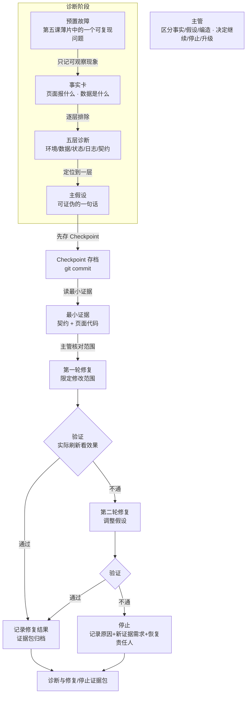

# 第六课学员指南——用事实找 Bug，在边界内修复

> **本课核心思想只有一句话：**
> **排错不是让 Agent 反复试，而是从事实出发、限制轮次，在证据不足时停下来交给合适的人。**

## 一、先看懂：今天为什么学、要带走什么

### 先看一个区别

| 让 Agent 盲目反复修 | 从事实出发、限制轮次、修不好就停 |
| --- | --- |
| 看到报错就让 AI"你看看怎么修"，AI 开始天马行空乱猜乱改 | 先复现故障只记事实，再五层定位，再读最小证据后才修 |
| AI 越改越崩，原来正常的模块也坏了 | 排错前先存 Checkpoint，修改只在限定范围内 |
| 两轮不通继续试第三轮第四轮，代码库越来越乱 | 两轮不通就停止，记录原因和恢复责任人 |
| AI 说"已修复"就信了，没有实际验证 | 修复后必须实际刷新看效果，不看 AI 自称结果 |

今天你要完成"诊断与修复/停止证据包"。它不是一份完美的 Bug 修复报告，也不是让 Agent 修到好为止；它只要求你从事实出发、用五层诊断定位、在限定轮次内修复或明确停止，并留下可追溯的证据。完成后你要带走：事实卡、一个主假设、最多两轮诊断的实际观察、修复结果或停止/升级理由、恢复责任人。

### 本课的有界排错闭环

```text
复现故障只记事实 → 五层诊断定位问题层 → 提出可证伪主假设
→ 先存 Checkpoint 再读最小证据 → 主管核对修改范围
→ 第一轮修复 → 验证（通过则记录 / 不通则调整假设）
→ 第二轮修复 → 验证（通过则记录 / 不通则停止）
→ 记录修复结果或停止原因 + 恢复责任人
```

"有界排错"不是偷懒不修，而是你始终承担三项责任：从事实出发而非猜测、限制修改范围和轮次、证据不足时停下来交给合适的人。

### 本课融合心智模型

这张图是整课的工作模型，不是课堂时间表。



这张图保留了原版控制流对比的演进逻辑：单 Agent 盲目反复修（原版痛点反例）→ 事实锚定排错 + 五层定位（本课方法）→ 有界排错 + 停止/恢复（本课收敛）。

### 五个必须掌握的概念

今天直接沿五个 Task 看见五个概念：Task 1—2 先记录事实并审查诊断报告，Task 3—4 在明确范围内修复和验证，Task 5 在证据不足、风险越界或两轮无进展时停止、升级或恢复。$diagnose Skill 负责执行诊断步骤，主管负责核对事实、批准范围并决定是否继续。

#### 1. 事实、假设与生成错误

- **是什么**：事实是看到的真实报错；假设是对根因的推测；生成错误是 AI 凭空捏造的不实信息。
- **怎么用**：故障排查时建立三栏清单，严禁把推测当事实，对 AI 声称“已经修好”的表述必须索取物证。
- **避坑红线**：严禁把 AI 生成的解释直接当成最终结论，缺少日志与代码证据一律视为未证明。

#### 2. 根因定位与五层诊断

- **是什么**：按“环境层 → 数据层 → 状态层 → 日志层 → 契约层”逐级排查问题的诊断方法。
- **怎么用**：提出一个有明确验证依据的推断，按层搜集证据；推断被推翻立刻更换方向。
- **避坑红线**：严禁看到界面报错就胡乱修改代码，没有定位到具体层级之前禁止动手。

#### 3. 重试预算与熔断

- **是什么**：为自动修复设定的次数上限（如最多 2 次），达到阈值强制停止。
- **怎么用**：防止 AI 在错误思路上越陷越深，保护上下文干净，及时触发人工介入。
- **避坑红线**：严禁解除重试限制，盲目重试不仅浪费成本，还会造成代码大面积污染。

#### 4. 有界排错（限时限范围）

- **是什么**：锁定单一问题、限定修改范围、设定最多只试两轮的止损排查机制。
- **怎么用**：排错前先存快照，第一轮不通调整思路试第二轮，两轮仍未解决立即停机转人工。
- **避坑红线**：严禁放任 AI 无限试错，两轮无进展时必须导出补丁快照并恢复现场，绝不扩大破坏面。

#### 5. 停止、升级与恢复

- **是什么**：停止当前自动化、交由明确责任人接管、从 Checkpoint 存档安全回退到已知版本。
- **怎么用**：达到停止条件时保留现场物证与所需证据清单，交接给对应技术责任人。
- **避坑红线**：严禁在未保留现场证据的情况下直接无差别清空工作区。

**事实锚定排错**与**五层诊断**是操作方法：先建立事实和验证信号，再按层定位；它们不占核心概念名额。

## 二、准备好：回顾第五课原型并确认环境

### 回顾第五课原型

打开你的第五课智能薄片或普通薄片，确认它仍可操作：
- 本地预览中原型能打开，业务路径仍能走通
- `docs/PROJECT_STATE.md` 有智能机会候选状态和上一课输入说明

如果薄片不可用或路径不通，先回到第五课修复，不要在不稳定的薄片上排错。

### 确认 Working Tree Clean

在终端运行：

```powershell
git status
```

预期输出：`nothing to commit, working tree clean`。如果 Working Tree 不是 Clean，先提交或还原遗留修改。

### 启动本地预览

双击项目根目录的 `start-project.bat`，或在终端运行：

```powershell
npm run dev
```

浏览器未自动打开时访问 `http://127.0.0.1:8888/`。

打开本地预览确认第五课原型仍可操作。超过 3 分钟仍打不开，请助教接管。

### 确认预置故障包

教师会在课堂上下发一个预置故障（如字段名不匹配导致界面异常）。确认你能复现这个故障后再开始诊断。不要同时排查多个故障。

### 确认 $diagnose Skill 可用

确认 `$diagnose` Skill 路径存在且可激活。$diagnose 是排错的结构化工具：你在 Task 1 激活 Skill 后，Agent 按 Phase 1—6 执行全部技术诊断（构建反馈循环 → 复现 → 假设 → 插桩 → 修复 + 回归测试 → 清理复盘），你在每个 Phase 边界做审查和决策——审查事实报告、选主假设、核对范围、验证结果、记录证据。你不需要自己找问题、复现或逐层排查，只需在边界审查 Agent 的产出。

## 三、动手做：有界排错五步

### Task 1：激活 $diagnose，确认故障现象，审查 Agent 的事实报告

**本步目的**：先看一眼故障长什么样，然后激活 $diagnose 让 Agent 去复现和记录，你审查事实报告。事实和猜测必须分开记录。这一步对应 $diagnose 的 Phase 1—2（构建反馈循环 + 复现）：Agent 构建可重复的 PASS/FAIL 信号并复现故障，你负责确认看到的是同一个故障、审查事实卡只含现象不含猜测。

**复制提示词**

```text
我已确认故障现象存在（看了一眼页面）。现在激活 $diagnose Skill，请按 Phase 1—2 执行：

1. 构建可重复的 PASS/FAIL 信号
2. 复现预置故障
3. 生成一张事实卡，只记录可观察事实（页面报什么、数据显示什么、控制台报什么）
4. 不要写猜测原因（那是假设，下一步再做）
5. 不要修改任何代码
6. 日志中有敏感信息（Token、Key、账号）的先脱敏为 <REDACTED>

事实卡格式：
- 故障现象：（只写看到什么）
- 复现步骤：（怎样触发）
- 控制台信息：（脱敏后第一行报错，如有）
- 数据状态：（字段值是什么）
```

**你应该看见**：AI 输出了一张事实卡，只记录可观察现象，不含猜测或编造，没有修改代码。你审查事实卡后确认只含现象，签确认。

**本步检查**：你先看了一眼故障现象；激活了 $diagnose 而非自己手动排查；事实卡只记现象不含猜测；敏感信息已脱敏；复现了故障；没有同时排查多个故障。

**必须停止**：如果你开始自己查控制台、逐行读代码，提醒"让 Agent 查，你审报告"；如果 AI 把猜测写进事实卡，提醒"事实是看到的，假设是想到的，分开记"；如果 AI 已经修改了代码，立即停止并还原。

### Task 2：审查 Agent 的五层诊断报告，选定一个可证伪主假设

**本步目的**：审查 Agent 的五层诊断报告，确认定位逻辑合理，选定一个可证伪的主假设。只选一个假设。这一步对应 $diagnose 的 Phase 3（假设）：Agent 逐层检查并生成 3—5 个可证伪假设并排序，你审查报告后选一个最可能的。

**复制提示词**

```text
$diagnose 已激活，请按 Phase 3 执行五层诊断。

故障现象：【粘贴 Task 1 的事实卡】

按以下口语标签逐层检查，从 Layer 1 开始逐层排除：
- Layer 1 环境：网页跑得起来吗？
- Layer 2 数据：有数据吗？拿到的是 null 吗？
- Layer 3 状态：数据变了界面动了吗？
- Layer 4 日志：控制台第一行红字报什么？（脱敏后）
- Layer 5 契约：字段名和契约配得上吗？

输出：
1. 每层的排查结论（PASS / FAIL / 不适用）
2. 定位到最可能的问题层（只选一层）
3. 生成 3—5 个可证伪假设并排序，标明最可能的主假设

不要同时提多个主假设。不要修改代码。
```

**你应该看见**：AI 逐层排查后定位到一层，生成了排序的假设列表并标明主假设，没有修改代码。你审查报告后确认定位合理，选定主假设。

**本步检查**：Agent 从 Layer 1 开始逐层排除而非跳层；你审查了报告而非自己逐层查；主假设可证伪（能被验证或推翻）；只选了一个假设。

**必须停止**：如果你开始自己逐层查，提醒"让 Agent 查，你审报告"；如果 AI 跳层排查，提醒"从 Layer 1 开始逐层排除"；如果同时提了多个主假设，缩到一个；如果 AI 修改了代码，立即停止。

### Task 3：存 Checkpoint，审查 Agent 的修复方案，核对范围后授权

**本步目的**：动代码前先存 Checkpoint 存档。$diagnose 已在 Task 1 激活，Agent 自动进入 Phase 4—5：读取最小证据（契约文件和页面代码）提出修复方案。你审查方案后核对修改范围，确认后才授权。你不需要重新激活 $diagnose。

**复制提示词**

```text
排错前先存 Checkpoint 存档。$diagnose 已在运行中，请按 Phase 4—5 执行：

1. 运行 git commit -m "checkpoint: before lesson 6 debug" 存档
2. 读取最小证据：只读契约文件和故障相关的页面代码
3. 确认主假设（字段名与契约不一致）
4. 提出修复方案：只改一个字段名，不碰其他文件
5. 等待主管核对范围后才执行修改

不要扩大修改范围。不要读取不必要的文件。不要重新激活 $diagnose。
```

**你应该看见**：AI 先存了 Checkpoint，读了契约和页面代码，提出了一个只改字段名的修复方案，等待你核对。你审查方案后确认范围没有扩散，授权执行。

**本步检查**：先存了 Checkpoint；只读了最小证据而非全部文件；你审查了修复方案并核对了修改范围；修改在范围内。

**必须停止**：如果未存 Checkpoint 就开始改，先补存；如果 AI 读太多文件，缩到最小证据；如果你未核对就授权，退回核对环节；如果 AI 扩大修改范围，立即停止。

### Task 4：验证结果，必要时进行第二轮，否则停止

**本步目的**：修复后实际刷新本地预览看效果。$diagnose 的 Phase 5 要求写回归测试，但在本课中回归测试由 Agent 自动完成，你只需确认原始故障不再复现。通过则进入 Task 5 记录；不通过则调整假设进行第二轮；两轮都不通则停止。

**复制提示词**

```text
请验证修复结果。

1. 刷新本地预览，观察故障是否消失
2. 基于实际观察（不是 AI 自称"已修复"）判断：
   - 通过：故障现象消失，进入 Task 5 记录
   - 不通过：调整假设，进行第二轮修复（仍限定范围）
   - 两轮都不通：停止，记录停止原因

不要继续试第三轮。不要相信"AI 说修好了"，必须实际看效果。
```

**你应该看见**：AI 刷新了页面，基于实际观察判断通过或不通过，没有自称"已修复"就算数。

**本步检查**：验证基于可观察结果而非 AI 自称；第二轮调整了假设而非盲目重复；两轮不通就停止。

**必须停止**：如果 AI 自称"已修复"但没有实际效果，要求实际刷新验证；如果第二轮盲目重复第一轮，提醒"换假设或停"；如果学员想继续试第三轮，执行停止。

### Task 5：记录修复后状态，或记录停止/升级原因和恢复责任人

**本步目的**：无论修复成功还是停止，都要完成证据包归档。事实卡、主假设、诊断过程、修复结果或停止原因、恢复责任人，六项缺一不可。这一步对应 $diagnose 的 Phase 6（清理 + 复盘）：Agent 清理调试日志和临时文件，你记录诊断结论和责任人。

**复制提示词**

```text
请帮我完成诊断与修复/停止证据包，写入 docs/LESSON_06_DEBUG_REPORT.md。

证据包必须包含以下六项：
1. 事实卡：（Task 1 的可观察现象）
2. 主假设：（Task 2 的可证伪主假设）
3. 诊断过程：（五层排查结论，定位到哪一层）
4. 修复结果：（改了什么，验证是否通过）或 停止原因：（两轮无进展 / 证据不足 / 风险越界）
5. 新证据需求：（如果停止，需要什么新证据才能继续）
6. 恢复责任人：（谁来接手，名字和角色）

如果修复成功：记录修复结果和恢复责任人。
如果停止：记录停止原因、新证据需求和恢复责任人。
```

**你应该看见**：`LESSON_06_DEBUG_REPORT.md` 包含六项完整内容，事实和假设分开记录，停止时有停止原因和恢复责任人。

**本步检查**：证据包完整（六项都有）；事实和假设分开记录；停止时有停止原因和恢复责任人而非只说"修不好"；修复结果可追溯。

**必须停止**：如果证据包不完整，补齐缺失项；如果事实和假设混在一起，分开记录；如果缺少恢复责任人，追问"谁来接手"。

核心路径通过后，让 Agent 更新 `docs/PROJECT_STATE.md`，记录诊断/恢复记录和下一课输入说明。它是下一课的项目交接单，不是第二份主要作业。

## 四、守住边界：安全红线、常见误区与问题处理

### 四条安全与真实性红线

- **数据与密钥**：只用 Mock/已脱敏数据，不输入真实资料、密钥、Token 或账号；日志脱敏后再给 AI，所有敏感信息替换为 `<REDACTED>`。
- **单故障原则**：不同时排查多个故障；一次只诊断和修复一个故障。
- **有界恢复**：不运行无范围恢复命令；回退时从 Checkpoint 存档恢复，导出 .patch 快照后恢复 Working Tree Clean。
- **真实性**：不把"自动修复"宣称为保证能力；修复结果必须实际验证，不看 AI 自称结果。

### 五个常见误区

| 误区 | 正确理解 |
| --- | --- |
| "遇到报错就把完整日志贴给 AI" | 日志中有 Token 和密钥，必须先脱敏为 `<REDACTED>` 再给 AI |
| "控制台全是红字肯定是我把系统搞砸了" | 控制台长堆栈是框架链式抛错，只需看第一行 Error Message，长堆栈留给 AI |
| "git restore 会把我之前写的代码全抹掉" | 排错前先存 Checkpoint，回滚只清除坏修补，历史代码毫发无损 |
| "AI 说已修复就是修好了" | 必须实际刷新本地预览看效果，不看 AI 自称结果 |
| "两轮不通再试一轮就好了" | 两轮不通就停止，记录原因和恢复责任人，不继续盲目试 |

### 遇到问题时只按五类处理

| 问题类型 | 先做什么 |
| --- | --- |
| **AI 把猜测写进事实卡** | 提醒"事实是看到的，假设是想到的，分开记" |
| **AI 盲目深挖底层框架** | 停止，限定修改只能在业务代码层，不碰 node_modules |
| **两轮不通学员想继续试** | 执行停止，记录停止原因和恢复责任人 |
| **粘贴含 Token 的完整日志** | 立即停止，脱敏后重新操作 |
| **AI 自称"已修复"但无实际效果** | 要求实际刷新本地预览验证，不看 AI 自称结果 |

## 五、证明会了：成果验收与随堂测试

### 成果验收

- **原型线**：对一个预置故障完成诊断，得到修复后的可见状态或明确停止记录；修改范围没有扩散。
- **主管线**：能区分事实、假设和模型编造；每轮动作、观察和判断可追溯；能基于证据选择继续或停止，而不是把"Agent 还想试"当理由。
- **交接单**：`LESSON_06_DEBUG_REPORT.md` 只作交接，不能抵消任何一条主线的未通过。

一句话记忆：**先复现只记事实，五层定位提一个假设，先存档再读最小证据，主管核对范围后修复，验证看实际效果，两轮不通就停，记录原因和责任人。**

必答题可以在对应 Task 后随手完成，最后只需检查并提交。

### 必答题（5 题）

1. 事实、假设和生成错误有什么区别？为什么排错时必须分开记录？
2. 五层诊断卡的五层分别是什么？为什么要从上到下逐层排除而不是到处乱改？
3. 有界排错要求明确哪四项？为什么不能无限试错？
4. 两轮诊断仍未通过时应该怎么做？为什么不能继续试第三轮？
5. 停止、升级与恢复分别是什么意思？停止时至少要记录哪三项？

### 拓展题（选做，2 题）

1. 重试预算/熔断的阈值应该怎么设？太高和太低各有什么风险？
2. 修掉页面报错不一定修掉根因，请举一个例子说明表象和根因的区别。

### 参考答案

1. 事实是观察现象、假设是待验证解释、生成错误是编造。分开才能追溯——混淆后无法判断哪条信息可信，也无法向 IT 交接。
2. 环境/数据/状态/日志/契约五层。逐层排除缩小范围，避免到处乱改扩大问题；跳层排查容易遗漏浅层问题。
3. 一个故障、一个主假设、修改范围、轮次上限。不能无限试错因为每轮试错可能扩大问题，且没有明确停止条件就无法交接。
4. 停止并记录停止原因、新证据需求和恢复责任人。不能继续试第三轮因为两轮无进展说明当前证据不足，继续试只会扩大风险。
5. 停止是暂停排错，升级是交给更合适的人，恢复是从 Checkpoint 回退。停止时至少记录停止原因、新证据需求和恢复责任人。

## 六、带到下一课：准备浏览器验收

本课主成果应在课堂内完成。课后只做 10—15 分钟准备，不继续开发功能：

1. 在 `PROJECT_STATE.md` 中补齐诊断/恢复记录和下一课输入说明；
2. 看一眼你的修复后的原型，想一句"如果让 Agent 用浏览器自动操作这个页面验收，你会怎么描述场景"。

下一课会让 Agent 用浏览器操作你的页面并留下验收证据。你已经有了一个稳定候选原型和已知验收场景，第七课会教你怎么把验收场景变成浏览器可执行步骤，并区分自动化验证证据和业务验收责任。
