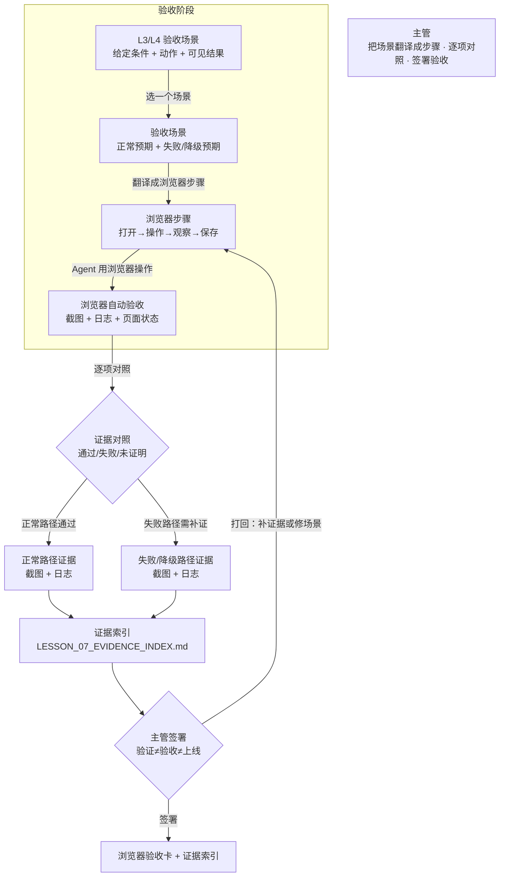

# 第七课学员指南 V4——让 Agent 操作页面并留下验收证据

> **本课核心思想只有一句话：**
> **工具验证行为，主管验收业务；测试通过不等于业务正确或可以上线。**

> **状态：V4_CONTENT_FROZEN（2026-08-12 用户确认）**。保留原第七课"让 Agent 操作页面完成验收"主线。原版 Playwright 浏览器操作和证据落盘保留并改写为业务视角。原版 QA Subagent 独立沙箱删除（虚构能力）；verify-project.ps1 删除（虚构能力）；[PASS] 全量校验删除。原版 Subagent 概念以业务视角重新引入——不是让学员安装沙箱，而是通过教师预配置的 Playwright Subagent 入口理解"主管调度只读子 Agent 执行浏览器操作并落盘证据"。新增"验收场景迁移"和"验证、验收与责任"两个核心概念。技术配置由教师预置，课堂不变成 MCP 安装课。

## 一、先看懂：今天为什么学、要带走什么

### 先看一个区别

| 主管口头验收 | Agent 用浏览器验收并留下证据 |
| --- | --- |
| 问"页面做好了吗"，AI 回答"做好了" | Agent 用浏览器实际操作页面、截图、记录日志 |
| 只看静态截图，不知道点击能不能走通 | 正常路径和失败路径都有可见证据 |
| 向 IT 交接时被打回，因为没有可追溯证据 | 证据索引可追溯，IT 能复核 |
| 测试通过了就以为可以上线 | 知道测试通过只证明行为正常，不证明业务正确 |

今天你要完成"浏览器验收卡 + 可追溯证据索引"。它不是一份全自动测试报告，也不是让 Agent 替你宣布通过；它只要求你把验收场景翻译成浏览器步骤，让 Agent 操作页面并保存证据，你逐项对照验收标准，标记已证明和未证明，最后由你签署。完成后你要带走：一个验收场景的浏览器操作证据、正常和失败路径的截图与日志、证据索引，以及你对"验证与验收区别"的理解。

### 本课的浏览器验收闭环

```text
从 L3/L4 选验收场景 → 明确正常与失败/降级预期 → 翻译成浏览器可执行步骤
→ Agent 用浏览器操作页面 → 每步保存截图和日志
→ 把观察与验收标准逐项对照 → 标记已证明/未证明/证据盲区
→ 对失败/降级路径补证 → 形成证据索引
→ 主管签署验收卡（说明验证≠验收≠上线）
```

"浏览器验收"不是让 Agent 替你决定通过，而是你始终承担三项责任：把业务验收场景翻译成可执行步骤、逐项对照证据判断是否通过、知道自动化证据不能替代业务批准。

### 本课融合心智模型

这张图是整课的工作模型，不是课堂时间表。



这张图保留了原版"口头验收 vs 自动验收"的对比演进逻辑：原版工程视角（QA Subagent + 双 MCP）→ 本课业务视角（MCP 最小模型 + Subagent 调度 + 浏览器验收 + 证据链 + 主管责任）。

### 五个必须掌握的概念

把今天的浏览器验收想成验房：先理解遥控器和电器的关系（MCP 最小模型），再让验房师带仪器实地检测（Subagent 与浏览器自动化验收），接着把验收标准翻译成检测步骤（验收场景迁移），然后逐项举证形成完整链条（证据链），最后区分检验科报告和主治医生签字（验证、验收与责任）。主管不是旁观者，而是翻译场景、对照证据、签署验收的人。

#### 1. MCP 最小模型

你在第六课五层诊断中排查过状态层——数据变了但界面没动。现在用 MCP 模型理解组件之间怎么通信。

- **是什么 / 不是什么**：Host 代表用户发起能力调用，Client 连接 Server，Server 暴露 Tools；MCP 不是产品业务 API，也不是 Agent 本身。Host 是用户运行的主程序（如 Claude），Client 是连接层，Server 是工具提供方（如 Playwright）。
- **怎样运作**：主管在 Host 中发起请求，Client 把请求传给 Server，Server 执行工具（如打开浏览器、点击按钮、截图）并返回结果；MCP 只是把"工具调用"标准化，不改变谁来负责。
- **类比与反例**：遥控器、信号线和电器的最小关系——主管按遥控器（Host），信号线（Client）把指令传给电器（Server），电器执行并返回结果；遥控器不是电器本身，信号线也不是业务审批。
- **今天怎样看见**：Task 2 你会在预配置入口发起 Agent 浏览器验收，知道 Host/Client/Server 的最小关系，并知道 MCP 不是业务 API。

#### 2. Subagent 与浏览器自动化验收

- **是什么 / 不是什么**：Subagent 是主管调度的只读子 Agent，在隔离沙箱中执行独立任务（如操作浏览器），有超时熔断、只读权限和磁盘落盘三条安全规则；不是多开一个 AI 对话，也不是让主管自己操作浏览器。浏览器自动化验收是 Subagent 按场景操作真实预览页面并观察结果，不是只读代码后自行宣布通过，也不是人工手动点一遍截图交差。
- **怎样运作**：主管在预配置入口调度 Subagent，Subagent 在只读沙箱中用浏览器工具按步骤操作页面，每一步保存截图和日志，超时自动释放，产物强制写入磁盘；写权限修改必须返回主 Agent 由主管签署 HITL 口令确认。Subagent 从 Task 2 激活后全程运行，主管在每个步骤边界做审查——审查证据是否完整、工具是否失败、是否偷偷换成代码推测。
- **类比与反例**：验房师带仪器实地检测——不是看图纸说"应该没问题"，而是用仪器逐项检测、拍照留证、出具报告；也不是业主自己随便看一眼就签字。Subagent 就像验房师带的检测仪器：独立运行、只读不碰、结果落盘。
- **今天怎样看见**：Task 2—3 你会调度 Subagent 用浏览器操作页面并保存证据，然后把观察与验收标准逐项对照。

#### 3. 验收场景迁移

- **是什么 / 不是什么**：把 L3 的给定条件、动作和可见结果转成浏览器可执行步骤，不是重新发明验收标准，也不是把业务场景变成技术测试脚本。
- **怎样运作**：取 L3/L4 的验收场景，保持业务含义不变，把"给定条件"翻译为页面初始状态，把"动作"翻译为浏览器操作步骤，把"可见结果"翻译为可观察的页面表现。
- **类比与反例**：菜谱翻译——中文菜谱翻译成英文菜谱，菜还是那道菜，只是换了操作语言；不是重新设计菜单，也不是把菜谱变成化学实验。
- **今天怎样看见**：Task 1 你会从 L3/L4 选一个验收场景，明确正常与失败/降级预期，再翻译成浏览器步骤。

#### 4. 证据链

你在第二课做过视觉证据基线——用前后对比证明改变。现在把同样的思维升级为证据链：不只存截图，还要把场景、操作、观察和结论串成可追溯的链条。

- **是什么 / 不是什么**：场景 → 操作 → 观察 → 原始证据 → 结论必须可追溯，不是只存截图不看内容，也不是只看结论不查原始证据。
- **怎样运作**：每个验收步骤都记录场景编号、操作描述、实际观察、原始证据（截图/日志/页面状态）和结论（通过/失败/未证明）；所有证据保存在 `LESSON_07_EVIDENCE_INDEX.md` 中。
- **类比与反例**：法庭举证链——物证、书证、证人证词和鉴定报告必须形成完整链条，不能只拿一张照片就定案；缺了任何一环，结论就站不住。
- **今天怎样看见**：Task 3—4 你会把观察与验收标准逐项对照，标记已证明、未证明和证据盲区，形成证据索引。

#### 5. 验证、验收与责任

- **是什么 / 不是什么**：工具验证行为（页面能打开、按钮能点、控制台无报错），主管验收业务（场景是否正确、结果是否符合业务要求）；测试通过不等于业务正确或可以上线。验证是技术层面，验收是业务层面，批准是主管层面。
- **怎样运作**：Agent 用浏览器验证页面行为是否正常，主管对照业务验收标准判断是否通过；Agent 可以收集证据但不能批准，主管基于证据批准或打回。
- **类比与反例**：医院检验科与主治医生——检验科出报告（验证），主治医生结合报告和病历做诊断判断（验收），最终治疗方案由主治医生签字（批准）；检验科不能替主治医生下诊断。
- **今天怎样看见**：Task 5 你会说明工具验证了什么、主管验收了什么、为什么测试通过不等于可以上线。

**Playwright/DOM/Console/Network** 是扩展认识：Playwright 驱动浏览器自动操作，DOM 是页面结构，Console 是控制台日志，Network 是网络请求记录。只要求识别名称，不要求配置或背诵。**不可信输入与提示注入** 也是扩展认识：页面内容可能夹带误导指令，Agent 不应把页面文字自动当作主管授权。两者只要求听过、能识别，不设独立通过门槛。

## 二、准备好：回顾第六课原型并确认环境

### 回顾第六课原型

打开你的第六课修复后或明确停止的原型，确认它仍可操作：
- 试衣镜中原型能打开，业务路径仍能走通
- `docs/PROJECT_STATE.md` 有诊断/恢复记录和上一课输入说明

如果原型不可用或路径不通，先回到第六课修复，不要在不稳定的原型上做浏览器验收。

### 确认 Working Tree Clean

在终端运行：

```powershell
git status
```

预期输出：`nothing to commit, working tree clean`。如果 Working Tree 不是 Clean，先提交或还原遗留修改。

### 启动试衣镜

双击项目根目录的 `start-project.bat`，或在终端运行：

```powershell
npm run dev
```

浏览器未自动打开时访问 `http://127.0.0.1:8888/`。

打开试衣镜确认第六课原型仍可操作。超过 3 分钟仍打不开，请助教接管。

### 确认浏览器验收环境

教师已预配置好 Playwright Subagent 入口（或等价浏览器自动化工具）。你不需要自行安装或配置。Subagent 在只读沙箱中运行浏览器操作，超时自动释放，产物写入磁盘。确认你能访问这个入口即可。如果入口不可用，请助教切换手动验收或等价工具。

## 三、动手做：浏览器验收五步

### Task 1：从 L3/L4 选择一个验收场景，明确正常与失败/降级预期

**本步目的**：先别急着操作浏览器，先选好你要验收什么。从 L3 业务功能卡或 L4 薄切片中选一个验收场景，写清给定条件、动作和可见结果，同时写一个正常预期和一个失败/降级预期。

**复制提示词**

```text
请帮我从 L3 业务功能卡或 L4 薄切片中选一个验收场景。

输出格式：
1. 场景名称
2. 给定条件：（页面初始状态是什么）
3. 动作：（用户做什么操作）
4. 可见结果：（正常情况下应看到什么）
5. 正常预期：（预期通过时的表现）
6. 失败/降级预期：（一个可能的失败或降级场景，如空数据、异常输入）

从我的 L3 契约和 L4 薄切片中选，不要临时编造。
不要操作浏览器。不要修改代码。
```

**你应该看见**：AI 输出了一个验收场景，有给定条件、动作、可见结果、正常预期和失败/降级预期，没有操作浏览器或修改代码。

**本步检查**：场景有给定条件、动作和可见结果三要素；正常和失败/降级预期都写了；场景来自 L3/L4 而非临时编造。

**必须停止**：如果场景不完整，回到 L3 契约补齐；如果只有正常预期没有失败预期，补写一个；如果场景太复杂，缩到一个可观察的变化。

### Task 2：调度 Subagent 用浏览器操作页面，保存截图和日志

**本步目的**：调度教师预配置的 Playwright Subagent，让它用浏览器实际操作你的页面，按场景步骤执行，每步保存截图和日志。工具失败时必须明确报告，不能偷偷换成代码推测。Subagent 在只读沙箱中运行，超时自动释放，产物强制写入磁盘。

**复制提示词**

```text
请用浏览器操作我的原型页面，按以下验收场景执行验收。

验收场景：【粘贴 Task 1 的场景】

执行要求：
1. 打开试衣镜预览页面
2. 按场景步骤操作页面（如：打开工单详情、点击处理按钮）
3. 每步保存截图和日志
4. 记录实际观察结果（不是推测，是看到什么）
5. 如果工具失败，明确报告"工具失败"，不要偷偷换成读代码推测
6. 不输入真实数据、密钥或 Token，只用 Mock 数据

完成后输出：
- 每步的操作描述和截图路径
- 实际观察结果
- 工具是否正常工作
```

**你应该看见**：Agent 用浏览器实际操作了页面，每步保存了截图和日志，记录了实际观察，工具失败时明确报告。

**本步检查**：Agent 实际操作了页面而非只读代码；每步保存了截图和日志；工具失败时明确报告而非偷偷换方式；没有输入真实数据/密钥。

**必须停止**：如果 Agent 只读代码不操作页面，提醒"用浏览器操作真实页面"；如果 Agent 工具失败后偷偷换成代码推测，停止并切换手动验收；如果在页面中输入真实数据，立即停止并脱敏。

### Task 3：把观察与验收标准逐项对照，标记已证明、未证明和证据盲区

**本步目的**：不要只看结论，逐项对照验收标准。每条标记通过、失败或未证明。未证明的要写明缺什么证据。

**复制提示词**

```text
请帮我把观察结果与验收标准逐项对照。

验收场景：【粘贴 Task 1 的场景】
浏览器操作结果：【粘贴 Task 2 的观察和截图路径】

逐项对照格式：
| 预期 | 实际观察 | 结论 | 证据 |
| --- | --- | --- | --- |

结论只能是：通过 / 失败 / 未证明
如果结论是"未证明"，写明缺什么证据。

不要跳过任何一条。不要只看总结论。
```

**你应该看见**：AI 逐项对照了验收标准，每条有结论和证据，未证明内容被明确标记。

**本步检查**：逐项对照而非只看总结论；未证明内容被明确标记而非跳过；证据盲区有说明而非假装不存在。

**必须停止**：如果只看结论不逐项，提醒"逐条对照"；如果未证明内容被跳过，补标记；如果没有证据盲区说明，追问"还有什么没证明"。

### Task 4：对一个失败/降级路径补证，并形成证据索引

**本步目的**：对失败/降级路径补充证据。用浏览器操作失败场景，保存截图和日志，把所有证据整理到 `LESSON_07_EVIDENCE_INDEX.md` 中。

**复制提示词**

```text
请帮我完成两件事：

1. 对失败/降级路径补充证据：
   - 用浏览器操作失败场景（如空数据、异常输入）
   - 保存截图和日志
   - 记录实际观察

2. 形成证据索引，写入 docs/LESSON_07_EVIDENCE_INDEX.md：
   每条证据包含：
   - 场景编号
   - 操作步骤
   - 观察结果
   - 原始证据路径（截图/日志）
   - 结论（通过/失败/未证明）

未证明的内容也要在索引中标记清楚，不要遗漏。
```

**你应该看见**：`LESSON_07_EVIDENCE_INDEX.md` 包含正常路径和失败路径的证据，每条有场景编号、操作、观察、证据路径和结论。

**本步检查**：失败/降级路径有可见证据而非只口头描述；证据索引包含场景、操作、观察、证据和结论五项；未证明内容在索引中标记清楚。

**必须停止**：如果失败路径没有实际操作，补操作；如果证据索引不完整，补齐缺失项；如果未证明内容在索引中遗漏，补标记。

### Task 5：主管签署验收卡，说明自动化验证证据与业务验收责任的区别

**本步目的**：最后由你签署验收卡。你必须能说出工具验证了什么、主管验收了什么、为什么测试通过不等于可以上线。

**复制提示词**

```text
请帮我生成本课的浏览器验收卡。

验收卡包含：
1. 验收场景名称
2. 正常路径结论（通过/失败）
3. 失败/降级路径结论（通过/失败/未证明）
4. 证据索引路径
5. 主管签署栏（姓名 + 日期）
6. 主管说明栏：
   - 工具验证了什么：（页面行为是否正常）
   - 主管验收了什么：（业务场景是否正确）
   - 为什么测试通过不等于可以上线：（测试只证明行为正常，不证明业务正确）

更新 docs/PROJECT_STATE.md 记录浏览器验收结果和下一课输入说明。
```

**你应该看见**：验收卡有主管签署，主管说明了验证和验收的区别，以及测试通过不等于上线的理由。

**本步检查**：主管实际签署而非只说"好了"；能说出验证和验收的区别；能说出测试通过不等于上线的理由。

**必须停止**：如果主管只说"好了"不签署，要求明确签署；如果不能说出区别，回到概念卡复习；如果把测试通过等同于上线，纠正"测试通过只证明行为正常，不证明业务正确"。

核心路径通过后，让 Agent 更新 `docs/PROJECT_STATE.md`，记录浏览器验收证据索引和下一课输入说明。它是下一课的项目交接单，不是第二份主要作业。

## 四、守住边界：安全红线、常见误区与问题处理

### 四条安全与真实性红线

- **数据与密钥**：只用 Mock/已脱敏数据，不在页面中输入真实数据、密钥、Token 或账号。
- **生产隔离**：不连接真实生产系统；浏览器只操作本地试衣镜预览页面。
- **技术不考**：不把 JSON-RPC、YAML、DOM 选择器变成主管考点；技术配置由教师预置。
- **真实性**：不虚构 `[PASS]` 全量校验或自动化审批；实际运行什么，就展示什么证据；未证明内容必须标记。

### 五个常见误区

| 误区 | 正确理解 |
| --- | --- |
| "AI 说做好了就是做好了" | 必须用浏览器实际操作页面，看实际观察而非 AI 自称 |
| "存了截图就是证据链" | 证据链要求场景→操作→观察→原始证据→结论五环可追溯，只存截图缺了观察和结论 |
| "测试通过了就可以上线" | 测试通过只证明行为正常，不证明业务正确；主管验收通过也不等于可以上线 |
| "Agent 收集的证据就是验收结果" | Agent 收集证据是验证，主管对照业务标准判断才是验收；Agent 不能替主管批准 |
| "浏览器验收就是手动点一遍截图" | 浏览器自动化验收是 Agent 按场景操作页面并保存证据，不是手动点一遍交差 |

### 遇到问题时只按五类处理

| 问题类型 | 先做什么 |
| --- | --- |
| **Agent 只读代码不操作页面** | 提醒"用浏览器操作真实页面"，不只看代码 |
| **Agent 工具失败后偷偷换成代码推测** | 停止，切换手动验收或等价工具，明确标记工具失败 |
| **在页面中输入真实数据** | 立即停止，脱敏后重新操作 |
| **只看结论不逐项对照** | 提醒"逐条对照验收标准"，标记每条结论 |
| **把测试通过等同于可以上线** | 纠正"测试通过只证明行为正常，不证明业务正确" |

## 五、证明会了：成果验收与随堂测试

### 成果验收

- **原型线**：自动操作个人原型中的一个场景，覆盖正常路径和一个失败/降级路径；至少一条正常路径和一条失败/降级路径有可见证据。
- **主管线**：能用自己的话说明 Host/Client/Server/Tool 的最小关系，并说明 MCP 不是业务 API；验收场景与自动操作一一对应；未证明内容被明确标记，没有虚构 `[PASS]`。
- **交接单**：`LESSON_07_EVIDENCE_INDEX.md` 只作交接，不能抵消任何一条主线的未通过。

一句话记忆：**从 L3 选场景写正常和失败预期，翻译成浏览器步骤让 Agent 操作页面保存截图和日志，逐项对照标记已证明和未证明，对失败路径补证形成证据索引，主管签署时说清验证不等于验收不等于上线。**

必答题可以在对应 Task 后随手完成，最后只需检查并提交。

### 必答题（5 题）

1. MCP 的 Host、Client、Server 和 Tool 之间的最小关系是什么？为什么 MCP 不是业务 API？
2. 浏览器自动化验收和只读代码后宣布通过有什么本质区别？
3. 验收场景迁移的"迁移"是什么意思？把 L3 的验收场景迁移成浏览器步骤时，什么不变、什么变？
4. 证据链要求哪五个环节可追溯？为什么只存截图不看内容不算证据链？
5. 验证和验收有什么区别？为什么测试通过不等于可以上线？

### 拓展题（选做，2 题）

1. 页面内容或工具返回可能夹带误导指令（提示注入），Agent 不应把页面文字自动当作主管授权。请举一个例子说明这个风险。
2. Playwright、DOM、Console、Network 分别帮助 Agent 做什么？为什么这些只是工程能力而非主管考点？

### 参考答案

1. Host 发起能力调用，Client 连接 Server，Server 暴露 Tools。MCP 是工具调用的标准协议，不是业务 API——它只负责"怎么调工具"，不负责"业务是否正确"。
2. 浏览器自动化验收是 Agent 用浏览器操作真实页面并观察结果；只读代码后宣布通过没有实际操作和观察，是 AI 自评而非验证。
3. 迁移是把业务验收标准翻译成浏览器可执行步骤，保持业务含义不变。不变的是验收标准（给定条件、动作、可见结果），变的是操作方式（从人工描述变成浏览器步骤）。
4. 场景→操作→观察→原始证据→结论五环可追溯。只存截图不看内容缺了"观察"和"结论"两环，无法判断截图说明了什么。
5. 验证是工具确认行为正常（页面能打开、按钮能点），验收是主管确认业务正确（场景是否符合业务要求）。测试通过只证明行为正常，不证明业务正确或可以上线。

## 六、带到下一课：准备独立评审

本课主成果应在课堂内完成。课后只做 10—15 分钟准备，不继续开发功能：

1. 在 `PROJECT_STATE.md` 中补齐浏览器验收证据索引和下一课输入说明；
2. 看一眼你的候选原型和证据包，想一句"如果让另一个 AI 在不知道我怎么做的情况下独立评审，它会找到什么问题"。

下一课会让 Codex 在隔离上下文中独立评审你的候选和证据。你已经有了一个候选原型、契约和浏览器验收证据包，第八课会教你什么是上下文隔离、独立 finding，以及主管如何处置评审结果。