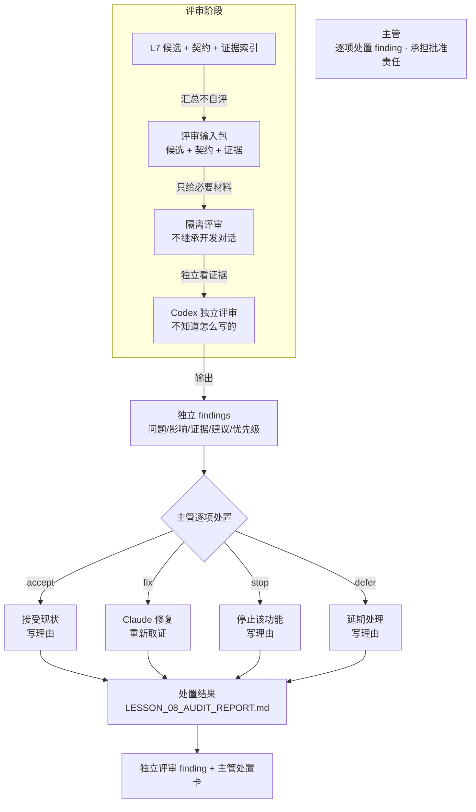

# 第八课学员指南 V4——Claude 执行，Codex 独立评审，主管裁决

> **本课核心思想只有一句话：**
> **执行者可验证，独立者评审，主管批准；三者不能压成一个自动通过点。**

> **状态：V4_CONTENT_FROZEN（2026-08-12 用户确认）**。保留原第八课"Codex 独立审查"主线。原版上下文隔离和背靠背盲审概念保留并改写为业务视角。原版六种多 Agent 拓扑降级为扩展认识；Codex Auditor、verify-project.ps1、YAML Frontmatter 删除。新增"独立 finding"和"验证/评审/批准三分"两个核心概念。

## 一、先看懂：今天为什么学、要带走什么

### 先看一个区别

| 一个 AI 既写又审 | 执行者和评审者分离 |
| --- | --- |
| AI 写完代码后自己说"没问题，已验收" | 另一个不知道怎么写的 AI 只看证据独立评审 |
| 上下文太长，AI 遗忘了初始规约，自卖自夸 | 评审者只拿隔离输入，不受开发对话影响 |
| 隐蔽 Bug 被忽略，因为"自己写的不会错" | 评审者逐项出 finding，指出问题、影响和证据 |
| AI 说通过了就以为可以合并 | 主管逐项决定 accept/fix/stop/defer，才批准 |

今天你要完成"独立评审 finding + 主管处置卡"。它不是让 Codex 替你批准，也不是让 AI 自动通过；它只要求你把材料交给隔离的评审者，得到独立 findings，然后由你逐项决定处置。完成后你要带走：一份隔离评审输入、带引证的独立 findings、每项 finding 的处置决定和理由，以及你对"验证、评审和批准三分"的理解。

### 本课的独立评审闭环

```text
汇总候选变更和证据（不自评通过）→ 建立隔离评审输入（只给必要材料）
→ Codex 独立评审输出 findings（问题/影响/证据/建议/优先级）
→ 主管逐项决定 accept/fix/stop/defer（写业务理由）
→ 需要修复的由 Claude 执行 → 关键项重新取证
→ 处置结果进入审计报告和项目状态
```

"独立评审"不是让 Codex 替你决定，而是你始终承担三项责任：给评审者隔离输入而非全部对话、逐项判断每条 finding 的处置、知道评审通过不等于主管批准。

### 本课融合心智模型

这张图是整课的工作模型，不是课堂时间表。



这张图保留了原版"单 AI 自卖自夸 vs 独立盲审"的对比演进逻辑：原版工程视角（6 大拓扑 + Codex Auditor）→ 本课业务视角（上下文隔离 + 独立 finding + 验证/评审/批准三分 + 主管处置）。

### 五个必须掌握的概念

把今天的独立评审想成审计故事，以餐厅出菜作补充：先让审计师只看凭证不看做账过程（上下文隔离），再让审计师逐项出审计发现报告（独立 finding），接着用餐厅出菜区分厨师试味、质检尝菜和店长拍板（验证/评审/批准三分），然后根据项目风险选审计分工方式（Agent 协作模式选型），最后管理层根据审计 findings 决定接受、整改、搁置或拒绝（HITL 处置）。主管不是旁观者，而是逐项处置 findings 并承担批准责任的人。

#### 1. 上下文隔离

- **是什么 / 不是什么**：评审者只接收约定的规格、候选和证据，不继承实现者的全部对话和自我辩护；不是给评审者看所有聊天记录，也不是让评审者和实现者用同一个会话。
- **怎样运作**：评审者拿到的是一份"隔离输入包"——契约、候选变更和证据索引，而不是开发过程中的全部对话和推演；评审者不知道实现者怎么想的，只看结果和证据。
- **类比与反例**：第三方审计会计师——只看凭证和账目，不参与做账过程，也不听会计的解释；不是让审计师和会计坐在一起对账。
- **今天怎样看见**：Task 2 你会建立隔离评审输入，只提供必要材料，不把全部开发对话也传给评审者。

#### 2. 独立 finding

- **是什么 / 不是什么**：每个评审结论都要指出问题、影响、证据和建议，不是笼统说"看起来没问题"，也不是只说"这里有点问题"不说明影响。
- **怎样运作**：评审者对每个发现输出四项：问题是什么、对业务有什么影响、证据在哪里、建议怎么处理；finding 有优先级（高/中/低），主管按优先级处置。
- **类比与反例**：审计发现报告——审计师逐项列出问题、财务影响、凭证证据和整改建议，不能只写"账目有点问题"。
- **今天怎样看见**：Task 3—4 你会让 Codex 输出独立 findings，然后逐项决定 accept/fix/stop/defer。

#### 3. 验证、评审与批准三分

- **是什么 / 不是什么**：执行者可验证（自己检查行为是否正常），独立者评审（第三方看证据找问题），主管批准或拒绝；三者不能压成一个自动通过点。验证是"自己做对了吗"，评审是"别人看有没有问题"，批准是"主管决定接不接受"。
- **怎样运作**：Claude 执行并自验行为，Codex 独立评审找问题，主管读取 findings 后批准、打回或延期；三者由不同角色承担，不能由同一个流程自动完成。
- **类比与反例**：餐厅出菜流程——厨师试味（验证），质检员尝菜（评审），店长决定能不能上桌（批准）；厨师不能自己说"好了"就上桌，质检员也不能替店长决定。
- **今天怎样看见**：Task 4—5 你会区分验证、评审和批准，不让 Claude 的修复和 Codex 的评审被同一自动流程冒充为主管批准。

#### 4. Agent 协作模式选型

- **是什么 / 不是什么**：根据依赖、并行性、独立性和责任选择流水线、调度/执行、并行、对等、评审等模式，不追求 Agent 数量，也不是越多 Agent 越好。
- **怎样运作**：判断任务之间是否有依赖（有则用流水线）、是否可并行（可则用并行）、是否需要独立（需要则用评审模式）；选择最简单足够的协作方式。
- **类比与反例**：审计项目分工——小公司一个会计兼做账和自核，大公司必须分会计和独立审计；不是所有项目都需要独立审计，但涉及高风险和外部责任时必须有。审计比喻帮助理解为什么需要分离角色，具体六种模式见扩展认识。
- **今天怎样看见**：Task 1—2 你汇总评审输入并建立隔离评审时，已经在实践"执行者和评审者分离"的协作模式。你在第七课已经体验过另一种协作模式——调度只读 Subagent 操作浏览器，本课的"调度/执行"就是同一概念在评审场景下的应用。

#### 5. 主管处置框架（accept/fix/stop/defer）

- **是什么 / 不是什么**：主管对 finding 作接受、修复、停止或延期决定，并记录承担理由；不是全部默认 accept，也不是让 AI 自动决定处置方式。
- **怎样运作**：主管逐项读取 finding，根据业务影响、风险和成本决定：accept（接受现状）、fix（修复问题）、stop（停止该功能）、defer（延期处理）；每个决定都要写理由。
- **类比与反例**：审计结论处置——审计师出具 findings 后，公司管理层决定接受、整改、搁置或拒绝；不能因为审计师说"问题不大"就忽略，也不能让审计师替管理层做决定。
- **今天怎样看见**：Task 4—5 你逐项决定处置方式，需要修复的由 Claude 执行，处置结果进入项目状态。

**六种协作模式名称** 是扩展认识：流水线、调度/执行、并行、对等、评审/辩论、人在回路仲裁，只要求用对比框架识别本课用了哪种，不搭建六套系统。**Reviewer fallback** 也是扩展认识：评审工具不可用时可切换隔离新会话或等价独立上下文，但不能因此跳过独立评审。两者只要求听过、能识别，不设独立通过门槛。

## 二、准备好：回顾第七课证据并确认环境

### 回顾第七课证据

打开你的第七课浏览器验收卡和证据索引，确认它们仍可用：
- `docs/LESSON_07_EVIDENCE_INDEX.md` 有正常路径和失败路径的证据
- `docs/PROJECT_STATE.md` 有浏览器验收证据索引和上一课输入说明

如果证据不可用，先回到第七课补齐，没有证据就无法做独立评审。

### 确认 Working Tree Clean

在终端运行：

```powershell
git status
```

预期输出：`nothing to commit, working tree clean`。如果 Working Tree 不是 Clean，先提交或还原遗留修改。

### 启动试衣镜

双击项目根目录的 `start-project.bat`，或在终端运行：

```powershell
npm run dev
```

浏览器未自动打开时访问 `http://127.0.0.1:8888/`。

打开试衣镜确认原型仍可操作。超过 3 分钟仍打不开，请助教接管。

### 确认评审环境

教师已预配置好 Codex 评审入口或等价隔离会话方案。你不需要自行安装。如果评审入口不可用，请助教切换隔离新会话作为 fallback。

## 三、动手做：独立评审与主管处置五步

### Task 1：汇总候选变更、契约和 L7 证据，不自评"已验收"

**本步目的**：先把评审输入准备好。汇总候选变更清单、L3 契约和 L7 证据索引，形成一份评审输入包。不要自评"已验收"或"没问题"。

**复制提示词**

```text
请帮我汇总评审输入包。

从我的项目中收集以下材料：
1. 候选变更清单：从 L4 到 L7 修改了哪些文件，改了什么
2. L3 业务功能卡：业务边界、数据契约和验收场景
3. L7 证据索引：LESSON_07_EVIDENCE_INDEX.md 的内容

汇总为一份评审输入包。
不要自评"已验收"或"没问题"。只提供事实材料。
不要包含开发过程中的对话和推演。
```

**你应该看见**：AI 输出了一份评审输入包，包含候选变更、契约和证据三部分，没有自评内容。

**本步检查**：评审输入包含候选、契约和证据三部分；没有自评通过或自我辩护；材料完整但不包含不必要的开发对话。

**必须停止**：如果缺少契约，回到 L3 补齐；如果有自评内容，删除；如果材料过多，缩到必要范围。

### Task 2：建立隔离评审输入，只提供必要材料和范围

**本步目的**：把评审输入包传给独立评审者，只包含契约、候选变更和证据索引，不包含开发过程中的对话和推演。

**复制提示词**

```text
请帮我建立隔离评审输入。

把以下材料传给独立评审者（Codex 或隔离新会话）：
1. 评审输入包：【粘贴 Task 1 的内容】

要求：
- 评审者只接收契约、候选变更和证据索引
- 不包含开发过程中的对话和推演
- 评审者不知道实现者怎么想的，只看结果和证据
- 评审范围：只评审上述材料范围内的内容

不要让评审者和实现者用同一个会话。
```

**你应该看见**：评审者只收到了约定的材料，不包含开发对话，范围明确。

**本步检查**：评审者只收到约定材料；不继承实现者的全部对话和自我辩护；材料范围明确。

**必须停止**：如果评审者收到太多材料，缩到必要范围；如果包含开发对话，删除；如果范围不明确，写清评审范围。

### Task 3：让 Codex 输出带引证、优先级和影响的独立 findings

**本步目的**：让评审者独立找问题。每项 finding 要有问题描述、业务影响、证据引证和建议，有优先级。

**复制提示词**

```text
请对评审输入包进行独立评审。

对每个发现输出以下四项：
1. 问题描述：发现什么问题
2. 业务影响：这个问题对业务有什么影响
3. 证据引证：证据在哪里（引用契约、证据索引或候选文件）
4. 建议：建议怎么处理

每项 finding 标记优先级：高 / 中 / 低

不要笼统说"看起来没问题"。每项都要具体。
不要修改任何代码。只输出 findings。
```

**你应该看见**：Codex 输出了独立 findings，每项有四项内容和优先级，引证了具体证据。

**本步检查**：findings 有四项（问题/影响/证据/建议）而非笼统评价；有优先级标记；引证了具体证据而非泛泛而谈。

**必须停止**：如果 findings 笼统，要求补充四项；如果缺少优先级，标记；如果没有引证证据，追问"证据在哪里"。

### Task 4：逐项决定 accept/fix/stop/defer，并说明业务理由

**本步目的**：由你逐项决定每条 finding 的处置。不要全部默认 accept。每项写业务理由。

**复制提示词**

```text
请帮我生成主管处置卡。

对每条 finding 逐项决定处置：

| Finding | 优先级 | 处置决定 | 业务理由 |
| --- | --- | --- | --- |

处置决定只能是：
- accept：接受现状（不影响业务或风险可接受）
- fix：修复问题（需要改代码并重新取证）
- stop：停止该功能（问题严重到需要停止）
- defer：延期处理（留到下一阶段处理）

每项必须写业务理由。不要全部默认 accept。每项业务理由至少说明：这个 finding 影响什么业务，修复/不修复的成本权衡是什么。不要只写"问题不大"。
```

**你应该看见**：处置卡有每条 finding 的处置决定和理由，不是全部 accept。

**本步检查**：每项 finding 有处置决定和理由，理由至少指出业务影响和成本权衡，不是只说"问题不大"；不是全部默认 accept；fix 的有后续修复计划；stop 或 defer 有明确理由。

**必须停止**：如果全部 accept，追问"有没有需要 fix 或 defer 的"；如果没有理由，补写；如果 fix 缺后续计划，补计划；如果理由只说"问题不大"或"可以接受"，追问这个 finding 影响什么业务、修复成本是多少。

### Task 5：需要修复的由 Claude 执行，关键项重新取证，处置结果进入项目状态

**本步目的**：对标记 fix 的 finding，让 Claude 执行修复。修复后对关键项重新取证。把处置结果写入审计报告和项目状态。

**复制提示词**

```text
请执行以下步骤：

1. 对标记 fix 的 finding，执行修复
2. 修复后对关键项重新在浏览器中取证（截图和日志）
3. 把处置结果写入 docs/LESSON_08_AUDIT_REPORT.md：
   - 每条 finding 的处置决定和理由
   - 修复后的重新取证结果
4. 更新 docs/PROJECT_STATE.md 记录独立评审结果和下一课输入说明

注意：修复是执行，批准是主管。Claude 的修复不能冒充为主管批准。
```

**你应该看见**：修复后有重新取证，处置结果写入审计报告和项目状态，没有把修复冒充为批准。

**本步检查**：修复后有重新取证而非只改代码；处置结果写入审计报告和项目状态；没有把 Claude 的修复和 Codex 的评审冒充为主管批准。

**必须停止**：如果修复后没有重新取证，补取证；如果处置结果未写入，补写；如果把修复冒充为批准，纠正"修复是执行，批准是主管"。

核心路径通过后，让 Agent 更新 `docs/PROJECT_STATE.md`，记录独立评审记录和下一课输入说明。它是下一课的项目交接单，不是第二份主要作业。

## 四、守住边界：安全红线、常见误区与问题处理

### 四条安全与真实性红线

- **数据隔离**：不向评审者提供真实敏感数据、密钥或不必要的实现对话；评审者只接收约定的规格、候选和证据。
- **主管责任**：不让 Codex 替主管批准业务；评审结果由主管裁决，不替代主管责任。
- **范围控制**：不要求学员实现全部协作拓扑；课堂只实践"执行者和评审者分离"一种模式。
- **真实性**：不虚构 `audit_status: PASS` 或自动化审批；实际评审出什么 finding，就展示什么 finding。

### 五个常见误区

| 误区 | 正确理解 |
| --- | --- |
| "一个 AI 既负责写代码又负责审计，效率最高" | 单个 AI 会自卖自夸，隐蔽 Bug 无法被识别；需要独立评审者 |
| "Codex 判定 PASS 后就自动合并了" | 最高决策权属于主管，AI 不能替人批准；主管逐项处置后才决定合并 |
| "评审者看的材料越多越好" | 评审者只看隔离输入，太多材料（尤其开发对话）反而影响独立判断 |
| "全部 accept 就是通过了" | 全部 accept 说明没有认真评审；每项都要写理由，fix/stop/defer 都是合理处置 |
| "Claude 修复了就是批准了" | 修复是执行，批准是主管；Claude 的修复不能冒充为主管批准 |

### 遇到问题时只按五类处理

| 问题类型 | 先做什么 |
| --- | --- |
| **评审者只说"看起来没问题"** | 要求输出四项 finding（问题/影响/证据/建议） |
| **主管全部默认 accept 或理由太笼统** | 追问"有没有需要 fix 或 defer 的"；如果理由只说"问题不大"，追问"这个 finding 影响什么业务，修复成本是多少" |
| **评审工具不可用** | 切换隔离新会话或等价独立上下文，不跳过评审 |
| **评审者收到开发对话** | 删除对话，只保留隔离输入 |
| **把 Claude 修复冒充为主管批准** | 纠正"修复是执行，批准是主管" |

## 五、证明会了：成果验收与随堂测试

### 成果验收

- **原型线**：对现有候选和证据进行一次独立评审，根据主管处置完成必要修复或明确延期；评审输入范围和上下文隔离方式明确。
- **主管线**：finding 有候选文件、行为证据或契约引证；主管能说明为何接受、修复、停止或延期；Claude 的修复和 Codex 的评审没有被同一自动流程冒充为主管批准。
- **交接单**：`LESSON_08_AUDIT_REPORT.md` 只作交接，不能抵消任何一条主线的未通过。

一句话记忆：**汇总候选和证据不自评，只给评审者隔离输入，Codex 出四项独立finding带优先级，主管逐项决定accept/fix/stop/defer写理由，修复后重新取证，处置结果进审计报告。**

必答题可以在对应 Task 后随手完成，最后只需检查并提交。

### 必答题（5 题）

1. 上下文隔离是什么意思？为什么评审者不能继承实现者的全部对话？
2. 独立 finding 的四项是什么？为什么"看起来没问题"不算 finding？
3. 验证、评审和批准分别由谁承担？为什么三者不能压成一个自动通过点？
4. Agent 协作模式选型的依据是什么？是不是 Agent 越多越好？
5. HITL 处置有哪四种决定？为什么不能全部默认 accept？

### 拓展题（选做，2 题）

1. 六种 Agent 协作模式分别是什么？本课实践了哪一种？为什么选这种？
2. 评审工具不可用时的 fallback 是什么？为什么不能因此跳过独立评审？

### 参考答案

1. 评审者只接收约定的规格、候选和证据，不继承实现者的全部对话和自我辩护。因为看了开发对话后会产生"既定印象"，影响独立判断。
2. 四项是问题/影响/证据/建议。"看起来没问题"没有具体问题、影响和证据，无法追溯和处置。
3. 执行者验证（自己做对了吗），独立者评审（别人看有没有问题），主管批准（决定接不接受）。三者由不同角色承担，压成一个自动通过点就失去了独立性和主管责任。
4. 依据是依赖、并行性、独立性和责任。不是 Agent 越多越好，选择最简单足够的协作方式即可。
5. accept/fix/stop/defer 四种。全部 accept 说明没有认真评审——如果每条 finding 都可以接受，可能说明评审不够深入或主管没有思考业务影响。

## 六、带到下一课：准备部门级 AI 机会选型

本课主成果应在课堂内完成。课后只做 10—15 分钟准备，不继续开发功能：

1. 在 `PROJECT_STATE.md` 中补齐独立评审记录和下一课输入说明；
2. 想一句"除了你已经选的那个智能候选点，你的部门还有哪些业务环节可能适合 AI，哪些不适合"。

下一课会从"一个候选点"扩展为部门业务流程级的 AI 机会与 Agent 范式选型。你已经有了一个经独立评审的候选原型、契约、证据和评审记录，第九课会教你画出部门 AI 机会地图，逐环节判断 AI 介入层级和范式。
