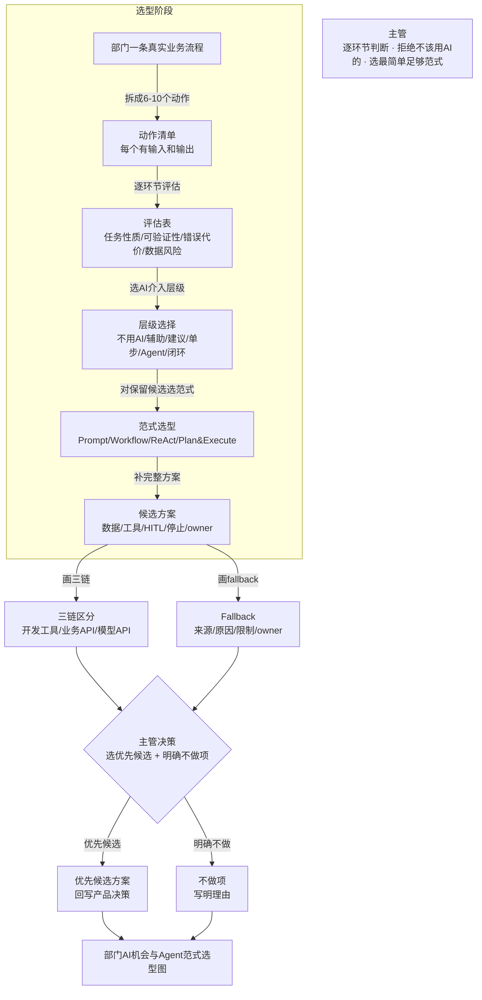

# 第九课学员指南——画出部门 AI 机会与 Agent 范式选型图

> **本课核心思想只有一句话：**
> **不是"我的部门能不能用 Agent"，而是逐环节判断任务性质、可验证性、风险和合适范式。**

## 一、先看懂：今天为什么学、要带走什么

### 先看一个区别

| 泛泛问"部门能不能用 Agent" | 逐环节判断画选型图 |
| --- | --- |
| 问 AI"我的部门适合用 Agent 吗"，得到一堆空泛建议 | 画出业务流程，逐环节判断任务性质和风险 |
| 所有环节都说"可以试试 AI"，没有拒绝 | 有明确的"不用 AI"环节和理由 |
| 不知道选什么范式，只知道"要用 AI" | 每个候选环节有范式、数据、工具、HITL 和停止条件 |
| 不知道谁负责失败，出了问题互相推 | 三链责任清楚，fallback 标记来源，失败有 owner |

今天你要完成"部门 AI 机会与 Agent 范式选型图"。它不是一份部门全面 AI 化方案，也不是让 AI 替你判断；它只要求你画出一条真实业务流程，逐环节判断任务性质、可验证性、风险和合适范式，并有明确的拒绝理由和优先候选。完成后你要带走：一张逐环节评估的选型图、至少一个"不做 AI"的有理由决定、一个优先候选的完整方案，以及三链责任与 fallback。

### 本课的流程级选型闭环

```text
画出部门一条真实业务流程 → 拆成具体人工/系统动作
→ 逐环节评估（任务性质/可验证性/错误代价/数据风险）
→ 选择 AI 介入层级（明确拒绝 AI 的环节及理由）
→ 对保留候选选范式（补数据/工具/HITL/停止条件/owner）
→ 画三链责任与 fallback → 选一个优先候选和一个明确不做项
→ 回写原型产品决策
```

"流程级选型"不是让 AI 替你决定，而是你始终承担三项责任：逐环节判断而非泛泛而谈、明确拒绝不该用 AI 的环节、为候选环节选最简单足够的范式并标注责任。

你在 L5 到 L8 已经积累了四种判断：L5 判断哪个环节不用 AI、L6 判断什么时候停止和升级、L7 判断验证和验收的区别、L8 判断 accept/fix/stop/defer。今天不是学新技能，而是把这些判断扩展到整个部门流程——从单点判断到逐环节判断。

### 本课融合心智模型

这张图是整课的工作模型，不是课堂时间表。



这张图保留了 L5 到 L9 的演进逻辑：L5 单点初筛（一个候选点）→ L9 流程级选型（全环节判断），从"一个环节能不能用 AI"到"每个环节该用什么程度的什么范式"。

### 五个必须掌握的概念

今天直接沿 Task 1—5 看见五个概念：Task 1—2 画真实流程并识别 AI 机会，Task 3 选择介入层级，Task 4 选择范式，Task 5 区分三条链并记录 fallback 和责任。AI 机会地图、介入迁移和范式选型是完成判断的方法。

#### 1. AI 机会

- **是什么 / 不是什么**：以真实业务流程节点为单位判断 AI 机会，不以"部门想用 AI"为单位；不是从"AI 能做什么"出发，而是从"这个环节需要什么"出发。
- **怎样运作**：画出部门一条真实业务流程，拆成具体动作，逐个判断任务性质、可验证性、错误代价和数据风险；只有满足条件的动作才进入 AI 候选，不满足的明确拒绝。
- **当课操作例子与边界**：Task 1—2 从真实流程节点出发，先写任务性质、价值、证据、风险和责任，再决定是否进入 AI 候选；不是先选工具再找场景。
- **帮助理解的类比（可选）**：像城市交通规划：先看每条路的客流需求，再决定哪条适合公交、哪条适合地铁、哪条走路就行；不是先买公交车再找路线。

#### 2. AI 介入层级

- **是什么 / 不是什么**：不用 AI、辅助、建议、单步执行、受控 Agent 和受控闭环必须按风险与价值选择；不是从 L5 的单点初筛直接跳到部门全面 AI 化，而是把 L5 的方法迁移到每个环节。
- **怎样运作**：对每个环节判断——能用规则的不用 AI，需要建议但不自动执行用辅助，需要生成但不直接修改用建议，需要单步执行用单步，需要多步调查用受控 Agent，需要闭环但低风险用受控闭环。
- **当课操作例子与边界**：Task 3 把 L5 的单点判断迁移到整条流程，逐环节选择最低足够层级；明确拒绝 AI 的环节也要写理由。

#### 3. Agent 范式

- **是什么 / 不是什么**：在 Prompt、Skill、Workflow、ReAct、增量实施范式（Plan & Execute）、Routing、Evaluator-Optimizer、多 Agent 等方式中选择最简单足够者；不是越多范式越好，也不是多 Agent 就是高级。
- **怎样运作**：判断路径是否预先确定（是则用 Workflow），是否需要动态调查（是则用 ReAct），是否需要先规划再执行（是则用 增量实施范式（Plan & Execute）），是否需要评估优化（是则用 Evaluator-Optimizer）；单 Agent 足够时不拆多 Agent。
- **当课操作例子与边界**：Task 4 先判断路径是否固定、是否要动态调查或评估优化，再选择 Workflow、ReAct、Plan & Execute 或其他最简单足够的方式；不因名称多就拆多 Agent。

#### 4. 三链区分

你在第八课学了上下文隔离——评审者和实现者不能混在同一个上下文里。现在把同样的思维扩展到三条链：开发工具、业务 API 和模型 API 也不能混为一谈。

- **是什么 / 不是什么**：区分开发工具链、产品业务 API 链和模型 API 链中的对象、凭证、数据与责任；MCP 不等于业务 API，开发工具也不等于产品能力。三链不能混为一谈。
- **怎样运作**：开发工具链是 Claude/Codex/Playwright 等帮助开发的工具；产品业务 API 链是产品运行时调用的业务接口；模型 API 链是产品运行时调用的 AI 模型接口。三链中的对象、凭证、数据和责任分别归属不同 owner。
- **当课操作例子与边界**：Task 5 分别列出开发工具、产品业务 API 和模型 API 的对象、凭证、数据与 owner；MCP 不等于业务 API，三链不能混管。
- **帮助理解的类比（可选）**：像厂房三个口：工具间（开发工具）、出货口（产品业务 API）、采购口（模型 API）——对象、凭证和责任不同，不能混管；MCP 属工具间，不等于出货口。开发工具不等于产品能力。

#### 5. Fallback 来源与失败责任

- **是什么 / 不是什么**：降级结果必须显示来源、原因、限制和 owner，不能把 Mock/缓存结果伪装成真实成功；失败时必须有明确的责任人，不是"AI 出错了所以 AI 负责"。
- **怎样运作**：对每个 AI 候选环节写明降级方式（人工接管、规则降级、缓存回退）、降级来源标签（模拟/缓存/人工）、降级原因类型和失败责任人；降级结果不能冒充正常结果。
- **当课操作例子与边界**：Task 5 为每个候选写降级方式、来源标签、原因和失败责任人；Mock、缓存或人工结果不能伪装成正常成功。
- **帮助理解的类比（可选）**：像挂“样品”标牌：样品不能当正品出货，降级结果必须标来源，出问题找对应负责人。不能把 Mock 伪装成正常成功。

**自动化红线预览** 是扩展认识：不可逆、高敏感、责任不清和难验证事项默认不进入自主执行。**多 Agent 的必要条件** 也是扩展认识：单 Agent 足够时不拆多 Agent，只有专业分工、并行或独立性确有价值时才采用。两者只要求听过、能识别，不设独立通过门槛。

## 二、准备好：回顾前八课并确认环境

### 回顾前八课

确认你的前八课成果可用：
- 你有一个经独立评审的候选原型和证据
- 你能说出 L5 选的那个智能候选点
- `docs/PROJECT_STATE.md` 有独立评审记录和上一课输入说明

### 想好一条部门业务流程

在课前或课堂前 5 分钟想好你部门的一条真实业务流程（如"收货→质检→上架→拣货→发货"或"接单→排产→生产→质检→出货"）。不需要太复杂，但必须是真实的、你熟悉的。

### 确认 Working Tree Clean

```powershell
git status
```

预期输出：`nothing to commit, working tree clean`。如果 Working Tree 不是 Clean，先提交或还原遗留修改。

## 三、动手做：流程级选型五步

### Task 1：画出部门一条真实业务流程，拆成具体人工/系统动作

**本步目的**：先把你的部门一条真实业务流程画出来，拆成 6—10 个具体人工/系统动作。不要想 AI，先画现状。

**复制提示词**

```text
请帮我画出我部门的一条真实业务流程，拆成具体动作。

业务流程名称：【填写你的部门流程，如"收货→质检→上架→拣货→发货"】

要求：
1. 画出完整流程，拆成 6—10 个具体人工/系统动作
2. 每个动作写清：
   - 动作名称
   - 输入是什么
   - 输出是什么
   - 当前谁在做（人工/系统/混合）
3. 先不要想 AI，只画现状
```

**你应该看见**：AI 输出了一条完整业务流程，拆成了 6—10 个具体动作，每个有输入、输出和当前做法。

**本步检查**：流程是一条完整的业务路径而非碎片；拆成了具体动作而非笼统环节；每个动作有输入和输出；没有开始想 AI。

**必须停止**：如果流程不完整，帮助补齐；如果动作太笼统，拆细；如果只有环节没有输入输出，补写。

### Task 2：对每个动作记录输入、判断性质、可验证性、错误代价和数据风险

**本步目的**：逐环节评估。对每个动作记录输入、任务性质（确定性/概率性）、可验证性、错误代价和数据风险。

**复制提示词**

```text
请对我在 Task 1 中拆解的每个业务动作做逐环节评估。

对每个动作回答以下五项：
1. 输入：需要什么输入数据或信息
2. 任务性质：确定性（规则清晰、结果唯一）还是概率性（需要判断、语言理解）
3. 可验证性：结果是否容易验证（高/中/低），验证标准是什么
4. 错误代价：错了会造成什么后果（高/中/低），是否可逆
5. 数据风险：涉及什么数据，是否敏感

输出为一张评估表，不要只标"适合AI"。
```

**你应该看见**：AI 输出了一张评估表，每个动作有五项评估，任务性质区分了确定性和概率性。

**本步检查**：每个动作有五项评估；任务性质区分了确定性和概率性；不只标"适合 AI"。

**必须停止**：如果只标"适合 AI"，要求补五项；如果任务性质没有区分，回指 L5 概念；如果可验证性太笼统，具体化。

### Task 3：选择 AI 介入层级，明确拒绝 AI/Agent 的环节及理由

**本步目的**：逐环节选 AI 介入层级。明确写出拒绝 AI/Agent 的环节及理由。至少有一个"不使用 AI/Agent"的有理由决定。

**复制提示词**

```text
请基于评估表，对每个动作选择 AI 介入层级。

AI 介入层级：
- 不用 AI：能用规则解决
- AI 辅助：AI 提供建议但不自动执行
- AI 建议：AI 生成内容但不直接修改
- 单步执行：AI 执行一个动作
- 受控 Agent：AI 多步调查，有人工检查点
- 受控闭环：低风险可自动闭环

要求：
1. 对每个动作选一个层级
2. 明确写出拒绝 AI/Agent 的环节及理由（至少一个"不用AI"）
3. 理由要基于你自己部门的具体业务约束（如特定风险、责任归属、法规或操作约束），不是泛化的"觉得不需要"或照搬教师案例的逻辑
4. 遵循最简单足够原则
```

**你应该看见**：AI 输出了每个动作的 AI 介入层级，有明确的拒绝理由。

**本步检查**：有至少一个"不使用 AI/Agent"的有理由决定；不是所有环节都选了 AI；拒绝理由基于任务性质和风险；拒绝理由引用了你自己部门的具体业务约束。

**必须停止**：如果所有环节都选 AI，追问"有没有能用规则解决的"；如果没有拒绝理由，补写；如果拒绝理由不基于风险，改写；如果拒绝理由只是复述教师案例的泛化模式，追问你自己部门的具体风险或约束是什么。

### Task 4：对保留候选选择范式，补数据、工具、HITL 和停止条件

**本步目的**：对选了 AI 的环节选范式，补数据、工具、HITL、停止条件和 owner。

**复制提示词**

```text
请对保留 AI 候选的环节选择范式并补充完整方案。

对每个候选环节回答：
1. 范式选择：Prompt / Skill / Workflow / ReAct / 增量实施范式（Plan & Execute） / Evaluator-Optimizer / 多 Agent
   - 选择理由（路径是否确定？是否需动态调查？是否需规划？）
2. 数据：需要什么输入数据（标明 Mock 来源）
3. 工具：需要调用什么工具
4. HITL：在哪个具体节点需要人批准或停止
5. 停止条件：什么情况下停止
6. owner：谁负责这个环节的运行和失败

单 Agent 足够时不拆多 Agent。选最简单足够的范式。
```

**你应该看见**：AI 输出了每个候选环节的范式选型和完整方案，六项都有明确答案。

**本步检查**：选型说明了数据、工具、证据、HITL、停止和 owner；范式与任务性质匹配；单 Agent 足够时没有拆多 Agent。

**必须停止**：如果范式与任务不匹配，回指 L5 概念；如果缺少 HITL/停止条件，补写；如果不必要拆多 Agent，缩回单 Agent。

### Task 5：画三链责任与 fallback，选出一个优先候选和一个明确不做项

**本步目的**：画三链（开发工具链、业务 API 链、模型 API 链）责任与 fallback，选一个优先候选和一个明确不做项，回写原型产品决策。

**复制提示词**

```text
请帮我完成三链责任与 fallback，并作出决策。

1. 画三链区分：
   - 开发工具链：用了什么开发工具（如 Claude/Playwright），owner 是谁
   - 业务 API 链：产品运行时调什么业务接口，owner 是谁
   - 模型 API 链：产品运行时调什么 AI 模型，owner 是谁
   确保三条链的对象和责任不混淆

2. 对每个 AI 候选环节写 fallback：
   - 降级方式（人工接管/规则降级/缓存回退）
   - 降级来源标签（模拟/缓存/人工）
   - 降级原因类型
   - 失败责任人

3. 作出决策：
   - 选出一个优先候选（最值得验证的环节）
   - 选出一个明确不做项（明确不用 AI 的环节，写理由）
   - 回写原型产品决策

更新 docs/PROJECT_STATE.md 记录选型图摘要和优先候选。
```

**你应该看见**：三链责任图、每个候选的 fallback、一个优先候选和一个明确不做项。

**本步检查**：三链对象与凭证责任没有混淆；fallback 不伪装真实结果；有优先候选和明确不做项；决策回写了产品决策。

**必须停止**：如果三链混淆，分开记录；如果 fallback 缺来源标记，补写；如果没有明确不做项，补一个。

核心路径通过后，让 Agent 更新 `docs/PROJECT_STATE.md`，记录选型图摘要、优先候选和下一课输入说明。它是下一课的项目交接单，不是第二份主要作业。

## 四、守住边界：安全红线、常见误区与问题处理

### 四条安全与真实性红线

- **数据与密钥**：不写真实接口接入代码，不向学员发放 Key；选型图只记录需求和方案，不实施。
- **最简单足够**：不把所有概率任务自动判成 Agent；逐环节判断最简单足够的方式。
- **多 Agent 红线**：不把多 Agent 当成熟度象征；单 Agent 足够时不拆。
- **fallback 真实性**：不把 Mock/缓存结果伪装成真实成功；降级结果必须标记来源。

### 五个常见误区

| 误区 | 正确理解 |
| --- | --- |
| "部门所有环节都应该用 AI" | 逐环节判断任务性质，能用规则的不用 AI；至少有一个不做的 |
| "多 Agent 比单 Agent 高级" | 多 Agent 是复杂度响应不是成熟度象征；单 Agent 足够时不拆 |
| "Mock 结果也是成功" | 降级结果必须标记来源，不能伪装成真实成功 |
| "三链都是 API 分不清" | 开发工具链、业务 API 链和模型 API 链是三条不同的链，对象和责任不同 |
| "选了 AI 就不用写 fallback" | 每个候选环节都必须写 fallback 来源和失败责任人 |

### 遇到问题时只按五类处理

| 问题类型 | 先做什么 |
| --- | --- |
| **所有环节都选了 AI** | 追问"有没有能用规则解决的" |
| **对部门流程不熟悉** | 帮助拆解但不代判断 |
| **把多 Agent 当成熟度象征** | 纠正"单 Agent 足够时不拆" |
| **把 Mock 结果当真实成功** | 纠正"降级结果必须标记来源" |
| **三链对象和责任混淆** | 分开记录三条链 |

## 五、证明会了：成果验收与随堂测试

### 成果验收

- **原型线**：把当前原型中的智能薄片放回完整业务流程，补充来源、失败显性化和责任边界。
- **主管线**：每个建议都对应具体业务节点；至少有一个"不使用 AI/Agent"的决定，拒绝理由引用你自己部门的至少一个具体业务约束，不是泛化套用教师案例的模式；选型说明了数据、工具、证据、HITL、停止和 owner；三链对象与凭证责任没有混淆，fallback 不伪装真实结果。
- **交接单**：`PROJECT_STATE.md` 只作交接，不能抵消任何一条主线的未通过。

一句话记忆：**画出部门一条真实流程拆成动作，逐环节评估任务性质和风险，选AI介入层级明确拒绝不该用的，对保留候选选最简单足够范式补数据工具HITL停止owner，画三链责任和fallback标来源，选一个优先候选和一个不做项。**

必答题可以在对应 Task 后随手完成，最后只需检查并提交。

### 必答题（5 题）

1. AI 机会地图以什么为单位判断？为什么不以"部门想用 AI"为单位？
2. AI 介入层级迁移有哪几个程度？为什么不是所有环节都选最高程度？
3. Agent 范式选型的依据是什么？为什么多 Agent 不是成熟度象征？
4. 三链区分区分哪三条链？为什么 MCP 不等于业务 API？
5. Fallback 来源与失败责任要求什么？为什么不能把 Mock 结果伪装成真实成功？

### 拓展题（选做，2 题）

1. 自动化红线有哪些？举一个你部门中不应该自动化的环节，说明理由。
2. 多 Agent 的必要条件是什么？什么情况下才值得拆多 Agent？

### 参考答案

1. 以真实业务流程节点为单位判断。不以"部门想用 AI"为单位，因为"部门想用 AI"是空泛的，逐环节判断才能落地——不同环节的任务性质、风险和可验证性不同，不能一刀切。
2. 不用 AI/辅助/建议/单步执行/受控 Agent/受控闭环。不是所有环节都选最高程度，因为能用规则的不用 AI，能用 Workflow 的不用 Agent；最简单足够优先。
3. 依据路径是否确定、是否需动态调查、是否需规划。多 Agent 不是成熟度象征，是复杂度响应——单 Agent 足够时不拆，只有专业分工、并行或独立性确有价值时才采用。
4. 开发工具链（开发用的工具）、业务 API 链（产品运行时调的业务接口）、模型 API 链（产品运行时调的 AI 模型）。MCP 是工具调用标准协议，不是业务接口。
5. 降级结果必须显示来源、原因、限制和 owner。不能伪装真实成功，因为这会导致决策者以为系统正常工作，实际是降级运行，可能产生错误判断。

## 六、带到下一课：准备产品决策与开发启动包

本课主成果应在课堂内完成。课后只做 10—15 分钟准备，不继续开发功能：

1. 在 `PROJECT_STATE.md` 中补齐选型图摘要、优先候选和下一课输入说明；
2. 想一句"如果要向 IT 交接你的原型和选型图，哪些已经证明了，哪些还没证明，哪些不能直接上线"。

下一课会冻结原型包并形成产品决策与开发启动包。你已经有了一个候选原型、契约、证据、评审记录和部门选型图，第十课会教你把所有资产汇总，作出继续/调整/暂缓/停止的产品决策，并形成 IT 能开始正式开发的输入。
