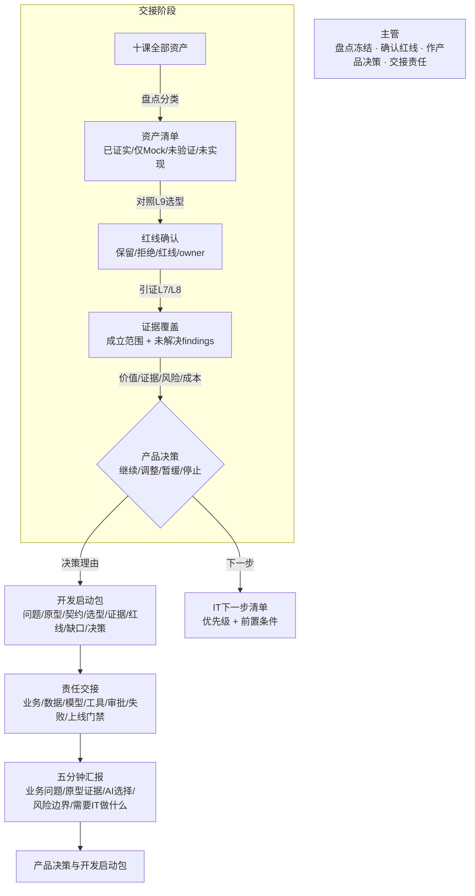

# 第十课学员指南——冻结原型包，形成产品决策与开发启动包

> **本课核心思想只有一句话：**
> **收口十课主线，不再新增功能；把原型、契约、智能机会、证据、评审、红线、责任和未完成项交给 IT，明确哪些仍不能上线。**

## 一、先看懂：今天为什么学、要带走什么

### 先看一个区别

| 把散乱 HTML 丢给 IT | 交出结构化开发启动包 |
| --- | --- |
| 丢几个页面文件，没有契约，没有证据 | 交出问题、原型、契约、选型、证据、红线和未完成项 |
| IT 不知道业务目标，不知道什么能用什么不能碰 | IT 知道从哪里开始、依据什么、缺什么、红线在哪 |
| Mock 和真实能力混为一谈，IT 以为已经做完了 | 四类资产清楚区分：已证实、仅 Mock/模拟、未验证、未实现 |
| 没有责任人，出了问题互相推 | 每项有 owner，交接是责任转移不是责任消失 |
| 做出来了就当能上线 | 有产品决策：继续、调整、暂缓或停止，有理由 |

今天你要完成"产品决策与开发启动包"。它不是一键生成的可上线 ZIP，不是包含源码和数据的交付物；它是一份结构化输入，让 IT 知道从哪里开始正式设计与开发。完成后你要带走：一份资产盘点清单（四类状态清楚区分）、一份红线与 owner 确认、一份证据覆盖说明、一个有理由的产品决策、一份 IT 下一步清单，以及一个五分钟业务汇报。

### 本课的交接闭环

```text
盘点十课资产（已证实 / 仅Mock模拟 / 未验证 / 未实现）
→ 对照L9选型确认保留/拒绝/红线/owner
→ 用L7/L8证据说明原型成立范围，列出未解决findings
→ 作出继续/调整/暂缓/停止的产品决定 + IT下一步清单
→ 完成五分钟汇报（业务问题/原型证据/AI选择/风险边界/需要IT做什么）
→ 更新PROJECT_STATE.md终局交接单
```

"交接"不是"交完就完了"，而是你始终承担三项责任：如实区分已证实和模拟、为每项确认 owner、作出有理由的产品决策并说明哪些不能上线。

### 本课融合心智模型

这张图是整课的工作模型，不是课堂时间表。



这张图保留了十课的完整演进逻辑：从 L1 的第一个普通业务原型，经过视觉重构、业务契约、薄切片、智能机会、诊断、验收、独立评审、部门选型，到 L10 的产品决策与开发启动包——从"做出一个原型"到"交出一份诚实的开发输入"。

### 五个必须掌握的概念

把今天的交接想成项目交接仪式：先看建筑模型和真实建筑的区别（原型与生产系统），再确认非交付清单（风险红线与非目标），接着作投资决定（产品决策），然后把材料整理成交接包（开发启动包），最后明确谁负责什么（责任交接）。主管不是旁观者，而是如实盘点、确认红线、作出决策和交接责任的人。

#### 1. 非生产就绪系统（原型与生产系统）

- **是什么 / 不是什么**：原型验证路径和决策；生产系统还需正式架构、安全、数据、测试、运维与责任治理。原型能跑通不等于能上线，原型的 Mock 数据和模拟智能行为不能冒充生产能力。
- **怎样运作**：原型回答"这条业务路径值不值得做、该不该用 AI"；生产系统回答"如何在安全、性能、成本和合规下稳定运行"。两者面向不同问题、不同标准和不同团队。
- **类比与反例**：建筑模型与真实建筑——模型验证户型和动线是否合理，真实建筑还需要结构计算、消防审批、水电工程和施工许可；不能因为模型好看就跳过施工图。
- **今天怎样看见**：Task 1 你会盘点十课资产，区分已证实和仅 Mock/模拟，这就是原型与生产系统的分界线。

#### 2. 风险红线与非目标

- **是什么 / 不是什么**：明确不能自动执行、必须人工批准、暂不建设或留给后续工程的事项；不是"所有风险都要在本课解决"，而是"所有风险都要被看见、被记录、有 owner"。
- **怎样运作**：从 L9 的三链责任和 fallback 中提取红线——不可逆动作（资金、合同）、高敏感数据、责任不清的模糊判断、难以验证的开放任务；把红线写入开发启动包，让 IT 知道哪些不能碰、哪些暂不做。
- **类比与反例**：交房时的非交付清单——房屋交付时附一份"尚未完成或需要业主自行处理"的清单，不假装一切都好；也不是"有问题就不交房"，而是"交房时说明清楚"。
- **今天怎样看见**：Task 2 你会对照 L9 选型确认红线和 owner。

#### 3. 产品决策

- **是什么 / 不是什么**：根据价值、证据、风险和成本选择继续、调整、暂缓或停止，不以"做出来了"自动等于应该建设；不是所有原型都要上线，也不是做出来就白做了。
- **怎样运作**：把价值（值不值得）、证据（能不能证明成立）、风险（出了问题多大代价）和成本（正式开发需要多少投入）四项放在一起，作出一个有理由的产品决定。决定可以是继续、调整方向、暂缓或停止，四者都是合理选择。
- **类比与反例**：投资决策——不是每个项目都投，不是每个项目都拒绝；依据预期回报、风险评估、已有证据和资金成本作决定；做出来了不等于应该投，没做也不等于白做。
- **今天怎样看见**：Task 4 你会作出继续/调整/暂缓/停止的决定并写理由。

#### 4. 开发启动包

- **是什么 / 不是什么**：把已确认事实、证据、缺口和下一步交给 IT；不是一键生成的可上线包，不是包含源码和数据的交付 ZIP。它是一份结构化的输入文件，让 IT 知道从哪里开始、依据什么、缺什么。
- **怎样运作**：汇总十课成果——问题与使用者、现有原型、业务/数据/验收契约、AI 机会与范式选型、测试和独立评审证据、风险红线、三链责任、未完成项、主管决策——形成一份 IT 能读懂、能追溯、能开始正式设计的输入。
- **类比与反例**：项目交接仪式——不是把钥匙丢给对方就走，而是带着建筑模型、竣工证据、红线清单和未完成清单坐下来，逐项说明"这是什么、证明了什么、还差什么、谁负责"。
- **今天怎样看见**：Task 1—4 的汇总就是你的开发启动包。

#### 5. 责任交接

- **是什么 / 不是什么**：业务、数据、模型、工具、审批、失败处置和上线门禁都有明确 owner；不是"交给 IT 就完了"，也不是"主管保留所有决定权"。交接是责任转移，不是责任消失。
- **怎样运作**：对开发启动包中每一项写明——谁是业务 owner、谁是数据 owner、谁是技术 owner、谁负责审批、谁负责失败处置、谁决定能否上线。暂不能确定的 owner 必须标"待定"并写明由谁去落实。
- **类比与反例**：铁路交接——新铁路开通前，运营权、维护权、安全审批权分别移交不同部门，不是一个人全管，也不是"交了就没人管了"。
- **今天怎样看见**：Task 2 和 Task 4 你会确认 owner 和作出决策。

**生产就绪缺口** 是扩展认识：安全评审、真实数据治理、集成测试、监控、回滚、成本和合规等后续门禁。**能力分级** 也是扩展认识：可以演示、可以试点、可以有限内部使用、可以生产上线是不同等级。两者只要求听过、能识别，不设独立通过门槛。

## 二、准备好：回顾前九课并确认环境

### 回顾前九课

确认你的前九课成果可用：
- 你有一个候选原型、业务契约、薄切片和智能薄片
- 你有 L7 浏览器验收证据和 L8 独立评审记录
- 你有 L9 部门 AI 机会与 Agent 范式选型图，能说出优先候选和不做项
- `docs/PROJECT_STATE.md` 有选型图摘要和上一课输入说明

### 确认 Working Tree Clean

```powershell
git status
```

预期输出：`nothing to commit, working tree clean`。如果 Working Tree 不是 Clean，先提交或还原遗留修改。

## 三、动手做：交接五步

### Task 1：盘点十课资产，区分已证实、仅 Mock/模拟、未验证和明确未实现

**本步目的**：先把十课做的所有东西盘点一遍，分清四类状态。不要新增东西，只盘点已有的。

**复制提示词**

```text
请帮我盘点十课训练营的全部资产。

要求：
1. 列出每一课做的主要成果（原型、契约、薄片、证据、选型图等）
2. 对每项标注：
   - 来源课次
   - 是什么
   - 当前状态（四选一）：
     * 已证实：有真实运行证据或验收通过
     * 仅 Mock/模拟：用模拟数据或模拟智能行为
     * 未验证：设计了但没跑过或没验证
     * 未实现：计划了但没做
3. 不要新增东西，只盘点已有的
4. 不要把 Mock 标成"已证实"
```

**你应该看见**：AI 输出了一份资产清单，每项有来源课次和四类状态之一，Mock 项标了"模拟"，未实现项标了"未实现"。

**本步检查**：四类状态都出现了；不是所有项都标"已证实"；Mock 项标了"模拟"；未实现项标了"未实现"而非省略。

**必须停止**：如果所有项都标"已证实"，追问"智能行为是模拟的还是真跑的"；如果漏了某课资产，回看 PROJECT_STATE.md；如果状态标签混淆，逐项确认。

### Task 2：对照 L9 选型，确认保留的智能机会、拒绝项、风险红线与 owner

**本步目的**：对照 L9 选型图，逐项确认保留、拒绝、红线和 owner。

**复制提示词**

```text
请对照我的 L9 部门 AI 机会与 Agent 范式选型图，逐项确认：

1. 保留的智能机会：哪些继续保留为候选？理由是什么？
2. 拒绝项：哪些明确不用 AI/Agent？理由是什么？
3. 风险红线：哪些动作绝对不能自动执行（不可逆/高敏感/责任不清/难验证）？
4. owner：对每项标注 owner
   - 业务 owner：负责业务目标和验收（通常是主管自己）
   - 数据 owner：负责数据质量和脱敏
   - 技术 owner：负责实现和运维（可能是 IT，待定也要写明）
   - 审批 owner：谁批准能否上线

拒绝项和红线要写理由。owner 不能全写"自己"或"IT"，要按角色分别标注。
```

**你应该看见**：AI 输出了保留项、拒绝项、红线项和 owner 标注，每项有理由。

**本步检查**：保留项有理由和 owner；拒绝项有理由；红线项有明确禁止范围；owner 不是全部写"自己"或"IT"，而是按角色分别标注。

**必须停止**：如果没有拒绝项，回指 L9；如果 owner 全写"IT"，追问"业务 owner 是谁"；如果红线缺失，追问"有没有不可逆动作"。

### Task 3：用 L7/L8 证据说明原型在哪些范围内成立，列出未解决 findings

**本步目的**：用证据说明成立范围，列出未解决 findings。不要用"应该没问题"代替证据。

**复制提示词**

```text
请用 L7 浏览器验收证据和 L8 独立评审记录，说明我的原型在哪些范围内成立。

1. 成立范围：逐项说明"什么被什么证据证明了"
   - 例：正常路径成立——L7 浏览器验收截图证明了正常路径可操作
   - 例：独立评审有记录——L8 有 finding 记录和主管处置
2. 未解决 findings：列出尚有问题的项
   - 例：失败降级路径未验证——L7 只验收了正常路径
   - 例：智能行为未接真实模型——L5 只做了模拟
3. 不要用"应该没问题"代替证据
4. 不要把 Mock 当真实证据
```

**你应该看见**：AI 输出了成立范围（有证据引证）和未解决 findings 清单。

**本步检查**：成立范围有具体证据引证（不是笼统说"应该没问题"）；未解决 findings 有清单；没有把 Mock 当真实证据。

**必须停止**：如果成立范围太笼统，追问"哪条证据证明了哪个范围"；如果未解决 findings 缺失，回看 L8 finding 清单；如果把 Mock 当真实证据，纠正。

### Task 4：作出继续/调整/暂缓/停止的产品决定，并形成 IT 下一步清单

**本步目的**：基于资产盘点、红线确认和证据覆盖，作出产品决定，形成 IT 下一步清单。

**复制提示词**

```text
请基于以下信息，帮我作出产品决定：

1. 资产盘点结果（Task 1）
2. 红线和选型确认（Task 2）
3. 证据覆盖范围和未解决 findings（Task 3）

产品决策要求：
1. 对每个保留候选作出决定：继续 / 调整 / 暂缓 / 停止
2. 每个决定写四项依据：
   - 价值：值不值得做
   - 证据：能不能证明成立
   - 风险：出了问题多大代价
   - 成本：正式开发需要多少投入
3. 不是所有项都"继续"；该暂缓的暂缓，该停止的停止

然后形成 IT 下一步清单：
- 每项标优先级（高/中/低）
- 每项标前置条件（需要什么先完成）
- 不是"全交 IT 自己看着办"
```

**你应该看见**：AI 输出了每个候选的产品决定（有四项依据）和 IT 下一步清单（有优先级和前置条件）。

**本步检查**：决定有四项依据（价值/证据/风险/成本）；不是所有项都"继续"；IT 清单有优先级和前置条件；不是"全交 IT 自己看着办"。

**必须停止**：如果全部"继续"，追问"有没有该暂缓的"；如果 IT 清单没优先级，排序；如果决定没理由，补写。

### Task 5：完成五分钟汇报——业务问题、原型证据、AI 选择、风险边界、需要 IT 做什么

**本步目的**：准备五分钟汇报，五个要素各 30—60 秒，不超时，不编造。

**复制提示词**

```text
请帮我准备五分钟汇报，覆盖五个要素：

1. 业务问题（30秒）：什么业务问题、谁遇到、为什么重要
2. 原型证据（60秒）：原型做了什么、有什么证据（引用L7验收和L8评审）
3. AI 选择（60秒）：哪个环节用AI/Agent、什么范式、哪个明确不用AI
4. 风险边界（60秒）：哪些是红线、哪些未验证、失败如何降级
5. 需要 IT 做什么（30秒）：下一步清单的优先项

要求：
- 每个要素只说结论，结论要能追溯到前四步的资产和证据
- 不要编造能力或夸大已证实范围
- 总计五分钟，不超时
```

**你应该看见**：AI 输出了五分钟汇报草稿，五个要素各有时长控制，结论可追溯。

**本步检查**：五分钟内覆盖五个要素；结论可追溯到前四步的资产和证据；没有编造能力或夸大已证实范围。

**必须停止**：如果超时，压缩各要素时间而非删除要素；如果结论不可追溯，回指具体证据；如果编造，纠正。

核心路径通过后，让 Agent 更新 `docs/PROJECT_STATE.md`，记录最终产品决策摘要、IT 下一步清单和课程完成标记。它是课程终局交接单，不是第二份主要作业。

## 四、守住边界：安全红线、常见误区与问题处理

### 四条安全与真实性红线

- **不新增功能**：不在最后一课新增功能填满"完整度"；冻结当前原型，不临时补新页面或新能力。
- **不假装完成**：不用 placeholder 假装缺口已完成；未完成项必须标"未实现"，Mock 项必须标"模拟"。
- **不声称生产就绪**：原型是开发起点，不是生产系统；不能因为能跑就说能上线。
- **不执行真实上线**：不连接真实生产系统，不执行真实部署或发布。

### 五个常见误区

| 误区 | 正确理解 |
| --- | --- |
| "做出来了就应该上线" | 做出来只证明路径可走，不证明值得正式开发；产品决策要依据价值/证据/风险/成本 |
| "Mock 跑通了就算成功" | Mock 是模拟，不是已证实能力；四类状态必须区分 |
| "交给 IT 就完了" | 交接是责任转移不是责任消失；每项有 owner，业务和数据 owner 是主管 |
| "最后一课补点功能更完整" | 最后一课不新增功能，只盘点和冻结；完整度不等于功能数量 |
| "原型能跑就能上线" | 原型与生产系统是两回事；生产还需安全/数据/集成/监控/合规等门禁 |

### 遇到问题时只按五类处理

| 问题类型 | 先做什么 |
| --- | --- |
| **想补新功能填满完整度** | 纠正"最后一课不新增功能，只盘点和冻结" |
| **把 Mock 当真实生产能力** | 纠正"Mock 是模拟，不是已证实能力" |
| **全部选"继续开发"** | 追问"有没有该暂缓或停止的" |
| **把责任全推给 IT** | 纠正"业务 owner 和数据 owner 是主管" |
| **声称原型生产就绪** | 纠正"原型是开发起点，不是生产系统" |

## 五、证明会了：成果验收与随堂测试

### 成果验收

- **原型线**：冻结当前可操作原型与证据，不在最后一课临时补新页面或新能力。
- **主管线**：包内关键结论能够追溯到契约、原型、测试或评审证据；Mock、模拟、真实能力和未验证项清楚区分；主管能说出至少三项可以继续开发和三项不能直接上线的事项；所有高风险动作、数据、系统和失败路径有 owner 或明确待定责任。
- **交接单**：`PROJECT_STATE.md` 只作交接，不能抵消任何一条主线的未通过。

一句话记忆：**盘点十课资产分清已证实和模拟，对照L9选型确认红线和owner，用L7/L8证据说明成立范围列未解决findings，作继续/调整/暂缓/停止的产品决定有理由，形成IT下一步清单有优先级和前置，五分钟汇报业务问题原型证据AI选择风险边界需要IT做什么。**

必答题可以在对应 Task 后随手完成，最后只需检查并提交。

### 必答题（5 题）

1. 原型与生产系统有什么区别？为什么原型能跑通不等于能上线？
2. 风险红线与非目标包括什么？为什么"所有风险都要被看见"比"所有风险都要被解决"更重要？
3. 产品决策的四个依据是什么？为什么"做出来了"不等于"应该建设"？
4. 开发启动包含什么？为什么不叫"可上线包"？
5. 责任交接要求什么？为什么交接是责任转移而不是责任消失？

### 拓展题（选做，2 题）

1. 生产就绪缺口有哪些？你的原型离生产上线还差哪些门禁？
2. 能力分级（可演示/可试点/可有限内部使用/可生产上线）四个等级的区别是什么？你的原型目前在哪一级？

### 参考答案

1. 原型验证路径和决策，生产系统还需正式架构、安全、数据、测试、运维和责任治理。原型用 Mock 数据和模拟行为，缺少安全评审和集成测试等门禁，所以能跑通不等于能上线。
2. 红线包括不可逆动作（资金、合同）、高敏感数据、责任不清的模糊判断和难以验证的开放任务。本课是交接不是解决，让 IT 知道边界比假装解决更重要——看不见的风险比解决不了的风险更危险。
3. 四个依据是价值、证据、风险和成本。做出来只证明路径可走，不证明值得投入正式开发——可能价值不够、风险太高或成本太大。
4. 包含已确认事实、证据、缺口、下一步和主管决策。叫"启动包"是因为它是 IT 开始正式设计的输入，不是可以直接上线的交付物——缺安全评审、集成测试、监控等生产门禁。
5. 要求每项有 owner（业务/数据/技术/审批/失败处置）。交接是责任从主管转移到 IT 和其他角色，不是没人负责也不是主管全管——每项有明确责任人，暂不能确定的标"待定"并写明由谁落实。

## 六、课程终点：你的十课完整认知链

本课主成果应在课堂内完成。课后只做 10—15 分钟准备，不继续开发功能：

1. 在 `PROJECT_STATE.md` 中补齐最终产品决策摘要和 IT 下一步清单；
2. 想一句"如果有人问你'这个原型能不能上线'，你怎么回答"。

你的十课完整认知链：

```text
先做出一个普通业务原型（L1）
→ 把业务和数据说清楚（L3）
→ 只实施一个可验收薄片（L4）
→ 再判断一个环节是否需要 AI/Agent（L5）
→ 用事实诊断失败（L6）
→ 让工具操作页面并留下证据（L7）
→ 让独立评审者提出 finding，由主管处置（L8）
→ 扩展为部门流程级 AI 机会与范式选型（L9）
→ 把原型、证据、红线、责任和缺口交给 IT（L10）
```

你现在已经拥有：一个可操作、可解释、可验证的部门业务原型包；一张部门 AI 机会与 Agent 范式选型图；一份诚实、可追溯、可供 IT 启动正式开发的产品决策包。

这不是终点，而是起点——原型回答了"值不值得做"，接下来的正式开发会回答"怎么在安全、性能和合规下稳定运行"。主管的责任没有结束，只是从"做原型"进入了"管开发"。
