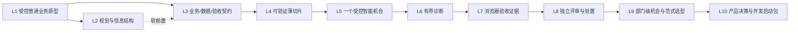

# 主管 AI 业务原型训练营：十课冻结教学基线

---

## 一、十课共同冻结规则

### 1. 学员与课程终点

- 学员是不了解 AI Agent、也未必能完整描述本部门信息化需求的业务主管。
- 课程不能要求学员在第一课就判断“哪个业务流程有 AI 机会”。
- 课程终点不是让主管成为程序员，而是让主管带着一个持续演进的部门业务原型，能够定义业务、裁定范围、理解 AI/Agent 的适用方式、验收证据、处置风险并与 IT 交接。
- 原型包是“开发起点”，不是“生产就绪系统”。

### 2. 两条线并行，但每课只形成一个主成果

**原型推进线**：同一个个人业务原型从首个可操作路径，逐步获得视觉结构、业务契约、薄切片、智能行为、诊断证据、浏览器验收、独立评审和交接材料。

**主管判断线**：主管从“会定义和验收普通业务原型”，逐步发展到“会判断哪里不用 AI、哪里用普通 AI、哪里用固定 Workflow、哪里值得用受控 Agent，以及人应在哪里批准、接管或停止”。

两条线不得变成两份并行作业。每课只有一个主成果，判断证据嵌入同一成果中；原型做得漂亮不能抵消判断错误，概念答对也不能抵消原型路径不可操作。

### 3. AI/Agent 融入业务的正式节点

| 阶段 | 课程处理 |
| --- | --- |
| L1—L4 | 使用开发 Agent 帮助制作普通业务原型；不要求判断业务 AI 机会，也不要求往业务中加入 AI 功能 |
| **L5** | **第一次正式教授并实践“AI/Agent 如何融入业务”**；主管只选一个低风险、可验证的智能环节 |
| L6—L8 | 围绕这个候选智能环节学习排错、自动化验收、独立评审和主管处置 |
| L9 | 从“一个候选点”扩展为部门业务流程级的 AI 机会与 Agent 范式选型 |
| L10 | 把原型、选型理由、证据、红线、责任和未完成项交给 IT |

### 4. 概念与材料负荷

- 每课 **3—5 个核心概念**，可有 **0—2 个扩展认识概念**。
- 首次核心概念使用四步概念解析公式：是什么/不是什么、怎样运作、业务类比与反例、刚完成的实操与主管价值。
- 扩展概念只要求“听过、能识别”，不设独立通过门槛；通常由教师用 2—4 分钟说明。
- 操作口令、工具名称和工程背景不自动升级为核心概念。
- 每课的核心概念要进入最终 `GLOSSARY`；扩展概念也登记，但标明“认识级”。
- 学员指南保持 6 大章；教师教案保持 8 大模块。章节内部可以有必要的小标题，但不得重新膨胀为知识目录。
- 每课保留随堂必答题 1—5 道、拓展题 0—2 道；常见误区不超过 5 项，问题处理不超过 5 类。

### 5. 原型范围与课后负担

- 每课的主要成果必须在课堂内形成；课后只允许补齐、复核或整理，不另开第二项大型作业。
- 不按页面数评价原型。一个页面能完成一条业务路径，就不强行拆成 3—5 页；确实需要两个页面才能完成也可以。
- 不要求把部门全部业务需求做成原型。十课始终围绕一个可解释、可验证、可交接的主路径及其必要扩展。
- `PROJECT_STATE.md` 是跨课交接单：记录当前做到了什么、依据是什么、下一步是什么、明确没做什么；它不是额外的主要作业，也不是事实权威的自动替代品。

### 6. 统一教学关系

- 教师用一个标准业务案例讲清方法和判断。
- 学员不先照抄教师案例再重做一遍，而是直接把同一方法迁移到自己的部门原型。
- Claude/开发 Agent 可以执行制作、修改、测试等工作；主管负责业务目标、范围、授权与验收。
- Codex 在独立评审课中承担隔离上下文的评审角色；评审结果仍由主管裁决，不替代主管责任。
- 所有学员实操使用 Mock 或事前脱敏数据，不输入真实密钥，不连接真实生产系统；教师如演示真实调用，必须在仓库外的受控环境完成。

---

## 二、十课总览

| 课次 | 课程主题 | 原型推进 | 主管判断 | 课堂主成果 |
| --- | --- | --- | --- | --- |
| L1 | 从业务问题到第一个受控原型 | 做出一条可操作的普通业务路径 | 分清 LLM、Tools、Agent 和主管责任 | 个人业务原型 V1 |
| L2 | 让原型变得清楚、可信、能用 | 改善信息结构与视觉表达，不扩业务范围 | 能说明保留、舍弃和修改的理由 | 视觉重构版原型 + 前后证据 |
| L3 | 把模糊业务说成可执行契约 | 用 `grill-me` 固定业务、数据和验收边界 | 能回答谁、为何、何时、做到哪、怎样算通过 | 业务定义包 V1 |
| L4 | 把契约切成一个可实施薄片 | 只实施一个可见、可验证的纵向变化 | 能裁定本轮做什么、不做什么、何时停止 | 薄切片候选 + 状态与版本证据 |
| **L5** | **第一次把 AI/Agent 融入业务** | 在现有原型中加入一个明确标记的智能行为模拟 | 判断不用 AI、AI 辅助、Workflow 或受控 Agent | 智能机会卡 + 原型智能薄片 V1 |
| L6 | 用事实找 Bug，在边界内修复 | 对普通或智能薄片完成有界诊断 | 用证据决定继续、停止、升级或恢复 | 诊断与修复/停止证据包 |
| L7 | 让 Agent 操作页面并留下验收证据 | 用预配置浏览器入口验收一个场景 | 分清自动化验证证据与业务验收责任 | 浏览器验收卡 + 证据索引 |
| L8 | Claude 执行，Codex 独立评审，主管裁决 | 对候选原型形成隔离上下文 finding | 接受、修复、停止或延期，并说明理由 | 独立评审 finding + 主管处置卡 |
| L9 | 部门 AI 机会与 Agent 范式选型 | 把单点智能薄片放回完整业务流程评估 | 逐环节选 AI 介入层级、范式、工具、证据和责任 | 部门 AI 机会与 Agent 选型图 |
| L10 | 冻结原型包并形成开发启动包 | 汇总原型、契约、证据、评审与缺口 | 判断可继续开发、不可直接上线和必须人工负责的事项 | 产品决策与开发启动包 |

### 十课知识与成果演进



L2 是重要的横向能力，但不是 L3 的硬前置；真正不能跳过的主链是“业务边界 → 契约 → 薄切片 → 智能机会 → 诊断 → 验收 → 独立评审 → 部门选型 → 交接”。

---

## 三、逐课冻结内容

## L1｜从业务问题到第一个受控原型

### 课程定位

让零基础主管先获得一次完整成功：不是先学信息化理论，也不是先找 AI 机会，而是从 A/B/C 三种业务原型起点中选一个，用已经提供的完整提示词直接做自己的普通业务原型。

### 两条线

- **原型推进线**：从自己的业务出发，完成一条最小、真实可操作的业务路径；页面数量由路径决定。
- **主管判断线**：分清 LLM 负责理解与推演、Tools 负责外部动作、Agent 负责组织多步执行、主管负责定义范围与验收。

### 课堂主成果

**个人业务原型 V1**：能打开，能完成一次点击、输入输出或状态变化；使用 Mock/脱敏数据；能说清谁在什么场景完成什么动作并看到什么结果。

### 核心概念（4）

1. **LLM**：生成候选内容的“概率大脑”，不是天然掌握部门事实的完整执行者。
2. **Tools**：读取、修改、运行和取得外部结果的“手脚”，不代表权限无限。
3. **Agent**：把 LLM、上下文和 Tools 组织起来完成多步工作的执行者，不承担主管的业务责任。
4. **业务原型**：验证一条业务路径的可操作样板，不是生产系统，也不等于全部需求。

### 操作方法

- **最小业务路径确认**：先确认一条从输入到结果的最短可操作路径。
- **本地预览**：在本机开发服务器中观察原型外观和交互并完成低成本验收。

### 扩展认识（1）

- **ReAct 现象**：执行一个动作、观察结果、根据结果调整；本课只认出现象，不进行业务 Agent 机会判定。

### 主要 Tasks

1. 从 A 监控决策、B 任务流程、C 操作工具中选择一个个人原型起点。
2. Task 1 只让 LLM 复述业务和提出最小路径，不读写项目。
3. Task 2 让 Tools 读取真实项目事实，修正方案但不实施。
4. Task 3 由主管确认路径、非目标和修改范围，再让 Agent 实施。
5. Task 4 在本地预览中验收，只修一个最影响理解或操作的问题，然后停止扩展并更新 `PROJECT_STATE.md`。

### AI/Agent 融入业务节点

**尚未开始。** 本课使用开发 Agent 制作普通业务系统原型，不判断部门流程中的 AI 机会，也不加入聊天框、AI 推荐、自动决策或业务 Agent。

### 通过证据

- 原型路径可操作并产生可见结果。
- 数据被明确标记为 Mock/脱敏。
- 学员能指出 LLM、Tools、Agent 与主管各自做了什么。
- 学员能够拒绝越阶段、越范围或缺乏证据的动作。

### 进入下一课的输入

当前原型 + 一张视觉参考图 + 一句最想改善的视觉或使用问题。

### 明确不做

- 不要求 3—5 个页面；不补全全部业务需求。
- 不判断业务 AI 机会；不连接真实 API、数据库或模型。
- 不把提示词中的“先确认”宣称为系统硬门禁。

---

## L2｜让原型变得清楚、可信、能用

### 课程定位

保留原第二课“视觉重构四步闭环”的主线：结构提取 → 规则映射 → 主管裁决 → 微调验收。目标不是讲前端术语，而是让主管把“我觉得不好看”转成可说明、可执行、可比较的业务视觉判断。

### 两条线

- **原型推进线**：在不增加业务功能的前提下，改善现有原型的信息层级、布局、状态表达和操作清晰度。
- **主管判断线**：从参考图提取意图，决定哪些 Keep、哪些 Omit、哪些 Modify，并能指出判断如何落在页面上。

### 课堂主成果

**视觉重构版个人原型**：包含前后对照、3—5 条设计约束及其页面落点，以及主管的 Keep/Omit/Modify 裁决。

### 核心概念（5）

1. **项目级 Agent 约束 / Agent Harness**：项目为 Agent 规定目标、范围、行为和设计规则的约束机制。
2. **约束作用域与优先级**：明确规则适用范围及冲突时的优先顺序。
3. **行为约束与设计约束**：分别约束 Agent 如何工作以及产物应满足什么视觉、交互和信息层级。
4. **信息优先级与视觉层级**：按业务重要性安排内容、状态、操作和视觉强调。
5. **约束一致性验证**：检查实现是否同时满足项目约束、设计约束和验收场景并留下证据。

### 操作方法

- **多模态参考提取、设计约束映射、Keep / Omit / Modify、视觉证据对比**：把参考意图转成约束、裁决和可核对的前后证据。
- **课堂产物**：`AGENTS.md`/`CLAUDE.md` 承载行为约束，`DESIGN.md` 承载设计约束，视觉证据记录验收对比；这些是交付产物，不是核心概念。

### 扩展认识（2）

- **Design Token**：把颜色、间距、字号等重复规则统一命名；教师一句话说明，不作为本课工程重点。
- **版本节点**：保留批准前后候选差异的记录；不要求主管掌握 Git 命令。

### 主要 Tasks

1. 从参考图提取多模态布局、过滤、强调和业务能力结构。
2. 把提取结果映射为 `DESIGN.md` 或同等设计约束，不先改页面。
3. 主管逐项作 Keep/Omit/Modify 裁决并授权本轮修改范围。
4. Agent 完成一次受控视觉重构；主管在本地预览中做前后对比。
5. 只做必要微调，保存视觉证据与本次裁决。

### AI/Agent 融入业务节点

**尚未开始。** Agent 只是帮助改造原型的开发执行者；本课不因为看见一个界面就判断其业务是否适合 AI。

### 通过证据

- 业务路径没有因视觉修改而失效。
- 至少 3 条约束可从参考意图追溯到页面落点。
- 学员能解释至少一项 Keep、一项 Omit 或 Modify 的业务理由。
- 前后差异可见、可复述、可追溯。

### 进入下一课的输入

可操作原型 + 视觉约束 + 学员仍说不清的一个业务问题。

### 明确不做

- 不扩大业务范围，不新增第二条主路径。
- 不把 Token、CSS、Git 变成主管的主要学习任务。
- 不照搬参考图中的业务字段和数据。

---

## L3｜把模糊业务说成可执行契约

### 课程定位

第三课只完成“定义正确”，不同时承担大规模实施。用 `grill-me` 把主管的口语想法追问成可核对的业务、数据与验收约定，为第四课薄切片实施提供冻结输入。

### 两条线

- **原型推进线**：围绕现有原型的一个主路径，补齐业务逻辑、字段、状态和验收场景。
- **主管判断线**：能够回答谁遇到什么问题、为什么要做、目标是什么、边界在哪里、错了有什么风险、怎样算通过、何时必须停。

### 课堂主成果

**个人业务定义包 V1**：一份统一收敛的业务功能卡，包含业务边界、数据契约、Mock 样例和 1—2 条验收场景；可由内部文件拆分存放，但对学员是一个成果。

### 核心概念（4）

1. **业务问题边界**：使用者、触发、问题、目标和明确非目标共同限定本次业务。
2. **业务契约**：把 User & Problem、Goal、Boundary、Risk、Acceptance、Stop/Escalation 固定为可执行约定。
3. **数据契约**：固定字段、含义、类型、枚举、来源状态和 Mock 规则，避免前后口径漂移。
4. **验收场景**：用给定条件、动作和可观察结果说明怎样算通过，不只列功能名称。

### 扩展认识（2）

- **敏感度分级与事前脱敏**：数据进入对话和材料前先判断，不在泄露后再补救。
- **结构化输出/类型文件**：工程师可把契约写成类型或 Schema；主管只需能核对业务含义。

### 操作方法

- **结构化追问（Grill-Me）**：按问题、目标、边界、风险、通过条件和停止条件追问并固化业务契约。

### 主要 Tasks

1. 选定现有原型中最需要说清的一条业务路径。
2. 使用 `grill-me` 依次澄清使用者与问题、目标、边界、风险、验收、停止/升级。
3. 把已确认决定收敛为业务功能卡，未确认项必须显式保留。
4. 固定字段字典、状态、Mock 样例和敏感度。
5. 写出 1—2 条可观察的验收场景，并由主管完成最终确认。

### AI/Agent 融入业务节点

**尚未开始正式判定。** `grill-me` 是本课使用的可复用追问 Skill；学员学习的是如何把普通业务定义清楚，不因为用了 Agent 追问就把业务本身判定为 Agent 场景。

### 通过证据

- 使用者、触发、目标和非目标均明确。
- 字段、规则和验收场景能够相互追溯。
- Mock 与敏感字段有明确标识。
- 学员能指出至少一个停止或升级条件，而不是要求 Agent“继续试到成功”。

### 进入下一课的输入

经主管确认的业务定义包 V1；第四课只能在该范围内选择一个薄切片实施。

### 明确不做

- 不在追问尚未结束时实施全部功能。
- 不把所有部门需求一次性写成大而全 PRD。
- 不用真实业务数据帮助 Agent“理解得更准确”。

---

## L4｜把契约切成一个可实施的薄片

### 课程定位

承接第三课冻结契约，把原第四课“切薄片实施”的主线完整保留。第三课负责把事情说对，第四课负责把一小件事情做对；不把两课挤成一节超载课。

### 两条线

- **原型推进线**：从业务定义包中选择一个纵向薄片，完成可见实施并保留正常、空或失败状态中的必要证据。
- **主管判断线**：能裁定切片是否足够小又足够完整，能区分业务状态与技术状态，并在实施前后分别确权。

### 课堂主成果

**可验证薄切片候选**：一个肉眼可见、可操作、可验收的变化，附契约追溯、状态说明和版本证据；两阶段版本记录是本课程方法，不是 Git 强制规则。

### 核心概念（4）

1. **薄切片**：一次完成一条从输入到结果的纵向变化，不是把任务拆成没有业务结果的技术碎片。
2. **版本控制基础**：识别 Working Tree、Diff、Commit 如何提供版本证据，不规定提交次数。
3. **技术状态与业务状态**：加载、错误等系统状态和待处理、已升级等业务含义不能混为一谈。
4. **可追溯验收**：把技术变化、验收场景、证据与主管业务处置关联起来。

### 扩展认识（1）

- **HITL 授权点**：在范围、实施和验收处由人作决定；本课以动作实践，不扩成理论课。

### 操作方法

- **Plan & Execute**：先形成经主管确认的实施计划，再按计划执行和调整。
- **两阶段版本记录**：分别记录候选实现和主管业务处置，不要求固定提交数量。
- **有界恢复**：由有权限人员按确认范围恢复到已知版本，保留范围、证据和责任人。

### 主要 Tasks

1. 校验第三课契约，列出可独立验收的候选切片。
2. 主管选择一个切片并写清本轮非目标。
3. Agent 先给出 Plan；主管核对字段、状态、修改范围和验收路径后才授权 Execute。
4. 实施一个可见变化，并至少展示两种必要状态。
5. 主管按契约验收，记录候选版本与处置结果，不自动宣称通过。

### AI/Agent 融入业务节点

**尚未开始业务 AI 机会判断。** 本课的 Agent 是实施原型的开发 Agent；Plan & Execute 是开发协作方式，不等于学员业务已经适合 Agent 化。

### 通过证据

- 切片从输入到结果完整，但范围只有一个主要变化。
- 变化能追溯到第三课契约和验收场景。
- 学员能指出至少一个技术状态和一个业务状态。
- 候选实现与主管处置分别留痕。

### 进入下一课的输入

稳定的普通业务薄片 + 已知业务规则、状态、验收场景和风险边界。

### 明确不做

- 不同时实施多个业务切片。
- 不要求主管手工掌握 staging、commit 或 CLI。
- 不在尚未理解业务环节时强加 AI 功能。

---

## L5｜第一次把 AI/Agent 融入业务

### 课程定位

这是课程中**正式开始教授业务 AI/Agent 融入**的节点。学员已经有原型、业务契约和薄切片，才有资格判断某个业务环节是否值得加入 AI。课堂只选择一个低风险、可验证、可降级的智能机会，不要求一开始就画完整部门 AI 蓝图。

### 两条线

- **原型推进线**：在现有业务薄片中加入一个明确标记为 Mock/模拟的智能行为，保持原路径可操作。
- **主管判断线**：逐环节判断不用 AI、AI 辅助、固定 Workflow 或受控 Agent，并选择最简单足够的方式。

### 课堂主成果

**智能机会卡 + 原型智能薄片 V1**：记录候选环节、选择层级与范式、需要的数据/工具、人工确认、停止/降级条件，并在原型中模拟正常和至少一种不确定/失败结果。

### 核心概念（5）

1. **AI 介入层级**：不用 AI、AI 辅助/建议、单步执行、受控 Agent 多步执行、低风险受控闭环是不同程度。
2. **确定性任务与概率性任务**：规则清晰、结果唯一的工作优先确定性程序；开放判断、语言理解等任务才可能需要模型。
3. **Workflow 与 Agent**：Workflow 走预先定义的路径；Agent 会根据观察动态决定下一步，不能把所有自动化都叫 Agent。
4. **ReAct**：根据当前目标选择动作、调用工具、观察结果再调整；适合调查和动态取证，不适合无边界高风险动作。
5. **HITL**：人在指定节点批准、纠正、接管或停止；不是最后看一眼，也不是一句文字承诺就自动形成硬控制。

### 扩展认识（2）

- **Plan & Execute 迁移比较**：与 ReAct 对比，判断何时先固定计划、何时允许局部动态循环。
- **Guardrail/护栏**：文字指导、流程门禁和运行时拦截强度不同；本课只要求认识层级。

### 操作方法

- **智能机会筛选**：逐项判断不用 AI、AI 辅助、Workflow 或受控 Agent，并说明理由与错误代价。
- **约束与 Fallback 设计**：明确数据、工具、HITL、停止条件和降级来源/责任。

### 主要 Tasks

1. 把第四课薄片拆成具体业务动作，并逐项标注当前人工/确定性处理方式。
2. 对每个动作做初筛：不用 AI、AI 辅助、Workflow、受控 Agent；说明理由与错误代价。
3. 只选一个低风险、结果可验证、能人工接管的候选机会。
4. 选择 Workflow、ReAct 或 Plan & Execute，并写出数据、工具、HITL、停止和降级。
5. 在原型中模拟该智能行为的正常与不确定/失败结果，明确标记“模拟”，由主管验收。

### AI/Agent 融入业务节点

**正式开始，并且从此持续。** 但本课判断仍是“候选机会”，不是部门永久结论；L9 才做完整流程级选型。

### 通过证据

- 学员能解释为什么所选环节不能只用确定性规则，或反过来为什么应拒绝 Agent。
- 选择的范式与任务性质匹配。
- 数据、工具、HITL、停止和降级均有明确答案。
- 原型中的智能结果有来源标签，不把 Mock 冒充真实 AI 能力。

### 进入下一课的输入

一个普通业务薄片 + 一个受控智能候选 + 正常、失败或不确定状态。

### 明确不做

- 不要求对全部门流程完成 AI 选型。
- 不连接真实模型、业务 API 或生产数据。
- 不追求自主程度最高；能满足需求的最简单方式优先。

---

## L6｜用事实找 Bug，在边界内修复

### 课程定位

保留原第六课“找 Bug / 排错”的主线。课程不教学员让 Agent 盲目反复修，而是教主管如何要求它从事实出发、限制轮次，并在证据不足时停下来交给合适的人。

### 两条线

- **原型推进线**：对普通薄片或智能薄片中的一个预置故障完成诊断，并得到修复后的可见状态或明确停止记录。
- **主管判断线**：区分事实、假设和模型编造，决定继续、重试、停止、升级或恢复。

### 课堂主成果

**诊断与修复/停止证据包**：事实卡、一个主假设、最多两轮诊断、实际观察、修复结果或停止/升级理由、恢复责任人。

### 核心概念（5）

1. **事实、假设与生成错误**：实际观察、待验证解释和模型凭空补全必须分开记录。
2. **根因与表象**：区分可见症状与造成症状的更深层原因。
3. **有界排错**：明确一个故障、一个主假设、修改范围和轮次上限；失败也必须留下证据。
4. **重试预算/熔断**：次数、时间和风险达到阈值就不再自动继续。
5. **停止、升级与恢复**：证据不足、风险越界或无进展时停止，由指定人员接管或按范围恢复。

### 操作方法

- **事实锚定排错**：先记录事实和 PASS/FAIL 信号，再提出假设、最小修改并复验。
- **五层诊断**：按环境、数据源、组件状态、日志和契约断言逐层定位。

### 主要 Tasks

1. 复现一个已脱敏故障，只记录可观察事实。
2. 用五层诊断卡确定最可能的问题层，提出一个可证伪主假设。
3. 让 Agent 读取最小证据并提出第一轮修复；主管先核对范围。
4. 验证结果；必要时进行第二轮，否则停止。
5. 记录修复后状态，或记录停止/升级原因、新证据需求和恢复责任。

### AI/Agent 融入业务节点

把 L5 的 ReAct 与有界控制落到真实排错：Agent 可以根据观察调整下一步，但不能无限自修；智能结果不正确时也要判断是提示、数据、工具、业务规则还是模型不确定性问题。

### 通过证据

- 诊断从可复现事实开始。
- 每轮动作、观察和判断可追溯。
- 修改范围没有扩散。
- 学员能基于证据选择继续或停止，而不是把“Agent 还想试”当理由。

### 进入下一课的输入

稳定候选原型 + 已知验收场景 + 一份诊断/恢复记录。

### 明确不做

- 不使用真实敏感日志、完整抓包、Token 或密钥。
- 不运行无范围恢复命令，不把“自动修复”宣称为保证能力。
- 不同时排查多个故障。

---

## L7｜让 Agent 操作页面并留下验收证据

### 课程定位

保留原第七课主线：主管亲自发起实操，让 Claude/开发 Agent 借助 Playwright 等浏览器/MCP 能力操作页面、验证场景、收集证据。技术配置由教师预置，课堂不变成 MCP 安装课。

### 两条线

- **原型推进线**：自动操作个人原型中的一个场景，覆盖正常路径和一个失败/降级路径。
- **主管判断线**：能够把验收场景、自动操作、可见观察、原始证据和结论串起来，并知道自动化证据不能替代业务批准。

### 课堂主成果

**浏览器验收卡 + 可追溯证据索引**：记录场景、操作步骤、观察结果、截图/日志/页面状态、失败或降级行为，以及仍未证明的内容。

### 核心概念（5）

1. **MCP 最小模型**：Host 通过 Client 连接 Server，Server 暴露 Tool；MCP 不是产品业务 API。
2. **Subagent**：由主 Agent 调度的限定任务执行者；只读、隔离、超时和落盘是本课程安全规程，不是本体定义。
3. **自动化验证与业务验收**：工具验证技术事实，主管验收业务；测试通过不等于业务批准。
4. **证据链**：场景 → 操作 → 观察 → 原始证据 → 结论必须可追溯。
5. **不可信输入与提示注入**：外部文本可能夹带误导指令，不能自动当作授权。

### 扩展认识（1）

- **Playwright / DOM / Console / Network**：帮助 Agent 操作和取证的工程能力，只要求识别，不要求配置或背诵。

### 操作方法

- **浏览器自动化验收、验收场景迁移、Subagent 课程安全规程**：把业务场景转成自动化步骤，在只读、隔离、超时、授权和落盘规程下采集证据。

### 主要 Tasks

1. 从 L3/L4 选择一个验收场景，明确正常与失败/降级预期。
2. 由主管在预配置单一入口发起 Claude/开发 Agent 浏览器验收。
3. Agent 操作页面并保存必要证据；工具失败时明确报告，不偷偷换成代码推测。
4. 主管把观察与验收标准逐项对照，标记已证明、未证明和证据盲区。
5. 对一个失败/降级路径补证，并形成证据索引。

### AI/Agent 融入业务节点

学员看到 Agent 如何通过工具获取外部事实，也同时看到其边界：是否可以行动取决于授权，是否正确取决于证据，是否接受取决于主管。

### 通过证据

- 学员能用自己的话说明 Host/Client/Server/Tool 的最小关系，并说明 MCP 不是业务 API。
- 验收场景与自动操作一一对应。
- 至少一条正常路径和一条失败/降级路径有可见证据。
- 未证明内容被明确标记，没有虚构 `[PASS]`。

### 进入下一课的输入

候选原型 + 契约 + 浏览器验收证据包；这些将交给隔离上下文的 Codex 评审。

### 明确不做

- 不让学员安装和配置多套 MCP、Playwright 或浏览器服务。
- 不把 JSON-RPC、YAML、DOM 选择器变成主管考点。
- 不连接真实生产系统或在页面中输入真实数据/密钥。

---

## L8｜Claude 执行，Codex 独立评审，主管裁决

### 课程定位

保留已确定的实操关系：Claude/开发 Agent 负责执行与形成候选，Codex 在隔离上下文中做独立评审，主管读取 finding 并作业务处置。独立评审不会影响课程原有设置，而是给主管增加第二双眼睛。

### 两条线

- **原型推进线**：对现有候选和证据进行一次独立评审，根据主管处置完成必要修复或明确延期。
- **主管判断线**：区分执行、验证、独立评审和批准，选择协作方式并承担最终处置理由。

### 课堂主成果

**独立评审 finding + 主管处置卡**：包含评审上下文范围、引证证据、问题优先级，以及 accept/fix/stop/defer 决定和理由。

### 核心概念（5）

1. **上下文隔离**：评审者只接收约定的规格、候选和证据，不继承实现者的全部对话和自我辩护。
2. **独立 Finding**：每个评审结论都要指出问题、影响、证据和建议，不是笼统说“看起来没问题”。
3. **验证、评审与批准三分**：执行者可验证，独立者评审，主管批准或拒绝；三者不能压成一个自动通过点。
4. **独立评审**：由未参与实现的评审者在隔离上下文中检查规格、证据和变更。
5. **主管裁决**：主管基于 Finding、证据和业务影响作出最终处置判断。

### 扩展认识（2）

- **六种协作模式名称**：全部可见，但只要求用一张对比框架识别；不搭建六套系统。
- **Reviewer fallback**：评审工具不可用时，可切到隔离新会话或等价独立上下文，但不能因此跳过独立评审。

### 操作方法

- **Agent 协作模式选型**：按依赖、并行性、独立性和责任选择协作方式。
- **accept / fix / stop / defer**：主管逐项接受、修复后重验、停止功能或延期 Finding，并写下业务理由。

### 主要 Tasks

1. Claude/开发 Agent 汇总候选变更、契约和 L7 证据，不自评“已验收”。
2. 建立隔离评审输入，只提供必要材料和范围。
3. Codex 输出带引证、优先级和影响的独立 findings。
4. 主管逐项决定 accept/fix/stop/defer，并说明业务理由。
5. 需要修复的由 Claude 执行；关键项重新取证，处置结果进入项目状态。

### AI/Agent 融入业务节点

主管开始理解多 Agent 不只是“多找几个 AI”：真正价值来自职责分离、上下文隔离、独立证据和明确的最终责任。

### 通过证据

- 评审输入范围和上下文隔离方式明确。
- finding 有候选文件、行为证据或契约引证。
- 主管能说明为何接受、修复、停止或延期。
- Claude 的修复和 Codex 的评审没有被同一自动流程冒充为主管批准。

### 进入下一课的输入

经主管处置的候选原型 + 独立评审记录 + 尚未解决的智能机会与技术边界。

### 明确不做

- 不让 Codex 替主管批准业务。
- 不要求学员实现全部协作拓扑。
- 不向评审者提供真实敏感数据、密钥或不必要的实现对话。

---

## L9｜画出部门 AI 机会与 Agent 范式选型图

### 课程定位

把 L5 的“一个智能候选点”扩展为流程级主管判断。学员不再泛泛问“我的部门能不能用 Agent”，而是逐环节判断任务性质、可验证性、风险、数据、工具、人工节点、失败责任和合适范式。

### 两条线

- **原型推进线**：把当前原型中的智能薄片放回完整业务流程，补充来源、失败显性化和责任边界。
- **主管判断线**：形成部门 AI 机会地图，能够拒绝不需要 AI 或不应自动化的环节，并为值得验证的环节选择范式。

### 课堂主成果

**部门 AI 机会与 Agent 范式选型图**：逐环节记录当前动作、输入、任务性质、可验证性、错误代价、数据风险、工具需求、AI 介入层级、Agent 范式、HITL、停止条件和责任人。

### 核心概念（5）

1. **AI 机会**：业务流程中值得评估是否引入 AI 的具体环节。
2. **AI 介入层级**：从不使用 AI、辅助生成、Workflow 到受控 Agent 的自治度梯度。
3. **Agent 范式**：围绕任务选择 Workflow、受控 Agent 或人工处理方式及责任边界。
4. **三链模型**：区分开发工具链、产品业务 API 链和模型 API 链中的对象、凭证、数据与责任；MCP 不等于业务 API。
5. **Fallback 来源与失败责任**：降级结果必须显示来源、原因、限制和 owner，不能把 Mock/缓存结果伪装成真实成功。

### 扩展认识（2）

- **自动化红线预览**：不可逆、高敏感、责任不清和难验证事项默认不进入自主执行。
- **多 Agent 的必要条件**：单 Agent 足够时不拆多 Agent；只有专业分工、并行或独立性确有价值时才采用。

### 操作方法

- **AI 机会地图、介入层级迁移、Agent 范式选型**：将单点判断迁移到部门流程并形成可追溯选型图。

### 主要 Tasks

1. 画出部门一条真实业务流程，拆成具体人工/系统动作。
2. 对每个动作记录输入、判断性质、可验证性、错误代价和数据风险。
3. 选择 AI 介入层级；明确拒绝 AI/Agent 的环节及理由。
4. 对保留候选选择 Prompt/Skill/Workflow/ReAct/Plan & Execute/多 Agent 等范式，补数据、工具、HITL 和停止条件。
5. 画三链责任与 fallback；选出一个优先候选和一个明确不做项，回写原型产品决策。

### AI/Agent 融入业务节点

这是正式的**流程级业务 AI/Agent 机会判定课**。判断建立在前八课的业务契约、原型行为、失败、证据和评审之上，不在第一课凭想象拍脑袋。

### 通过证据

- 每个建议都对应具体业务节点，不是抽象口号。
- 至少有一个“不使用 AI/Agent”的有理由决定。
- 选型说明了数据、工具、证据、HITL、停止和 owner。
- 三链对象与凭证责任没有混淆，fallback 不伪装真实结果。

### 进入下一课的输入

经筛选的优先智能机会 + Agent 范式选型图 + 三链责任 + 红线和未决问题。

### 明确不做

- 不写真实接口接入代码，不向学员发放 Key。
- 不把所有概率任务自动判成 Agent。
- 不把多 Agent 当成熟度象征。

---

## L10｜冻结原型包，形成产品决策与开发启动包

### 课程定位

收口十课主线，不再新增功能。主管把原型、契约、智能机会、证据、评审、红线、责任和未完成项整理成 IT 能够开始正式设计与开发的输入，并明确哪些内容仍不能上线。

### 两条线

- **原型推进线**：冻结当前可操作原型与证据，不在最后一课临时补新页面或新能力。
- **主管判断线**：作出继续开发、调整方向、暂缓或拒绝的产品决定，明确生产化前置和责任人。

### 课堂主成果

**产品决策与开发启动包**：产品决策记录继续、调整、暂缓或停止的业务判断；开发启动包汇总问题、原型、契约、AI 机会、证据、红线、责任和未完成项，供 IT 开始正式设计与开发。

### 核心概念（5）

1. **原型与生产系统**：原型验证路径和决策；生产系统还需正式架构、安全、数据、测试、运维与责任治理。
2. **风险红线与非目标**：明确不能自动执行、必须人工批准、暂不建设或留给后续工程的事项。
3. **产品决策**：根据价值、证据、风险和成本选择继续、调整、暂缓或停止，不以“做出来了”自动等于应该建设。
4. **生产就绪缺口**：安全评审、真实数据治理、集成测试、监控、回滚、成本和合规等后续门禁。
5. **责任交接**：业务、数据、模型、工具、审批、失败处置和上线门禁都有明确 owner。

### 操作方法

- **原型交付就绪度检查**：检查证据、红线、缺口和责任交接，判断是否适合交给 IT。

### 主要 Tasks

1. 盘点十课资产，区分已证实、仅 Mock/模拟、未验证和明确未实现。
2. 对照 L9 选型，确认保留的智能机会、拒绝项、风险红线与 owner。
3. 用 L7/L8 证据说明原型在哪些范围内成立，列出未解决 findings。
4. 作出继续/调整/暂缓/停止的产品决定，并形成 IT 下一步清单。
5. 完成五分钟汇报：业务问题、原型证据、AI 选择、风险边界、需要 IT 做什么。

### AI/Agent 融入业务节点

从“会判断”进入“会交接”：不仅说明要用哪种 AI/Agent，还必须说明为什么、依赖什么、如何验证、何时降级、由谁批准和谁承担失败。

### 通过证据

- 包内关键结论能够追溯到契约、原型、测试或评审证据。
- Mock、模拟、真实能力和未验证项清楚区分。
- 主管能说出至少三项可以继续开发和三项不能直接上线的事项。
- 所有高风险动作、数据、系统和失败路径有 owner 或明确待定责任。

### 课程终点

一个可操作、可解释、可验证的部门业务原型包；一张部门 AI 机会与 Agent 范式选型图；一份诚实、可追溯、可供 IT 启动正式开发的产品决策包。

### 明确不做

- 不在最后一课新增功能填满“完整度”。
- 不用 placeholder 假装缺口已经完成。
- 不声称课程产物生产就绪，不执行真实上线、部署或发布。

---

## 四、跨课概念分布

| 概念簇 | 首次正式课 | 主要迁移 | 系统收口 |
| --- | --- | --- | --- |
| LLM—Tools—Agent—业务原型 | L1 | L4、L5、L7、L8 | L10 |
| 视觉层级—约束映射—主管裁决—视觉证据 | L2 | L4、L7 | L10 |
| 业务边界—业务契约—数据契约—验收场景 | L3 | L4、L6、L7、L9 | L10 |
| 薄切片—Plan & Execute—状态—版本记录 | L4 | L5、L6、L8 | L10 |
| AI 介入层级—Workflow/Agent—ReAct—HITL | L5 | L6、L7、L8、L9 | L10 |
| 事实诊断—五层排错—有界停止/恢复 | L6 | L7、L8 | L10 |
| MCP—浏览器验收—证据链 | L7 | L8、L9 | L10 |
| 上下文隔离—独立 Finding—协作模式—主管裁决 | L8 | L9 | L10 |
| AI 机会—范式选型—三链—fallback/owner | L9 | — | L10 |
| 原型/生产边界—产品决策—红线—开发启动包 | L10 | — | L10 |

### 学员应形成的一条完整认知链

```text
先做出一个普通业务原型
→ 把业务和数据说清楚
→ 只实施一个可验收薄片
→ 再判断一个环节是否需要 AI/Agent
→ 用事实诊断失败
→ 让工具操作页面并留下证据
→ 让独立评审者提出 finding，由主管处置
→ 扩展为部门流程级 AI 机会与范式选型
→ 把原型、证据、红线、责任和缺口交给 IT
```

---

## 五、后续逐课生成时不得漂移的检查项

1. L1—L4 是否仍然是普通业务原型与信息化基础，而没有提前要求学员判定业务 AI 机会？
2. L5 是否明确成为第一次正式教授和实践业务 AI/Agent 融入的节点？
3. L6、L7、L8 是否分别保留“找 Bug”“浏览器/MCP 验收”“Claude 执行—Codex 独立评审—主管裁决”的原主线？
4. L9 是否完成流程级 AI 机会与 Agent 范式选型，而不是重复 L5 的单点初筛？
5. 每课是否同时推进原型线和主管判断线，并收敛为一个课堂主成果？
6. 每课核心概念是否为 3—5 个、扩展认识是否为 0—2 个，且复合标题没有隐藏额外学习负荷？
7. 主成果是否能在课堂内形成，是否避免固定页面数、全业务原型化和大型课后双作业？
8. 学员是否始终使用 Mock/事前脱敏数据，不接真实密钥和生产系统，不虚构自动化、验证或上线能力？
9. 学员指南是否保持 6 大章、教师教案是否保持 8 模块，并保留核心概念关系图而不是给学员展示课堂节奏图？
10. L10 是否明确为开发启动点而非生产终点？

如果后续某课的教案或指南改变上述目标、主成果、核心判断或 AI 融入节点，应视为课程规格变化，先回到本基线讨论，不能由 Skill 自行改写。
